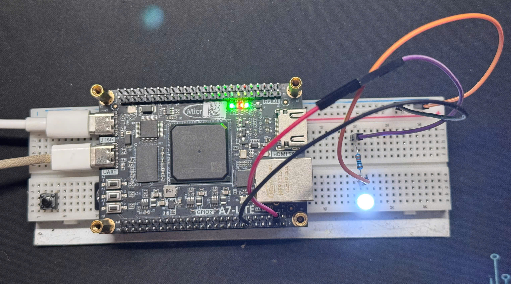

# RV32IM 5-Stage RISC-V Core & FPGA SoC

[](https://github.com/vohoangnguyennnn/riscv-rv32im-core/actions/workflows/rtl-regression.yml)
[](https://github.com/vohoangnguyennnn/riscv-rv32im-core/actions/workflows/act4-regression.yml)
[](rtl)
[](docs/architecture.md)
[](LICENSE)


A synthesizable, single-issue, in-order RV32IM processor and compact SoC, taken from RTL design through bare-metal software, FreeRTOS, regression testing, Vivado implementation, and deployment on a Xilinx Artix-7 board.

The repository is organized as an evidence-backed engineering project: architectural behavior, pipeline control, verification results, performance counters, implementation reports, and board observations are documented separately with their provenance kept explicit.

[Results](#evidence-snapshot) · [Architecture](#architecture) · [Verification](#verification) · [FPGA](#fpga-implementation) · [Performance](#performance) · [Quick start](#quick-start) · [Documentation](#documentation)

## Evidence snapshot

| Area | Result |
|---|---|
| Core | 5-stage IF/ID/EX/MEM/WB, single-issue, in-order RV32IM |
| Privileged support | Machine-mode CSR subset, precise synchronous traps, MTIP interrupt, ECALL/MRET |
| RTL regression | 21/21 unit and 7/7 directed integration tests passed |
| Software | 2/2 bare-metal smoke tests and FreeRTOS demo passed |
| ISA suites | 40 RV32I + 8 RV32M pinned riscv-tests; 39 RV32I + 8 RV32M ACT4 |
| FPGA target | MicroPhase A7-Lite R1.1, Xilinx Artix-7 XC7A35T |
| Latest Vivado implementation | `smoke.mem`; fully routed at 75 MHz; setup WNS +0.017 ns, hold WHS +0.099 ns |
| Utilization | 3,785 LUT, 1,994 FF, 16 BRAM, 4 DSP |
| Power estimate | 0.254 W vectorless post-route estimate; Medium confidence, not board-measured |
| Directed performance | 35,245 instructions in 50,101 cycles; CPI 1.422, IPC 0.703 |
| CoreMark | 2.127 CoreMark/MHz, CRC-valid performance run |
| Prior board bring-up | PASS recorded for the separately hash-identified FreeRTOS image |

Results above were recorded on 2026-08-25 against core commit `b16b1b0`. The latest supplied Vivado package was captured from `b16b1b0-dirty` with `TCM_INIT_FILE=smoke.mem`; it must not be treated as the same artifact as the earlier FreeRTOS board image. Exact tool versions, hashes, timing paths, and evidence boundaries are recorded in the [hardware validation report](docs/hardware-validation.md).

## Engineering highlights

- Built a complete scalar datapath around explicit valid/kill/stall semantics, with forwarding and load-use interlocks.
- Implemented a variable-latency iterative RV32M unit with request/response handshakes and precise retirement.
- Added split instruction/data memory protocols with stable held requests and at most one outstanding transaction per port.
- Brought up a 64 KiB TCM SoC with timer, UART, GPIO, diagnostics, and a pinned FreeRTOS kernel.
- Verified the design across directed RTL tests, software smoke tests, two simulators, two external ISA suites, and FPGA deployment.
- Kept performance and hardware claims tied to reproducible counters and frozen reports rather than unsupported estimates.

## Architecture

| Property | Implementation |
|---|---|
| Pipeline | IF, ID, EX, MEM, WB |
| Execution | Single-hart, single-issue, in-order |
| ISA | RV32I 2.1, full RV32M 2.0, Zicsr and documented machine-mode subset |
| Control transfer | EX-stage branch/JAL/JALR/MRET resolution |
| Traps | Precise synchronous exceptions plus machine-timer interrupt |
| Memory | Separate instruction/data request-response ports |
| MDU | Iterative multiply/divide unit with architectural corner-case handling |
| Observability | Retirement trace, trap trace, and diagnostic counters |


Pipeline control is centralized around architectural validity:

- EX/MEM and MEM/WB hold while memory or MDU responses are pending.
- Forwarding covers EX/MEM and MEM/WB sources; loads trigger a one-cycle load-use interlock.
- Redirects and traps invalidate younger instructions before they can retire or commit stores.
- Flushes dominate stalls, allowing redirect and trap handling to remain precise under back-pressure.
- Divide-by-zero and signed-overflow results follow RV32M architectural rules.

The complete stage contract, forwarding priority, CSR behavior, and trap ordering are documented in [architecture.md](docs/architecture.md) and [pipeline-control.md](docs/pipeline-control.md).

## SoC and software

The FPGA-facing SoC integrates the core with a unified true-dual-port TCM and three compact memory-mapped peripheral regions, plus an in-TCM completion word:


*Structural overview of the intended FPGA SoC: 75 MHz clocking, five-stage RV32IM core, dual-port TCM, memory demultiplexer, timer/MTIP, UART, GPIO, and board status outputs.*

| Region | Address | Role |
|---|---|---|
| TCM | `0x0000_0000`-`0x0000_FFFF` | 64 KiB instruction/data memory; completion (`tohost`) word at `0x0000_FFFC` |
| Timer | `mtimecmp` `0x0200_4000`/`0x0200_4004`, `mtime` `0x0200_BFF8`/`0x0200_BFFC` | MTIP interrupt source |
| UART | `0x1000_0000` | 115200 8N1 console |
| GPIO | `0x1001_0000` | LEDs, board input, software test output |

The software stack includes startup code, linker scripts, trap entry, minimal runtime support, bare-metal tests, and a pinned FreeRTOS Kernel V11.3.0 demo using the official GCC RISC-V port plus a project-specific chip extension.

The frozen FreeRTOS run demonstrates:

- preemptive scheduling across the `blink`, `echo`, and `check` application tasks plus the kernel idle task;
- five machine-timer interrupts;
- thirteen ECALL-driven yields and eighteen MRET retirements;
- three GPIO state transitions;
- UART `READY\n` output and `0xA5` echo;
- matching architectural behavior in Verilator and Questa.

See [software.md](docs/software.md) for the boot flow, ABI assumptions, trap contract, memory layout, and demo acceptance criteria.

## Verification


| Layer | Coverage | Entry point |
|---|---|---|
| Static RTL | Strict Verilator lint | `make lint` |
| Unit | ALU, immediate, branch, register file, load/store, MDU | `make unit` |
| Integration | Forwarding, stalls, traps, interrupts, protocol back-pressure | `make integration` |
| Assertions | Protocol stability and control invariants | `make assertions` |
| Software | Bare-metal and FreeRTOS execution | `make baremetal freertos` |
| ISA | Pinned riscv-tests RV32I/RV32M | `make isa` |
| Independent ISA | ACT4 RV32I/RV32M | `make act4` |
| Cross-simulator | Frozen FreeRTOS scenario in Questa | `make questa-freertos-run` |

The ACT4 run is intentionally reported separately from the pinned riscv-tests count. Pass/fail is determined from architectural signatures, trace invariants, and explicit software completion—not from simulation exit status alone.

Detailed test ownership, checker behavior, expected counts, and residual verification gaps are in [verification.md](docs/verification.md).

## FPGA implementation



*Earlier FreeRTOS board bring-up; separate from the latest `smoke.mem` report package.*

The latest supplied implementation package was generated with Vivado 2024.1 for `xc7a35tfgg484-2`, using a 50 MHz board oscillator and a 75 MHz generated SoC clock.

| Check | Latest report result |
|---|---:|
| Route status | Fully routed, 0 unrouted nets |
| Setup | WNS +0.017 ns, TNS 0.000 ns |
| Hold | WHS +0.099 ns, THS 0.000 ns |
| Setup/hold endpoints | 0 failing out of 6,867 |
| Pulse width | WPWS +5.537 ns |
| DRC | 0 errors |
| Clock coverage | 0 unclocked sequential cells, 0 unconstrained endpoints |
| Bitstream | Generated and hash-identified |
| Power | 0.254 W estimated; Medium confidence |

The worst setup path runs from `id_ex_q[rs2][2]` to `next_pc_q[28]`: 13.183 ns across 25 logic levels, with 68.2% of delay attributed to routing. The design is closed for the stated 75 MHz target; this result is not presented as device Fmax.

Resource usage is 18.20% LUT, 4.79% FF, 32.00% BRAM, and 4.44% DSP. The post-route power estimate is vectorless and has Medium confidence; it is not measured board power. The report exposes six bonded I/O and therefore does not validate the current ten-port RTL/XDC boundary or a new FreeRTOS board deployment.

Board pin mapping, reset behavior, bring-up sequence, and report provenance are in [fpga.md](docs/fpga.md) and [hardware-validation.md](docs/hardware-validation.md).

## Performance


Directed workloads use committed-instruction and cycle counters over complete-program runs, from reset release through the retirement-qualified completion store, not regions of interest:

| Workload | Instructions | Cycles | CPI | IPC |
|---|---:|---:|---:|---:|
| Arithmetic | 9,251 | 10,287 | 1.112 | 0.899 |
| Branch | 19,758 | 29,190 | 1.477 | 0.677 |
| Memory | 5,370 | 9,011 | 1.678 | 0.596 |
| MDU | 866 | 1,613 | 1.863 | 0.537 |
| **Aggregate** | **35,245** | **50,101** | **1.422** | **0.703** |

The CoreMark performance profile completes 2,000 iterations with a valid CRC at CPI 1.642 and 2.127 CoreMark/MHz. A separate validation profile also passes at 2.121 CoreMark/MHz.

These are RTL counter-derived results evaluated at the architectural 75 MHz target. They are not board wall-clock measurements and are not EEMBC-certified submissions. Methodology and raw counters are documented in [performance.md](docs/performance.md) and [coremark.md](docs/coremark.md).

## Quick start

### Requirements

- GNU Make and Python 3
- Verilator 5.x
- RISC-V GCC toolchain with an `riscv*-unknown-elf-` prefix
- Optional: Questa for cross-simulator runs, Vivado for FPGA implementation, ACT4 for the independent ISA suite

### Run the public regression

```bash
git clone https://github.com/vohoangnguyennnn/riscv-rv32im-core.git
cd riscv-rv32im-core
make test
```

Useful focused targets:

```bash
make lint
make unit
make integration
make assertions
make baremetal
make freertos
make isa
make benchmark
make coremark
make fpga
```

Use `make help` for tool overrides and optional targets. ACT4 is an explicit separate run:

```bash
make act4
```

## Repository map

```text
rtl/
  core/          Processor pipeline, CSR, LSU, and MDU
  soc/           TCM, timer, UART, GPIO, and SoC integration
  fpga/          Board wrapper and reset synchronization
tb/              Unit, integration, assertion, and memory-model testbenches
sw/              Runtime, BSP, tests, FreeRTOS, ISA, and benchmark software
sim/questa/      Batch and curated waveform flows for Questa
scripts/         Vivado implementation/report scripts
tools/           Image conversion, benchmark, and trace helpers
constraint/      Xilinx board constraints
verification/    ACT4 model and runner configuration
third_party/     Pinned external test, RTOS, and benchmark sources
docs/            Design, verification, software, performance, and FPGA reports
```

## Documentation

| Document | Purpose |
|---|---|
| [Documentation index](docs/README.md) | Canonical reading order and ownership |
| [Architecture](docs/architecture.md) | ISA profile, datapath, CSRs, traps, memory contracts |
| [Pipeline control](docs/pipeline-control.md) | Forwarding, stalls, flushes, redirects, retirement |
| [Verification](docs/verification.md) | Test strategy, evidence matrix, residual gaps |
| [Software](docs/software.md) | Runtime, FreeRTOS port, memory layout, demo behavior |
| [Performance](docs/performance.md) | Directed benchmark methodology and results |
| [CoreMark](docs/coremark.md) | Build profile, counters, CRC, interpretation |
| [FPGA](docs/fpga.md) | Board integration and operational bring-up |
| [Hardware validation](docs/hardware-validation.md) | Evidence provenance, compatibility, hashes, and claim boundary |
| [Waveform debug](docs/waveform-debug.md) | Trace and waveform workflow |

For a technical review, read Architecture → Pipeline control → Verification → Hardware validation.

## Evidence boundary

This repository demonstrates an engineering-prototype core and SoC with a routed 75 MHz implementation point. It does **not** claim RISC-V certification, EEMBC certification, production-silicon qualification, measured power, PVT closure, reliability sign-off, or FPGA Fmax.

The latest implementation report and the earlier FreeRTOS board observation are separate evidence snapshots. A clean implementation using the current RTL/XDC and selected firmware must be reported and deployed before they can be presented as one immutable release artifact.

## License

Released under the [MIT License](LICENSE).

RISC-V is a trademark of RISC-V International. CoreMark is a trademark of EEMBC. This project is not affiliated with or endorsed by either organization.
