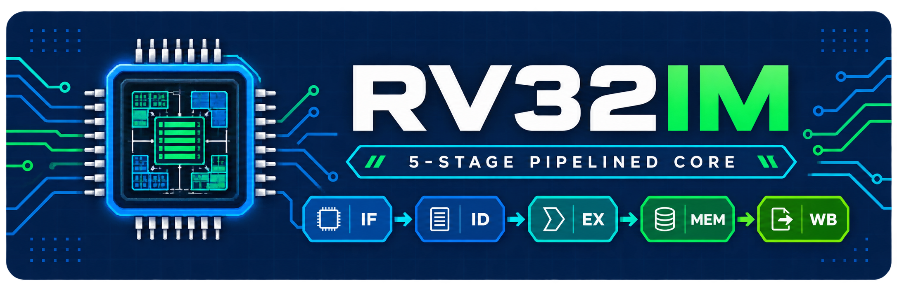

# RV32IM 5-Stage Pipelined RISC-V Core

[](https://github.com/vohoangnguyennnn/riscv-rv32im-core/actions/workflows/rtl-regression.yml)
[](https://github.com/vohoangnguyennnn/riscv-rv32im-core/actions/workflows/act4-regression.yml)
[](LICENSE)
[](rtl/core/rv32_core.sv)
[](docs/architecture.md)

<p align="center">
  
</p>

A synthesizable, single-hart, single-issue, in-order RISC-V processor
implementing the RV32I base ISA and complete RV32M multiply/divide extension in
a classic IF–ID–EX–MEM–WB pipeline. The repository covers the front-end CPU
development flow from architectural definition and SystemVerilog RTL through
pipeline verification, freestanding software, architectural regression, FPGA
implementation, and physical-board bring-up.

The core is intentionally compact enough for direct RTL review while still
addressing the control problems that distinguish a processor from a collection
of datapaths: forwarding priority, load-use interlocks, request/response
backpressure, multicycle execution, wrong-path cancellation, precise traps,
and a single architectural commit interface.

<p align="center">
  
</p>

<p align="center"><em>Implemented FPGA/SoC boundary: synchronized reset,
five-stage RV32IM execution, independent instruction and data ports, and a
firmware-initialized 64 KiB dual-port TCM.</em></p>

[Architecture](#architecture-at-a-glance) ·
[Verification](#verification) ·
[FPGA](#fpga-implementation) ·
[Quick start](#quick-start) ·
[Documentation](#documentation) ·
[Scope](#scope-and-claim-boundary)

## Project status

**The documented RTL and simulation scope is complete and passing.** The core
executes compiled RV32IM/Zicsr bare-metal software, passes the pinned upstream
RV32I/RV32M suite, and passes the ACT4 4.0.0 I/M architectural regression using
Sail as the reference model.

Vivado synthesis, placement, routing, and bitstream generation completed at
50 MHz for the confirmed MicroPhase A7-Lite R1.1 device
`xc7a35tfgg484-2`. The bitstream subsequently executed on the physical board,
where firmware PASS/DONE behavior was observed locally. Exact public
bitstream/firmware provenance and a board capture remain publication work.

| Area | Current baseline |
|---|---:|
| Microarchitecture | Five-stage IF–ID–EX–MEM–WB integrated |
| ISA | RV32I 2.1 + RV32M 2.0 |
| Additional architectural support | Six Zicsr operations over a documented CSR set; minimal synchronous M-mode trap path |
| Static RTL | Core, TCM, SoC, reset, and FPGA-top lint PASS |
| Unit simulation | **17/17 PASS** |
| Integration simulation | **7/7 PASS** |
| Bare-metal programs | **2/2 PASS** |
| Pinned `riscv-tests` | **40 RV32I + 8 RV32M PASS** |
| ACT4 4.0.0 + Sail 0.10 | **39/39 RV32I + 8/8 RV32M PASS** |
| FPGA implementation | Routed at 50 MHz with positive setup/hold slack |
| Physical-board smoke | PASS/DONE observed locally; public evidence bundle pending |

These results are engineering evidence for the checked-in configuration. They
do not claim official RISC-V certification, full Privileged Architecture
compliance, silicon validation, or production characterization.

## Engineering highlights

- Five pipeline stages with explicit valid-bit bubbles and centralized hold,
  flush, redirect, and precise-trap control.
- EX-stage forwarding from EX/MEM and MEM/WB with deterministic
  younger-producer priority.
- One-bubble load-use interlock for the default one-cycle TCM, plus correct
  behavior under request backpressure and delayed responses.
- EX-resolved branches, `JAL`, `JALR`, and `MRET`, flushing exactly the two
  younger pipeline packets when taken.
- Four RV32M multiply variants using a registered synthesis-friendly datapath,
  and four divide/remainder variants using a 32-iteration restoring divider.
- RISC-V-defined divide-by-zero and signed-overflow results without arithmetic
  traps.
- Precise synchronous exceptions carried with the faulting packet and committed
  at WB after all older work completes.
- Minimal machine-mode CSR path with atomic Zicsr read-modify-write semantics,
  trap entry, `MRET`, and 64-bit cycle/retirement counters exposed as RV32
  halves.
- Independent blocking instruction/data request-response interfaces with
  explicit backpressure, access-error propagation, and stale-response drain.
- Parameterized true-dual-port TCM with byte write enables, fixed one-cycle
  responses, range checks, and optional FPGA block-RAM initialization.
- Architectural retirement trace reporting PC, instruction, GPR/memory side
  effects, traps, and control-transfer metadata.
- Reproducible verification spanning deterministic unit checks, cross-stage
  integration, compiler-generated software, pinned ISA tests, ACT4, and FPGA
  smoke tests.

## Architecture at a glance

| Property | Implemented configuration |
|---|---|
| Hart model | One hart, single issue, in order |
| XLEN | 32 bits |
| ISA | RV32I 2.1 + RV32M 2.0 |
| Instruction encoding | Fixed 32-bit instructions; `IALIGN=32` |
| Endianness | Little-endian |
| Register file | 32 × 32-bit GPRs; `x0` hardwired to zero |
| Pipeline | IF, ID, EX, MEM, WB |
| Control resolution | EX stage |
| Peak throughput | Up to one issue and one retirement per cycle when unstalled |
| GPR dependency handling | EX/MEM and MEM/WB forwarding; WB-to-ID bypass |
| Memory architecture | Independent instruction and data request/response ports |
| Default memory | Unified 64 KiB true-dual-port TCM at `0x0000_0000` |
| Exception model | Precise synchronous exceptions committed at WB |
| Execution environment | Minimal M-mode-only bare-metal environment |
| Interrupts | Not implemented |
| Caches, MMU, PMP | Not implemented |

### Pipeline responsibilities

| Stage | Primary responsibility |
|---|---|
| IF | Track fetch requests, sequence the PC, and discard stale responses after redirect |
| ID | Decode, generate immediates, read GPRs, and identify source dependencies |
| EX | Execute ALU/branch/CSR operations, generate addresses, and run blocking MUL/DIV |
| MEM | Complete blocking loads/stores and propagate memory faults |
| WB | Commit GPR/CSR state, enter precise traps, and emit retirement events |

### Representative control behavior

| Event | Baseline response |
|---|---|
| Independent instruction stream | Up to one issue/retirement per cycle |
| Immediate TCM load consumer | One interlock bubble |
| Taken branch, `JAL`, `JALR`, or `MRET` | Flush IF/ID and ID/EX |
| Not-taken conditional branch | No redirect bubble |
| Memory wait | Hold the owning packet and older/younger state consistently |
| Multiply/divide | Hold EX until the selected MDU result is accepted |
| Synchronous exception | Quiesce younger work, drain older work, then trap precisely |

The full programmer-visible contract, CSR set, exception policy, and module
ownership are specified in [Architecture](docs/architecture.md). Cycle-level
forwarding, interlock, backpressure, redirect, and trap priority are specified
in [Pipeline and control](docs/pipeline-control.md).

## SoC, memory, and software contract

`rv32_core` exposes independent instruction and data ports using a blocking
request/response protocol. The request channel uses valid/ready handshaking and
the response channel returns a valid pulse, data, and an error indication. Each
port permits at most one outstanding transaction; request payload remains
stable under backpressure, and every accepted request receives one ordered
response. This boundary can host the included TCM or a future cache/bus bridge
without changing architectural commit semantics.

The baseline SoC connects both ports to one inferred true-dual-port memory:

- instruction port A is read-only;
- data port B supports reads and byte-enabled writes;
- both ports accept a request every cycle and respond one cycle later;
- the memory array is not reset, preserving FPGA block-RAM inference;
- a constant `$readmemh` file can initialize the FPGA bitstream.

### Default 64 KiB memory map

| Address range | Purpose |
|---|---|
| `0x0000_0000–0x0000_00FF` | Reset/startup code |
| `0x0000_0100–0x0000_03FF` | Direct-mode trap entry |
| `0x0000_0400–__image_end` | Application text, read-only data, data, and BSS |
| `0x0000_EF00–0x0000_FEFF` | Reserved 4 KiB downward-growing stack |
| `0x0000_FFFC–0x0000_FFFF` | Retirement-qualified completion mailbox |

The freestanding software environment targets `rv32im_zicsr` with the ILP32
ABI. It provides reset startup, `gp`/`sp` setup, BSS initialization, an assembly
trap wrapper, a weak C trap handler, linker assertions, minimal memory
primitives, and deterministic PASS/FAIL termination.

Firmware completion is recognized only from the first non-trapping retired
full-word store to `0x0000_FFFC`. A wrong-path, squashed, misaligned, or faulting
store cannot produce a false PASS. The complete ABI, linker, runtime, image,
and mailbox contract is documented in [Software](docs/software.md).

## Verification

The verification environment is deliberately lightweight and auditable:
self-checking SystemVerilog testbenches, compiled bare-metal images,
architectural signatures, retirement events, and pinned independent suites.
Waveforms explain cycle-level causality but are not used as the pass/fail
oracle.

| Layer | Scope | Result | Command |
|---|---|---:|---|
| Static RTL | Core, TCM, SoC, reset, FPGA top | PASS | `make lint` |
| Unit | Datapath, stages, protocol engines, CSR, MDU, TCM | **17/17** | `make unit` |
| Integration | Full core, hazards, waits, control, CSR/trap, SoC, FPGA | **7/7** | `make integration` |
| Bare-metal | Production startup/runtime, smoke, expected traps | **2/2** | `make baremetal` |
| `riscv-tests` | Pinned `rv32ui` and `rv32um` programs | **48/48** | `make isa` |
| ACT4 + Sail | Generated RV32I/RV32M architectural tests | **47/47** | `make act4` |
| FPGA simulation | Reset, initialized TCM, mailbox, LED/status wrapper | **3/3** | `make fpga` |

The directed pipeline suite covers producer/consumer distances, forwarding
priority, false dependency suppression, load-use bubbles, delayed memory,
request stability, single retirement under hold, branch/jump recovery,
wrong-path side-effect suppression, exception priority, trap entry, and
`MRET`.

<p align="center">
  <a href="docs/images/full-core-pipeline-waveform.png">
    
  </a>
</p>

<p align="center"><em>Representative full-core execution window. The
self-checking test result is the oracle; this capture exposes pipeline
occupancy, forwarding/control decisions, memory handshakes, and retirement.</em></p>

`make test` is the public blocking regression. It runs lint, all 24 RTL
simulations, both bare-metal programs, and 48 pinned ISA programs. ACT4 remains
a separate gate because it requires additional pinned generation and Sail
dependencies. See [Verification](docs/verification.md) for requirement
traceability, exact counts, CI behavior, failure triage, sign-off criteria, and
known coverage gaps.

## FPGA implementation

<p align="center">
  
</p>

The FPGA top integrates the complete processor, synchronized board reset,
64 KiB initialized TCM, heartbeat/PASS LEDs, and active-high FAIL/DONE outputs
on JP2. DDR3/MIG, UART, Ethernet, HDMI, caches, and a debug transport are not
instantiated.

| Item | Reviewed result |
|---|---:|
| Board | MicroPhase A7-Lite R1.1 |
| Exact part | `xc7a35tfgg484-2` |
| Tool snapshot | Vivado 2024.1 |
| Clock target | 50 MHz / 20.000 ns |
| Setup WNS / TNS | +3.382 ns / 0.000 ns |
| Hold WHS / THS | +0.064 ns / 0.000 ns |
| Slice LUTs | 2,881 / 20,800 (13.85%) |
| Slice registers | 1,580 / 41,600 (3.80%) |
| Block RAM tiles | 16 / 50 (32.00%) |
| DSP48E1 blocks | 4 / 90 (4.44%) |
| Routed-net errors | 0 |
| Unconstrained internal endpoints | 0 |
| Estimated on-chip power | 0.110 W, medium-confidence vectorless estimate |

Reviewed evidence: [timing](docs/images/timing_report.png),
[utilization](docs/images/utilization_report.png),
[implemented device](docs/images/device.png),
[power](docs/images/power_report.png),
[core schematic](docs/images/schematic_rv32core.png), and
[FPGA schematic](docs/images/schematic_fpga.png).

The design completed bitstream generation and executed on the target board with
the expected PASS/DONE result observed locally. The remaining public-evidence
task is to pair a board photograph or logic-analyzer capture with the exact
board revision, Git commit, bitstream hash, and firmware hash. Detailed reset,
pin, TCM initialization, Vivado, bring-up, and sign-off procedures are in
[FPGA implementation](docs/fpga.md).

## Quick start

### Required tools

- GNU Make and Python 3;
- Verilator;
- GNU RISC-V bare-metal GCC/binutils using the
  `riscv64-unknown-elf-` prefix.

QuestaSim is optional for interactive waveform debug. Vivado is required only
for FPGA synthesis, implementation, and bitstream generation. ACT4 additionally
requires the pinned generator/Sail bootstrap dependencies described by
`make act4-check-tools`.

### Clone and run the public regression

```sh
git clone https://github.com/vohoangnguyennnn/riscv-rv32im-core.git
cd riscv-rv32im-core
make -j"$(nproc)" test
```

Expected final summary:

```text
[PASS] RTL lint, 24 RTL simulations, 2 bare-metal programs, and 48 ISA tests completed
```

### Common targets

| Command | Purpose |
|---|---|
| `make lint` | Lint the core, TCM, SoC, reset, and FPGA top |
| `make unit` | Run all 17 unit testbenches |
| `make integration` | Run all 7 integration testbenches |
| `make gate4` | Run forwarding, memory-wait, and control acceptance tests |
| `make baremetal` | Build and execute `smoke` and `trap` |
| `make isa` | Run 40 RV32I and 8 RV32M programs |
| `make act4` | Generate and run all 47 ACT4 I/M tests |
| `make fpga` | Run reset, SoC/TCM, and FPGA-wrapper smoke tests |
| `make questa-check` | Run the curated Questa portfolio in batch mode |

Useful focused runs:

```sh
make tb_pipeline_forwarding
make tb_pipeline_memory_wait
make tb_pipeline_control
make baremetal-smoke
make isa-rv32um-div
make act4-test ACT4_TEST='M-div*'
```

Interactive debug:

```sh
make questa-gui TEST=tb_pipeline_forwarding
make questa-baremetal-gui PROGRAM=smoke
make questa-isa-gui ISA_TEST=rv32um-div
```

Generate FPGA firmware images:

```sh
make -C sw BUILD_DIR=../build/software all
```

Use `build/software/smoke.mem` as the `TCM_INIT_FILE` input when creating the
Vivado project described in [FPGA implementation](docs/fpga.md).

## Repository structure

```text
.
├── rtl/core/          # Pipeline, execution units, CSR state, and core boundary
├── rtl/soc/           # Dual-port TCM and reusable core+TCM integration
├── rtl/fpga/          # Reset synchronizer and A7-Lite synthesis top
├── tb/unit/           # Leaf and stage-level self-checking testbenches
├── tb/integration/    # Full-core, pipeline, SoC, FPGA, and software tests
├── tb/common/         # Shared encoders, scoreboard helpers, delayed memory
├── sw/                # Freestanding runtime and project software
├── sw/isa/            # Pinned upstream ISA-test target environment
├── verification/act4/ # ACT4 DUT configuration and failure-triage runner
├── third_party/       # Pinned and licensed external verification sources
├── constraint/        # A7-Lite Vivado XDC
├── scripts/vivado/    # Post-implementation report collection
├── sim/questa/        # Batch and curated waveform views
├── files/             # Ordered RTL source manifests
├── tools/             # Binary/ELF to Verilog memory-image converters
└── docs/              # Architecture, verification, software, and FPGA docs
```

Generated simulation models, waveforms, software images, Vivado projects, run
databases, and implementation review packages remain outside version control.

## Documentation

Start with the [documentation index](docs/README.md), or go directly to:

| Document | Engineering scope |
|---|---|
| [Architecture](docs/architecture.md) | ISA boundary, state, pipeline organization, memory model, CSRs, traps, and retirement |
| [Pipeline and control](docs/pipeline-control.md) | Forwarding, interlocks, waits, redirects, precise traps, and global action priority |
| [Verification](docs/verification.md) | Test architecture, requirement traceability, commands, evidence, sign-off, and gaps |
| [Software](docs/software.md) | ILP32 ABI, runtime, linker map, trap wrapper, mailbox, and image generation |
| [FPGA implementation](docs/fpga.md) | Board integration, reset/TCM contract, XDC, Vivado evidence, and bring-up |
| [Waveform debug](docs/waveform-debug.md) | Questa portfolio, signal groups, capture procedure, and evidence policy |
| [Release checklist](docs/release-checklist.md) | Final verification, package review, tagging, and GitHub publication |

## Scope and claim boundary

The current release intentionally does not implement:

- compressed, atomic, floating-point, vector, bit-manipulation, or other
  optional ISA extensions;
- Zifencei or instruction-fetch synchronization for self-modifying code;
- asynchronous interrupts or the complete machine interrupt/status stack;
- U-mode, S-mode, delegation, virtual memory, page tables, or PMP;
- instruction/data caches, coherency, branch prediction, superscalar issue, or
  out-of-order execution;
- AXI, AHB, APB, DDR3/MIG, UART, Ethernet, HDMI, or other peripheral
  integration;
- RISC-V debug mode, triggers, a debug module, or JTAG DTM;
- production boot ROM, secure boot, firmware update, or an operating-system
  environment.

High-value next steps are retirement-stream differential checking against an
independent model, deterministic constrained-random instruction generation,
formal properties for pipeline/memory invariants, coverage closure, a scripted
Vivado build, cache/bus integration, and publication of the reproducible
physical-board evidence bundle.

Passing `riscv-tests` and ACT4 is architectural regression evidence, not an
official certification statement. The implemented CSR/trap environment is a
documented minimal subset, not the complete RISC-V Privileged Architecture.
The 0.110 W FPGA value is a vectorless estimate, not measured board power. The
on-board run is a locally observed result until its exact provenance is
published.

## References and license

Architectural behavior was reviewed against the official RISC-V specifications:

- [RV32I Base Integer Instruction Set, Version 2.1](https://docs.riscv.org/reference/isa/unpriv/rv32.html)
- [M Extension for Integer Multiplication and Division, Version 2.0](https://docs.riscv.org/reference/isa/unpriv/m-st-ext.html)
- [Zicsr Extension for CSR Instructions, Version 2.0](https://docs.riscv.org/reference/isa/unpriv/zicsr.html)
- [Machine-Level ISA, Version 1.13](https://docs.riscv.org/reference/isa/priv/machine.html)

The original RTL, verification environment, software, and documentation are
released under the [MIT License](LICENSE). The pinned subset under
`third_party/riscv-tests/` retains its upstream BSD 3-Clause license and records
its source revision in
[`third_party/riscv-tests/UPSTREAM.md`](third_party/riscv-tests/UPSTREAM.md).
