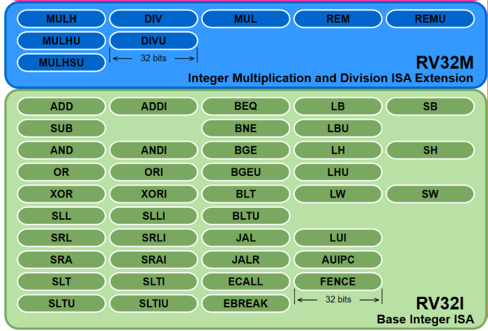
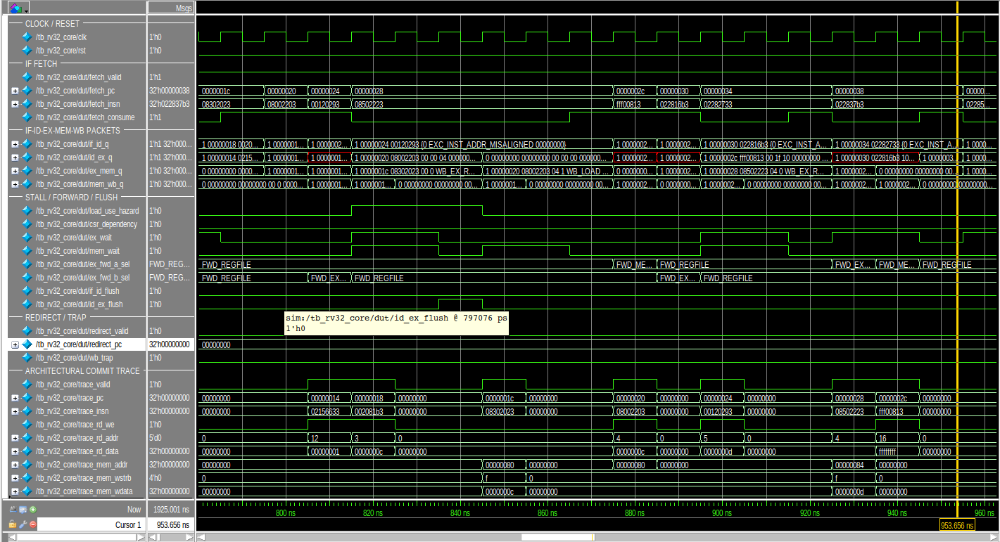
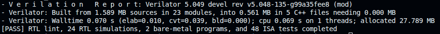
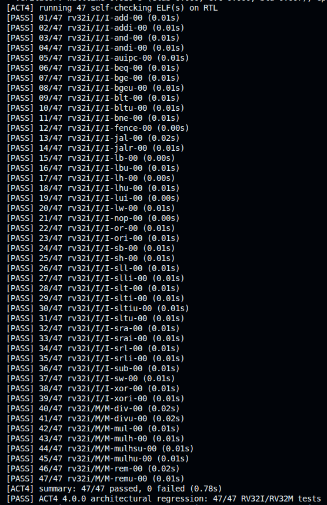
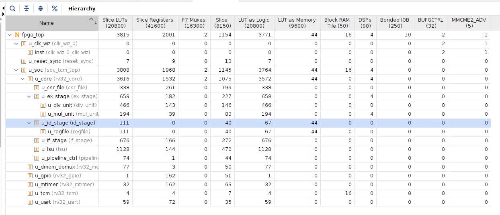
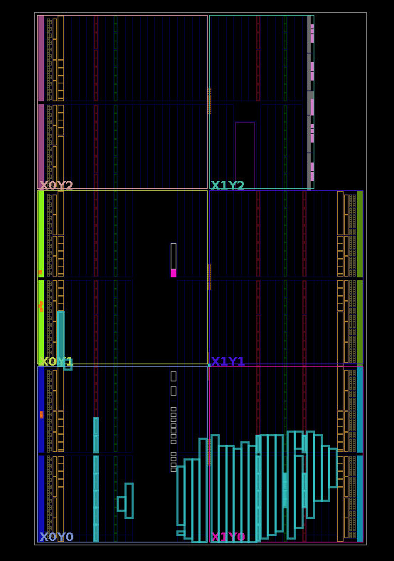
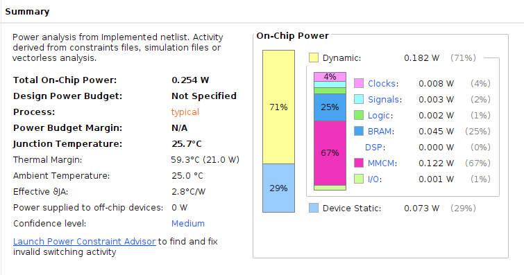
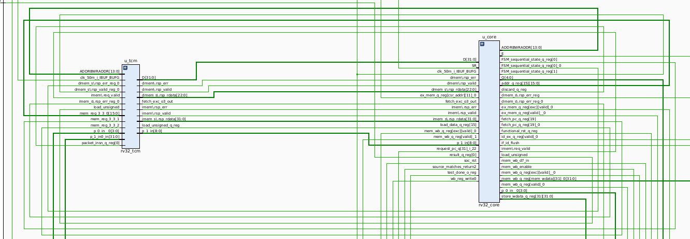
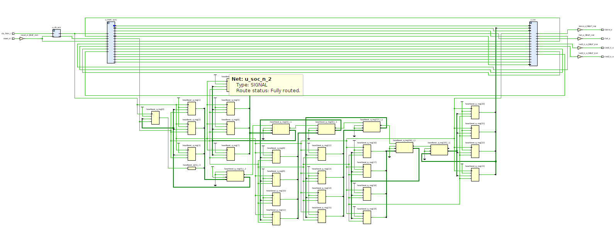

# RV32IM 5-Stage Pipelined RISC-V Core

[](https://github.com/vohoangnguyennnn/riscv-rv32im-core/actions/workflows/rtl-regression.yml)
[](https://github.com/vohoangnguyennnn/riscv-rv32im-core/actions/workflows/act4-regression.yml)
[](LICENSE)
[](rtl/core/rv32_core.sv)
[](docs/isa-regression.md)

<p align="center">
  
</p>

A synthesizable, single-issue, in-order RISC-V processor implementing the
RV32I base ISA and the complete RV32M integer multiply/divide extension in a
classic five-stage pipeline. The project covers the complete front-end RTL
development path: microarchitecture definition, pipeline control, hazard and
forwarding logic, precise exceptions, machine-mode CSRs, memory integration,
bare-metal software, architectural regression, FPGA implementation, and
continuous integration.

The design is intentionally compact enough to audit at RTL level while still
addressing the control and verification problems that distinguish a processor
from a collection of instruction datapaths: request/response backpressure,
multi-cycle execution, wrong-path cancellation, exception ordering,
architectural commit, and end-to-end software execution.

<p align="center">
  
</p>

<p align="center"><em>Top-level FPGA implementation boundary: synchronized
reset, five-stage RV32IM core, separate instruction/data paths, and a
firmware-initialized 64 KiB dual-port TCM.</em></p>

## Table of contents

- [Project status](#project-status)
- [Engineering highlights](#engineering-highlights)
- [Architecture specification](#architecture-specification)
  - [Microarchitectural timing and throughput](#microarchitectural-timing-and-throughput)
  - [Pipeline organization](#pipeline-organization)
  - [Hazard, stall, and forwarding strategy](#hazard-stall-and-forwarding-strategy)
  - [Control transfers](#control-transfers)
  - [RV32M execution units](#rv32m-execution-units)
  - [Precise exceptions and machine-mode state](#precise-exceptions-and-machine-mode-state)
- [Core integration interfaces](#core-integration-interfaces)
- [SoC and memory subsystem](#soc-and-memory-subsystem)
- [Verification strategy](#verification-strategy)
  - [Directed control and data-hazard coverage](#directed-control-and-data-hazard-coverage)
  - [Representative measured execution](#representative-measured-execution)
  - [ISA and architectural regressions](#isa-and-architectural-regressions)
- [FPGA implementation](#fpga-implementation)
  - [Target board: MicroPhase A7-Lite R1.1](#target-board-microphase-a7-lite-r11)
  - [Implementation evidence](#implementation-evidence)
- [Bare-metal software flow](#bare-metal-software-flow)
- [Repository structure](#repository-structure)
- [Getting started](#getting-started)
- [Documentation](#documentation)
- [Scope boundaries and next steps](#scope-boundaries-and-next-steps)
- [Engineering claims and reproducibility](#engineering-claims-and-reproducibility)
- [License](#license)

## Project status

**RTL implementation and simulation verification are complete for the scope
documented in this repository.** The core passes the directed RTL regression,
freestanding C/assembly programs, a pinned upstream `riscv-tests` RV32I/RV32M
suite, and the ACT4 4.0.0 I/M architectural suite using Sail as the reference
model.

FPGA synthesis, placement, and routing have also completed at 50 MHz in a local
Vivado 2024.1 review run. Final board sign-off remains deliberately open until
the Vivado part is matched to the exact device marking on the physical board
and the bitstream is validated on hardware. The project does **not** claim
official RISC-V certification or silicon validation.

| Area | Current result |
|---|---|
| Microarchitecture | Five-stage IF–ID–EX–MEM–WB pipeline integrated |
| ISA | RV32I + complete RV32M; selected Zicsr and machine-mode support |
| RTL verification | 17 unit + 7 integration simulations passing |
| Bare-metal validation | 2 freestanding C/assembly programs passing |
| Pinned `riscv-tests` | 40 RV32I + 8 RV32M programs passing |
| ACT4 4.0.0 + Sail 0.10 | 39/39 RV32I + 8/8 RV32M tests passing |
| FPGA implementation snapshot | Routed at 50 MHz with positive setup/hold slack |
| Continuous integration | GitHub Actions RTL and path-filtered ACT4 workflows configured |

## Engineering highlights

- Clean five-stage pipeline with explicit valid-bit bubbles and centralized
  hold, flush, and redirect control.
- EX-stage forwarding from EX/MEM and MEM/WB, with younger-producer priority and
  one-cycle load-use interlock for fixed-latency TCM.
- Correct pipeline behavior under memory request backpressure, delayed
  responses, multi-cycle multiply/divide execution, traps, and redirects.
- EX-resolved branch, JAL, JALR, and MRET with deterministic two-bubble taken
  control-transfer penalty when using the one-cycle TCM.
- Precise synchronous exceptions carried with the faulting instruction and
  committed at the WB boundary; younger side effects are squashed.
- Complete RV32M datapath: four multiply variants, four divide/remainder
  variants, divide-by-zero behavior, and signed overflow corner cases.
- Minimal machine-mode CSR subsystem with Zicsr read-modify-write operations,
  trap entry, MRET, and 64-bit cycle/retirement counters exposed through RV32
  CSR halves.
- Blocking instruction/data request-response interfaces with explicit
  backpressure and access-error propagation, providing a defined integration
  seam for a future cache or bus bridge.
- Parameterized true dual-port TCM suitable for FPGA block-RAM inference,
  byte-write enables, deterministic one-cycle responses, and optional memory
  initialization.
- Architectural retirement trace containing PC, instruction, register and
  memory side effects, traps, and control-transfer metadata.
- Reproducible verification spanning module-level checkers, full-pipeline
  scenarios, compiler-generated software, upstream ISA tests, and Sail-backed
  ACT4 tests.

## Architecture specification

| Property | Implementation |
|---|---|
| ISA | RV32I 2.1 + RV32M 2.0 |
| XLEN | 32 bits |
| Execution model | Single hart, single issue, in order |
| Pipeline | IF, ID, EX, MEM, WB |
| Peak issue/retirement rate | One instruction per cycle when no dependency, memory, or MDU stall is present |
| Instruction alignment | `IALIGN=32`; compressed instructions are not implemented |
| Endianness | Little-endian |
| Control-transfer resolution | EX stage |
| Register file | 32 × 32-bit GPRs, two asynchronous reads, one synchronous write; `x0` hardwired to zero |
| Memory architecture | Separate instruction and data ports connected to a unified dual-port TCM |
| Default TCM | 64 KiB at `0x0000_0000` |
| Privilege support | Minimal M-mode execution environment |
| CSR instructions | CSRRW, CSRRS, CSRRC, CSRRWI, CSRRSI, CSRRCI |
| System instructions | ECALL, EBREAK, MRET; FENCE is a legal ordering no-op for the blocking memory system |
| Exceptions | Instruction/load/store address misalignment and access fault, illegal instruction, breakpoint, M-mode ECALL |
| Interrupts | Not implemented |
| MMU/caches | Not implemented |
| RTL language | Synthesizable SystemVerilog |

<p align="center">
  
</p>

<p align="center"><em>Implemented RV32I base integer and RV32M
multiplication/division instruction scope. Zicsr operations and MRET are
implemented as the documented machine-mode subset.</em></p>

### Microarchitectural timing and throughput

The following values are deterministic properties of the implemented baseline;
they are not workload-dependent benchmark results.

| Metric | Implemented behavior | Condition |
|---|---|---|
| Peak issue / retirement | 1 instruction per cycle | No dependency, memory, MDU, or redirect stall |
| TCM response | 1 cycle after request acceptance | Fixed-latency dual-port TCM |
| Load-use interlock | 1 bubble | Immediate consumer of a TCM load |
| Taken branch / JAL / JALR / MRET | 2 younger instructions flushed | EX-stage resolution with one-cycle TCM |
| Not-taken conditional branch | 0 bubbles | No redirect is generated |
| MUL response | 2 cycles from request acceptance to response valid | Two-stage registered multiplier |
| DIV / REM normal case | 32 restoring-division iterations | Response appears after iteration 32 |
| DIV / REM special cases | Response in the cycle after request acceptance | Divide-by-zero and signed overflow |
| Outstanding memory transactions | 1 per instruction/data port | Blocking request/response contract |

Application CPI is workload-dependent and should be measured from the exposed
`mcycle` and `minstret` counters over a defined steady-state interval:

```text
CPI = (mcycle_end - mcycle_start) / (minstret_end - minstret_start)
```

Startup, trap setup, memory initialization, and the completion-mailbox store
should be excluded when comparing application CPI across implementations.

### Pipeline organization

Each inter-stage packet is a packed SystemVerilog structure containing its own
`valid` state, instruction metadata, control, result, and exception information.
The four pipeline registers are owned by `rv32_core`, making the priority rule
`reset > flush > enable > hold` visible in one integration module. An invalid
packet represents a bubble; the control path does not depend on injecting a
special NOP encoding.

| Stage | Primary responsibilities |
|---|---|
| IF | PC generation, blocking instruction fetch, redirect handling, stale-response cancellation, fetch faults |
| ID | RV32IM/Zicsr decode, immediate generation, GPR read, WB-to-ID bypass, early exception generation |
| EX | Operand forwarding, ALU, branch/jump/MRET resolution, effective address, CSR RMW, MUL/DIV sequencing |
| MEM | Load/store request and response handling, byte-lane processing, memory-access faults |
| WB | Single retirement observation point, GPR/CSR commit, precise trap entry, trace generation |

### Hazard, stall, and forwarding strategy

The bypass network selects the newest architecturally valid producer for both
EX operands. EX/MEM has priority over MEM/WB, and producers targeting `x0` or
carrying an exception are excluded. The same forwarded operands feed ALU,
store-address, store-data, branch comparison, JALR, and MDU consumers.

The hazard unit detects true dependencies using decoded `uses_rs1` and
`uses_rs2` metadata, avoiding false stalls on instruction fields that happen to
alias a source-register position. An immediately dependent load inserts one
bubble. Longer memory latency holds the appropriate pipeline state through the
memory handshake. CSR dependencies are serialized where a younger CSR access
or MRET must observe an older uncommitted CSR write.

Centralized pipeline control resolves simultaneous events in age order. An
older WB trap or MEM exception overrides a younger EX redirect; a newly
detected exception squashes younger instructions and drains the faulting packet
to the commit boundary. Directed tests exercise collisions among stalls,
redirects, exceptions, and MDU completion rather than validating each event
only in isolation.

### Control transfers

Conditional branches, JAL, JALR, and MRET resolve in EX. A taken transfer
flushes IF/ID and ID/EX. With the one-cycle TCM, this produces a deterministic
two-bubble taken penalty; a not-taken conditional branch does not flush.
JALR clears target bit zero, while any remaining violation of `IALIGN=32`
raises an instruction-address-misaligned exception instead of redirecting.

The fetch unit tracks at most one outstanding request. If a redirect invalidates
an in-flight fetch, its response is explicitly discarded, preventing a stale
instruction from re-entering the pipeline when connected to a delayed memory.

### RV32M execution units

The multiplier and divider use decoupled request/response contracts and retain
their response until the downstream stage accepts it. Flush and trap logic can
kill an in-flight younger operation without allowing it to retire later.

- `mul_unit` captures 33-bit signed-normalized operands and registers the low or
  high architectural result for MUL, MULH, MULHSU, and MULHU. FPGA synthesis
  infers four DSP48E1 blocks in the reviewed configuration.
- `div_unit` implements restoring division at one quotient bit per iteration.
  DIV, DIVU, REM, and REMU complete in 32 iterations for normal operands, with
  local handling of division by zero and signed `INT_MIN / -1` overflow exactly
  as required by the ISA.

### Precise exceptions and machine-mode state

Exception metadata travels with the instruction to MEM/WB. Trap entry suppresses
normal register and CSR side effects, writes `mepc`, `mcause`, and `mtval`, then
redirects to direct-mode `mtvec`. MRET uses `mepc` as an EX-stage control target.
This design makes the retirement boundary the authoritative observation point
for trace and trap ordering.

Implemented CSRs are:

| CSR group | Registers |
|---|---|
| Machine trap state | `mtvec`, `mscratch`, `mepc`, `mcause`, `mtval` |
| Counters | `mcycle/mcycleh`, `minstret/minstreth` |
| Identification | `misa`, `mvendorid`, `marchid`, `mimpid`, `mhartid` |

This is a deliberately limited machine-mode environment. `mstatus`, interrupts,
PMP, delegation, U-mode, and S-mode are outside the current scope and must not
be inferred from the presence of Zicsr instructions.

## Core integration interfaces

`rv32_core` exposes independent instruction and data instances of
`rv32_mem_if`. Each interface permits at most one outstanding transaction and
uses an explicit request/response protocol:

```text
request accepted = req_valid && req_ready
response          = rsp_valid + rsp_rdata + rsp_err
```

Requests and responses are ordered, stores receive a completion response, and
the master always accepts a response. This simple contract supports a
one-cycle TCM while still verifying multi-cycle latency and request
backpressure. A future I-cache, D-cache, AXI/AHB bridge, or external memory
controller can be placed below this boundary while preserving the core-side
contract.

The retirement interface exports:

- retired PC and instruction;
- GPR write-enable, destination, and data;
- memory address, write strobes, and write data;
- trap indication and cause;
- control-transfer classification, taken status, and target.

Trace consumers therefore observe architectural events without binding to
private pipeline register names. The same interface drives test diagnostics and
the SoC completion mailbox.

## SoC and memory subsystem

`soc_tcm_top` connects the core to a unified true dual-port TCM: port A serves
instruction reads, and port B serves data reads and byte writes. Both return a
registered response one cycle after request acceptance. The memory array is not
reset, preserving FPGA block-RAM inference and allowing initialization through
`$readmemh`.

Default memory map:

| Address range | Purpose |
|---|---|
| `0x0000_0000` | Reset/startup code |
| `0x0000_0100` | Direct-mode trap vector |
| `0x0000_0400` | Bare-metal application text/data |
| `0x0000_EF00–0x0000_FEFF` | 4 KiB downward-growing stack |
| `0x0000_FFFC` | Test completion mailbox (`tohost`) |

The mailbox recognizes only the first aligned full-word store observed on the
retirement trace. A wrong-path or faulting store cannot produce a false PASS.
The status remains sticky until reset and can be consumed by a simulation
harness, an LED wrapper, or a future debug peripheral.

## Verification strategy

The verification plan uses layered, self-checking evidence. Module-level tests
prove local arithmetic and protocol invariants; integration tests target
cross-stage ordering; software tests exercise the ABI and runtime; independent
ISA suites validate complete programs on the integrated RTL hierarchy.

| Verification layer | Scope | Result | Reproduction / evidence |
|---|---|---:|---|
| Static RTL checks | Verilator lint across the core, TCM, SoC, reset synchronizer, and FPGA top | **PASS** | `make lint` · [regression log](docs/images/rtl_lint.png) |
| Unit simulation | ALU, decode, branch, GPR, IF/ID/EX, hazard, forwarding, LSU, MDU, CSR, reset, TCM, and control | **17/17 PASS** | `make unit` · [captured result](docs/images/rtl_lint.png) |
| Integration simulation | Core, CSR/trap, SoC/TCM, FPGA boundary, forwarding, memory wait states, and pipeline control | **7/7 PASS** | `make integration` · [full-core waveform](docs/images/full-core-pipeline-waveform.png) |
| Bare-metal software | Startup, ABI, stack/data/BSS, compiled C execution, traps, and MRET | **2/2 PASS** | `make baremetal` · [bare-metal harness](docs/baremetal-harness.md) |
| Upstream `riscv-tests` | Pinned full-core `rv32ui` and `rv32um` programs | **48/48 PASS** | `make isa` · [ISA regression](docs/isa-regression.md) |
| ACT4 + Sail | ACT4 4.0.0 RV32I/RV32M ELFs checked with Sail RISC-V 0.10 signatures | **47/47 PASS** | `make act4` · [ACT4 run](docs/images/act4.png) |

The primary integration oracles are architectural signatures and retirement
events. Internal checks are used selectively for microarchitectural invariants
such as forwarding priority, exact bubble count, payload stability under
backpressure, and flush masks. Failure diagnostics include recent retirement
history and optional CSV traces, ELF files, link maps, and disassembly.

### Directed control and data-hazard coverage

The integration suite explicitly covers:

- RAW dependencies at producer/consumer distances of one, two, and three;
- EX/MEM priority over a matching MEM/WB producer;
- dependencies into ALU operands, store address/data, branches, JALR, and MDU;
- load-use interlocks and delayed-memory backpressure;
- forwarding of ALU, load, CSR old-value, PC+4, MUL, and DIV results;
- taken/not-taken control flow and wrong-path register, memory, CSR, and MDU
  side-effect suppression;
- simultaneous older exception and younger redirect priority;
- precise instruction, load, and store faults followed by trap entry and MRET;
- no duplicate retirement while the pipeline is held.

### Representative measured execution

The following measurements were captured from the current Verilator integration
run. They are execution evidence for the documented scenarios, not a
steady-state application benchmark.

| Scenario | Cycles | Retirements / checks | Measured behavior |
|---|---:|---:|---|
| Bare-metal `smoke` | 451 | 171 retirement events | 0 traps; harness-level CPI = **2.637** |
| Full-core `tb_rv32_core` | 191 | 27 retirement events | Integrated RV32IM execution PASS |
| Forwarding and load-use | 237 | 57 checks | 4 load-use bubbles |
| Delayed-memory pipeline | 125 | — | 96 `mem_wait` cycles; 32 request-backpressure cycles |
| Precise control/trap handling | 87 | 44 checks | 2 precise traps |

The `smoke` CPI includes reset/startup, runtime initialization, function-call
overhead, and the completion-mailbox store. Use a dedicated long-running
benchmark for a headline CPI comparison; the methodology is described in the
[microarchitectural timing section](#microarchitectural-timing-and-throughput).

<details>
<summary><strong>Open captured terminal excerpts</strong></summary>

```text
$ make baremetal-smoke BAREMETAL_PLUSARGS="+trace=/tmp/smoke.csv +max_cycles=300000"
tb_baremetal: PASS smoke (451 cycles, 171 trace events, 0 traps)

$ make tb_rv32_core
tb_rv32_core: PASS (191 cycles, 27 trace events)

$ make tb_pipeline_forwarding
tb_pipeline_forwarding: PASS (237 cycles, 57 checks, 4 load-use bubbles)

$ make tb_pipeline_memory_wait
tb_pipeline_memory_wait: PASS (125 cycles, mem_wait=96, req_backpressure=32)

$ make tb_pipeline_control
tb_pipeline_control: PASS (87 cycles, 44 checks, 2 precise traps)
```

</details>

### ISA and architectural regressions

The repository vendors a minimal, pinned snapshot of upstream `riscv-tests` at
commit `447a5fcb8253627ddb5f6a226f64e43463afcdd5`. The suite runs 40 in-scope
RV32I and all 8 RV32M programs through the complete core and TCM. `fence_i` is
excluded because Zifencei is not implemented; `ma_data` is excluded because the
documented execution environment raises precise misalignment traps.

ACT4 uses `riscv-arch-test` 4.0.0 at commit
`a7c99303516f4e668f7488f172043392e23b9dfd`, Sail RISC-V 0.10, and a pinned UDB
RV32 I/M configuration. It provides an independent 47-test architectural
regression for the RV32I/RV32M claim. Privileged ACT4 tests are intentionally
disabled because this core implements only the documented machine-mode subset;
CSR and trap behavior is covered separately by directed RTL and bare-metal
tests.

<p align="center">
  
</p>

<p align="center"><em>Representative full-core execution window from
<code>tb_rv32_core</code>: concurrent IF-to-WB packet flow, load-use and memory
wait behavior, operand forwarding, pipeline flush control, and retirement
events.</em></p>

<details>
<summary><strong>Open captured regression evidence</strong></summary>

#### Complete local RTL, software, and ISA regression

<p align="center">
  <a href="docs/images/rtl_lint.png">
    
  </a>
</p>

The captured summary records a clean Verilator lint run followed by **24 RTL
simulations**, **2 bare-metal programs**, and **48 upstream ISA tests**.

#### ACT4 architectural regression

<p align="center">
  <a href="docs/images/act4.png">
    
  </a>
</p>

The ACT4 capture lists every executed I/M test and closes with **47/47 PASS**:
39 RV32I tests and 8 RV32M tests. This is architectural-regression evidence,
not a claim of official RISC-V certification.

</details>

## FPGA implementation

### Target board: MicroPhase A7-Lite R1.1

<p align="center">
  
</p>

<p align="center"><em>MicroPhase A7-Lite development platform used for the
FPGA implementation target. The exact populated FPGA marking must be verified
before generating the final board bitstream.</em></p>

The A7-Lite R1.1 is a compact Xilinx Artix-7 development platform with an
FGG484 FPGA footprint, on-board memory, programming/debug interfaces, user I/O,
and high-speed peripheral connectivity. The board capabilities below are taken
from the
[A7-Lite R1.1 reference schematic](https://github.com/MicroPhase/fpga-docs/blob/master/schematic/A7-LITE_R11.pdf);
only the resources listed as used are part of the current RV32IM integration.

| Board resource | Datasheet capability | Use in this project |
|---|---|---|
| FPGA | Xilinx Artix-7 XC7A35T in an FGG484 package in the R1.1 reference design | Implements `fpga_top`, the RV32IM core, and the TCM subsystem |
| System clock | 50 MHz single-ended oscillator | Drives `clk_50m_i` and the complete synchronous design |
| User controls | Push buttons and two active-low green LEDs | K3 is the active-low reset; LED1 is heartbeat and LED2 indicates software PASS |
| Expansion I/O | Two 50-pin GPIO headers | JP2 exports active-high FAIL and DONE status for an external LED or logic analyzer |
| On-board memory | 4 Gbit DDR3 SDRAM | Not used; firmware executes from the 64 KiB BRAM-backed TCM |
| Programming/debug | USB-JTAG and USB-UART | USB-JTAG is available for FPGA programming; UART is outside the current SoC scope |
| High-speed peripherals | Gigabit Ethernet and HDMI TX | Present on the board but intentionally unused by this core-focused implementation |

This resource partition keeps the hardware demonstration aligned with the
project scope: the FPGA fabric, clock, reset, BRAM, status LEDs, and GPIO are
used, while DDR3, Ethernet, HDMI, and UART remain available for future SoC
extensions rather than being implied as implemented features.

The repository includes a synthesis top and constraints for the MicroPhase
A7-Lite R1.1 platform:

- 50 MHz single-ended board clock;
- asynchronous board-reset capture with synchronized functional reset;
- 64 KiB initialized TCM;
- heartbeat, PASS, FAIL, and DONE status outputs;
- XDC pin, clock, voltage, I/O-standard, and timing-exception constraints.

The latest reviewed local implementation snapshot used Vivado 2024.1 and part
`xc7a35tfgg484-1`:

| Metric | Post-implementation result |
|---|---:|
| Clock target | 50 MHz / 20.000 ns |
| Setup WNS / TNS | +0.772 ns / 0.000 ns |
| Hold WHS / THS | +0.027 ns / 0.000 ns |
| Slice LUTs | 2,879 / 20,800 (13.84%) |
| Slice registers | 1,580 / 41,600 (3.80%) |
| Block RAM tiles | 16 / 50 (32.00%) |
| DSP48E1 blocks | 4 / 90 (4.44%) |
| Routed nets with errors | 0 |
| Unconstrained internal endpoints | 0 |
| Estimated on-chip power | 0.110 W, medium-confidence vectorless estimate |

These values are engineering evidence, not final hardware characterization.
The board documentation currently references an XC7A35T FGG484 `-2/-2L`
device, whereas the reviewed run used speed grade `-1`. The exact package and
speed grade must be read from the physical device, selected in Vivado, and
reimplemented before claiming board sign-off. The current reports also contain
advisory DSP-pipelining and BRAM byte-write-inference methodology warnings that
should be reviewed before any Fmax or power-optimization claim.

### Implementation evidence

<p align="center">
  <a href="docs/images/timing_report.png">
    
  </a>
</p>

<p align="center"><em>Post-route timing at the 50 MHz target: setup
WNS +0.772 ns and hold WHS +0.027 ns, with no failing endpoints.</em></p>

<p align="center">
  <a href="docs/images/utilization_report.png">
    
  </a>
</p>

<p align="center"><em>Hierarchical post-implementation utilization showing
the core, CSR/EX/ID/IF/LSU hierarchy, 16 inferred BRAM tiles, and four DSP48E1
blocks.</em></p>

<details>
<summary><strong>Open additional Vivado implementation evidence</strong></summary>

#### Implemented device view

<p align="center">
  <a href="docs/images/device.png">
    
  </a>
</p>

#### Vectorless power estimate

<p align="center">
  <a href="docs/images/power_report.png">
    
  </a>
</p>

The reported **0.110 W** is a medium-confidence vectorless estimate derived
from default/static activity assumptions; it is not board-measured power.

#### Synthesized hierarchy schematics

<p align="center">
  <a href="docs/images/schematic_rv32core.png">
    
  </a>
</p>

<p align="center"><em>Synthesized RV32IM core boundary and its architectural
interfaces.</em></p>

<p align="center">
  <a href="docs/images/schematic_fpga.png">
    
  </a>
</p>

<p align="center"><em>FPGA integration hierarchy including reset handling,
core/TCM integration, and board-visible status logic.</em></p>

</details>

> [!NOTE]
> The remaining FPGA sign-off artifact is a photograph of the programmed
> A7-Lite board showing heartbeat/PASS/DONE after the exact device package and
> speed grade have been confirmed.

## Bare-metal software flow

The software environment builds freestanding RV32IM/Zicsr ELF32 binaries with
the ILP32 ABI. It provides reset startup, global-pointer and stack setup, BSS
initialization, a trap-entry assembly wrapper, a weak C trap handler, linker
range assertions, and the `tohost` completion protocol.

Each program produces:

```text
ELF -> map + disassembly -> flat binary -> word-oriented Verilog memory image
```

The `smoke` program exercises compiler-generated arithmetic, calls, stack
alignment, initialized data, BSS, byte/word memory operations, M-extension
operations, and CSR reads. The `trap` program checks ECALL, EBREAK, illegal
instruction handling, `mcause/mepc/mtval`, trap return, and MRET.

## Repository structure

```text
.
├── rtl/
│   ├── core/          # Pipeline, execution units, CSR state, and core interface
│   ├── soc/           # Dual-port TCM and reusable core+TCM integration top
│   └── fpga/          # Reset synchronizer and A7-Lite FPGA top
├── tb/
│   ├── unit/          # Module and stage-level self-checking testbenches
│   ├── integration/   # Full-core, pipeline-control, SoC, FPGA, and software tests
│   ├── common/        # Shared testbench package and delayed memory model
│   └── data/          # Small deterministic initialization images
├── sw/
│   ├── runtime/       # Startup, trap entry, and bare-metal runtime
│   ├── tests/         # Freestanding C/assembly programs
│   └── isa/           # Target environment and build flow for upstream ISA tests
├── verification/act4/ # ACT4 DUT configuration and failure-triage runner
├── third_party/       # Pinned, licensed upstream verification sources
├── constraint/        # Board-specific Vivado XDC
├── scripts/vivado/    # Implementation report collection
├── sim/questa/        # Batch and curated waveform-debug flows
├── tools/             # ELF/binary to Verilog memory-image converters
├── files/             # RTL and verification source manifests
├── docs/              # Detailed design and verification documentation
└── .github/workflows/
```

## Getting started

### Prerequisites

The standard regression requires:

- GNU Make and Python 3;
- Verilator;
- GNU RISC-V bare-metal GCC/binutils using the
  `riscv64-unknown-elf-` prefix.

On Ubuntu:

```sh
sudo apt-get update
sudo apt-get install --yes \
  make python3 verilator \
  gcc-riscv64-unknown-elf binutils-riscv64-unknown-elf
```

QuestaSim is optional for waveform-oriented debug. ACT4 additionally requires
`mise`, Sail RISC-V 0.10, Git, curl, unzip, and SHA-256 tools. Vivado is required
only for FPGA synthesis and implementation.

### Clone and run the complete local regression

```sh
git clone https://github.com/vohoangnguyennnn/riscv-rv32im-core.git
cd riscv-rv32im-core
make -j"$(nproc)" test
```

Generated models and software products are placed in per-user directories
under `/tmp`, so parallel targets do not collide and the source tree remains
clean.

### Common targets

```sh
make test                 # Lint + all RTL, bare-metal, and pinned ISA tests
make unit                 # 17 module/stage-level simulations
make integration          # 7 full-pipeline/SoC/FPGA simulations
make gate4                # Forwarding, wait-state, control, and squash suite
make fpga                 # Reset, SoC boundary, image, and LED simulation smoke
make baremetal            # Build and run smoke + trap programs
make isa                  # Run 40 RV32I + 8 RV32M upstream programs
make act4                 # Generate and run all 47 ACT4 I/M tests
make tb_div_unit          # Build and run one named testbench
make isa-rv32um-div       # Build and run one named ISA program
make list                 # List every available simulation target
make clean                # Remove generated local regression products
```

### QuestaSim debug

```sh
make questa-list
make questa-run TEST=tb_pipeline_forwarding
make questa-gui TEST=tb_pipeline_forwarding
make questa-baremetal-gui PROGRAM=smoke
make questa-isa-gui ISA_TEST=rv32um-div
```

Curated waveform scripts group stage-valid state, forwarding selections,
hazards, memory handshakes, redirects, exceptions, and retirement signals for
repeatable debug reviews.

### FPGA preparation

Build an initialized software image:

```sh
make -C sw BUILD_DIR=../build/software all
```

For Vivado, add the sources listed in `files/fpga.f`, set `fpga_top` as the
synthesis top, add `constraint/main.xdc`, select the **exact device fitted to
the board**, and set `TCM_INIT_FILE` to the desired `.mem` image. After routing,
the report bundle can be collected from the open project with:

```tcl
source {/absolute/path/to/scripts/vivado/collect_impl_reports.tcl}
```

Program the generated bitstream and record the board revision, device marking,
tool version, image hash, and observed heartbeat/PASS/FAIL/DONE behavior.

## Documentation

| Document | Scope |
|---|---|
| [Microarchitecture](docs/rv32im-5stage-design.md) | Pipeline, module contracts, control policy, traps, and staged implementation plan |
| [Gate 4 verification](docs/gate4-verification.md) | Requirement-to-checker mapping for hazards, waits, redirects, and precise squash |
| [Bare-metal harness](docs/baremetal-harness.md) | Runtime ABI, memory map, linker contract, software images, and trace debug |
| [ISA regression](docs/isa-regression.md) | Pinned source provenance, exact RV32I/RV32M coverage, exclusions, and diagnostics |
| [ACT4 regression](docs/act4-regression.md) | Sail-backed architectural flow, pinned versions, configuration, and artifacts |
| [SoC/TCM integration](docs/soc-tcm-top.md) | Core-memory boundary, parameters, mailbox, and retirement interface |
| [FPGA bring-up](docs/fpga-bringup.md) | Reset contract, XDC, image flow, LED protocol, and board checklist |
| [FPGA implementation status](docs/fpga-implementation-status.md) | Reviewed timing snapshot and remaining speed-grade/on-board checks |
| [Questa waveform flow](docs/questa-waveform.md) | Curated debug portfolio and waveform evidence policy |
| [Release checklist](docs/release-checklist.md) | Repository review, release tagging, and GitHub publication procedure |

## Scope boundaries and next steps

The current release focuses on a verifiable RV32IM integer core and a small TCM
SoC. The following features are intentionally not implemented:

- C, A, F, D, or V ISA extensions;
- instruction/data caches or cache coherency;
- AXI/AHB/APB interconnect;
- DDR3/MIG integration;
- interrupt controller or asynchronous interrupt handling;
- U-mode, S-mode, MMU, page tables, or PMP;
- debug module, JTAG DTM, UART, or production boot ROM;
- branch prediction, superscalar issue, or out-of-order execution.

High-value future work includes retirement-level differential testing against
Spike, constrained-random instruction generation, formal properties for
pipeline control and memory protocols, functional/code coverage closure,
cache/bus integration, and timing/power optimization after exact-board sign-off.

## Engineering claims and reproducibility

Results in this README are tied to checked-in source manifests and documented
tool/test versions. They describe the tested configuration and should not be
interpreted as broader certification. In particular:

- passing `riscv-tests` and ACT4 is architectural regression evidence, not an
  official RISC-V certification statement;
- the selected CSR/trap implementation is not a complete privileged
  architecture implementation;
- vectorless FPGA power is an estimate, not measured board power;
- the existing `-1` implementation snapshot is not final evidence for a board
  fitted with a `-2/-2L` device;
- simulation and routed timing do not replace an on-board bitstream test.

This claim discipline is intentional: the repository distinguishes implemented
behavior, verified behavior, inferred hardware, and pending physical evidence.

## License

The original RTL, verification environment, software, and documentation are
released under the [MIT License](LICENSE). The pinned subset under
`third_party/riscv-tests/` retains its upstream BSD 3-Clause license and records
its source revision in
[`third_party/riscv-tests/UPSTREAM.md`](third_party/riscv-tests/UPSTREAM.md).
