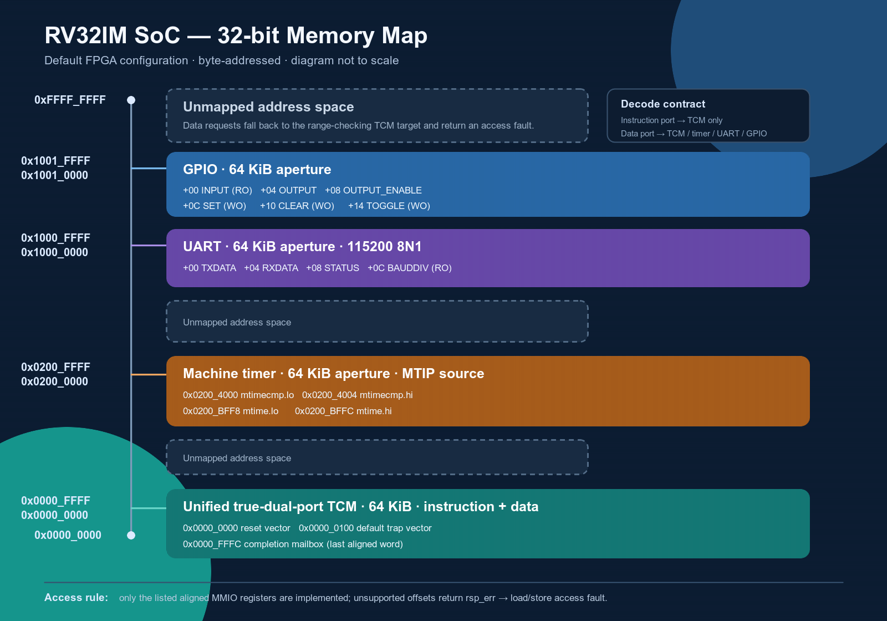

# RV32IM Core Architecture

This document defines the implemented architecture of the RV32IM five-stage
processor in this repository. It is an implementation specification: statements
here are derived from the checked-in RTL rather than from planned features or
superseded design alternatives.

The core is a synthesizable, single-hart, single-issue, in-order RV32IM
processor with a classic IF–ID–EX–MEM–WB pipeline. It implements the complete
RV32I base integer instruction set and RV32M multiply/divide extension, the six
Zicsr read-modify-write instructions over a documented CSR set, and a minimal
machine-mode environment with precise synchronous traps, machine-timer
interrupts, `MRET`, and a legal no-op implementation of `WFI`. This is
intentionally only a subset of the RISC-V Privileged Architecture.

For cycle-level hazard, stall, flush, and redirect behavior, see
[Pipeline and control](pipeline-control.md). Requirement traceability and the
current verification evidence are defined in
[Verification](verification.md), while the runtime, linker, trap ABI, and
firmware-image flow are defined in [Software](software.md). Board integration
is defined in [FPGA implementation](fpga.md); frozen implementation and
benchmark results belong to [Hardware validation](hardware-validation.md),
[Performance](performance.md), and [CoreMark](coremark.md).

## 1. Architectural profile

| Property | Implemented configuration |
|---|---|
| ISA | RV32I 2.1 + RV32M 2.0 |
| Additional instructions | Six Zicsr 2.0 operations, `MRET`, and no-op `WFI` |
| XLEN | 32 bits |
| Hart model | One hart, single issue, in order |
| Pipeline | IF, ID, EX, MEM, WB |
| Instruction encoding | Fixed 32-bit instructions; `IALIGN=32` |
| Endianness | Little-endian |
| Register file | 32 × 32-bit GPRs; two asynchronous reads and one synchronous write |
| Control-transfer resolution | EX stage |
| Memory architecture | Independent instruction and data request/response ports |
| Default memory system | 64 KiB TCM plus memory-mapped timer/UART/GPIO |
| Trap model | Precise synchronous exceptions and MTIP committed at WB |
| Execution environment | M-mode bare-metal and FreeRTOS subset |
| Interrupts | Single machine-timer source (`MTIE`/`MTIP`, cause 7) |
| Caches, MMU, PMP | Not implemented |

The baseline can accept and retire one instruction per cycle when there is no
data dependency requiring an interlock, no control redirect, no memory delay,
and no multicycle M-extension operation. This is a throughput capability, not
an application CPI claim.

<p align="center">
  
</p>

<p align="center"><em>FPGA SoC integration view: 75 MHz clocking, reset
synchronization, the five-stage RV32IM core, dual-port TCM, memory
demultiplexer, machine timer, UART, and GPIO. The peripheral register
contracts and memory map are defined in Sections 6–7.</em></p>

## 2. Design scope and compliance boundary

### 2.1 Implemented instruction scope

| Class | Instructions |
|---|---|
| Upper immediate | `LUI`, `AUIPC` |
| Integer immediate | `ADDI`, `SLTI`, `SLTIU`, `XORI`, `ORI`, `ANDI`, `SLLI`, `SRLI`, `SRAI` |
| Integer register-register | `ADD`, `SUB`, `SLL`, `SLT`, `SLTU`, `XOR`, `SRL`, `SRA`, `OR`, `AND` |
| Control transfer | `JAL`, `JALR`, `BEQ`, `BNE`, `BLT`, `BGE`, `BLTU`, `BGEU` |
| Loads | `LB`, `LH`, `LW`, `LBU`, `LHU` |
| Stores | `SB`, `SH`, `SW` |
| Memory ordering | `FENCE` |
| Environment | `ECALL`, `EBREAK` |
| RV32M multiply | `MUL`, `MULH`, `MULHSU`, `MULHU` |
| RV32M divide/remainder | `DIV`, `DIVU`, `REM`, `REMU` |
| CSR access | `CSRRW`, `CSRRS`, `CSRRC`, `CSRRWI`, `CSRRSI`, `CSRRCI` |
| Machine control | `MRET` and `WFI` within the documented M-mode subset |

<p align="center">
  
</p>

<p align="center"><em>Implemented RV32I/RV32M instruction boundary. The Zicsr
operations and minimal machine-mode control flow are summarized separately
below. Optional ISA, privilege, memory-system, and debug features are not
claimed.</em></p>

<p align="center">
  
</p>

<p align="center"><em>Implemented Zicsr CSR read/modify/write instruction
forms. The supported CSR addresses and access permissions are defined in
Section 3.2.</em></p>

The decoder validates the relevant opcode, `funct3`, and `funct7` fields.
Unsupported or reserved encodings generate an illegal-instruction exception
instead of being interpreted as a nearby legal operation.

`FENCE` is a legal ordering no-op in the implemented execution environment.
The current system is single-hart, uncached, blocking, and permits at most one
outstanding transaction per core memory port, so earlier memory operations have
completed before a later operation advances past them. `FENCE.I` belongs to
Zifencei and remains illegal because instruction-fetch synchronization for a
self-modifying or cached execution environment is outside this scope.

`WFI` is legal only at its exact implemented encoding and retires as a no-op.
The core does not enter a low-power state or stop instruction issue while
waiting for an interrupt.

### 2.2 Explicitly unsupported

The architecture does not implement:

- the C, A, F, D, V, B, or other optional ISA extensions;
- Zifencei and instruction-cache synchronization;
- machine software/external interrupt sources (`MSIP`/`MEIP`), interrupt
  prioritization beyond MTIP, or vectored `mtvec`;
- U-mode, S-mode, delegation, virtual memory, page tables, or `satp`;
- PMP, debug mode, triggers, or a JTAG debug transport;
- caches, coherency, branch prediction, speculative retirement, or multiple
  issue;
- AXI, AHB, APB, DDR, DMA, PLIC, or cache-coherent integration.

Passing RV32I/RV32M regressions does not imply official RISC-V certification or
full privileged-architecture compliance. The privilege claim is limited to
M-mode with `MIE/MPIE/MPP`, `MTIE/MTIP`, direct `mtvec`, precise trap entry,
and `MRET`; U/S modes, delegation, and the remaining interrupt sources are
outside scope.

## 3. Programmer-visible state

### 3.1 Integer state

The hart exposes 32 integer registers, `x0`–`x31`, and a 32-bit program
counter. Register `x0` always reads as zero and ignores writes. Registers
`x1`–`x31` have no architectural reset requirement; startup software must not
assume an initial value.

The register file has two combinational read ports and one rising-edge write
port. An explicit WB-to-ID bypass defines same-cycle read-after-write behavior
independently of FPGA memory inference semantics.

### 3.2 Implemented machine CSRs

| CSR | Address | Access | Implemented behavior |
|---|---:|---:|---|
| `mstatus` | `0x300` | RW/WARL | `MIE`/`MPIE` writable; `MPP` hardwired to M; all other fields zero |
| `misa` | `0x301` | RO | `MXL=1`; I and M bits set (`0x4000_1100`) |
| `mie` | `0x304` | RW/WARL | `MTIE` writable; `MSIE`/`MEIE` and other fields read zero |
| `mtvec` | `0x305` | RW | Direct mode only; low two bits are forced to zero |
| `mscratch` | `0x340` | RW | General trap-handler scratch register |
| `mepc` | `0x341` | RW | Faulting PC; low two bits are forced to zero |
| `mcause` | `0x342` | RW/WLRL subset | Bit 31 distinguishes interrupts; implemented code in bits `[4:0]` |
| `mtval` | `0x343` | RW | Fault address, target, instruction, or zero as listed below |
| `mip` | `0x344` | RW-addressed | Live read-only `MTIP`; writes are legal and have no effect |
| `mcycle` | `0xB00` | RW | Low half of a 64-bit cycle counter |
| `mcycleh` | `0xB80` | RW | High half of the cycle counter |
| `minstret` | `0xB02` | RW | Low half of a 64-bit retirement counter |
| `minstreth` | `0xB82` | RW | High half of the retirement counter |
| `mvendorid` | `0xF11` | RO | Reads zero |
| `marchid` | `0xF12` | RO | Reads zero |
| `mimpid` | `0xF13` | RO | Reads zero |
| `mhartid` | `0xF14` | RO | Reads zero for the single hart |
| `mconfigptr` | `0xF15` | RO | Reads zero |

`mcycle` normally increments once per non-reset clock, and `minstret` normally
increments once for each non-trapping instruction retired at WB. An explicit
write to either RV32 counter half suppresses the corresponding implicit 64-bit
counter increment on that edge and replaces only the addressed half.

CSR reads and legality checks occur in EX, but state changes occur only at WB.
`CSRRW` and `CSRRWI` always request a write. The set/clear forms suppress their
write when `rs1=x0` or `zimm=0`, allowing read-only CSR access without an
illegal write. Access to an unimplemented CSR, or an actual write to a read-only
CSR, raises an illegal-instruction exception.

`mstatus` resets with `MPP=M`, `MIE=0`, and `MPIE=0`. Precise trap entry saves
the previous global enable with `MPIE←MIE` and clears `MIE`. A committed `MRET`
restores `MIE←MPIE`, sets `MPIE←1`, keeps the single legal `MPP=M` value, and
redirects to `mepc`. `mie.MTIE` and the live `mip.MTIP` level jointly qualify
the only asynchronous source.

## 4. Microarchitecture

### 4.1 Top-level organization

<p align="center">
  <a href="images/pipeline-diagram.png">
    
  </a>
</p>

<p align="center"><em>High-level IF–ID–EX–MEM–WB stage sequence with
interstage hazard/bubble markers. Forwarding, hold, flush, and redirect paths
are not depicted here; they are specified in §§4.3–4.4 below and in
[Pipeline and control](pipeline-control.md).</em></p>

The four interstage registers are packed structures defined in
`rv32_pkg.sv` and owned by `rv32_core.sv`. Each packet carries a `valid` bit;
`valid=0` represents a bubble. Pipeline storage follows the same priority rule:

```text
reset > flush > enable > hold
```

Clearing a packet on reset or flush prevents invalid payload fields from
creating accidental dependencies or side effects.

### 4.2 Stage responsibilities

| Stage | Primary responsibilities |
|---|---|
| IF | Track PC, issue instruction requests, buffer one response, discard stale responses after redirects, and attach instruction access faults |
| ID | Strict decode, immediate generation, GPR reads, WB-to-ID bypass, illegal instruction detection, and creation of the ID/EX packet |
| EX | Operand forwarding, ALU execution, address generation, branch/jump/MRET resolution, CSR read-modify-write, and blocking MUL/DIV execution |
| MEM | Drive the LSU, wait for data responses, format load results, and attach load/store faults |
| WB | Commit GPR/CSR state, take precise traps, increment `minstret`, and emit the architectural trace |

The core is in order from fetch through commit. There is no reorder buffer,
scoreboard, speculative state checkpoint, or out-of-order completion path.
Multicycle EX and delayed MEM operations hold the owning pipeline packet until
their response is accepted.

<p align="center">
  <a href="images/schematic_rv32core.png">
    
  </a>
</p>

<p align="center"><em>Vivado synthesized hierarchy of the implemented core;
the architectural diagram remains the primary readability view.</em></p>

### 4.3 Data hazards and forwarding

Two independent EX operand muxes select the register-file snapshot, the newest
eligible EX/MEM result, or the final MEM/WB writeback value. EX/MEM has priority
over MEM/WB when both packets target the same source register. EX/MEM forwarding
supports ALU/MDU results, link values (`PC+4`), and old CSR values; loads are
excluded until their data reaches MEM/WB.

An immediately dependent load consumer receives one bubble with the default
one-cycle TCM. If memory takes longer, the blocking LSU and centralized
pipeline control extend the hold until the response arrives. Forwarded operands
are shared by ALU, branch/JALR comparison, store address/data, CSR, and MDU
consumers.

CSR ordering is address aware. A CSR instruction in ID waits only behind an
older ID/EX or EX/MEM writer to the same architectural CSR state. The low/high
halves of `mcycle` and `minstret` alias their respective 64-bit counters;
`minstret[h]` also waits for any older non-trapping retirement still in flight.
`MRET` waits only for an older write to `mepc`. A writer already in MEM/WB
commits on the edge that advances the reader to EX, so it adds no stall.

Detailed priority and timing examples are specified in
[Pipeline and control](pipeline-control.md).

### 4.4 Control transfers

Conditional branches, `JAL`, `JALR`, and `MRET` resolve in EX using forwarded
source operands. Branch and `JAL` targets are PC-relative. `JALR` computes
`rs1 + imm` and clears bit 0 before the `IALIGN=32` alignment check.

A taken transfer flushes the younger IF/ID and ID/EX packets. With the default
one-cycle TCM this produces two control bubbles. A not-taken conditional branch
does not redirect or flush. A taken target with either low address bit set
raises an instruction-address-misaligned exception on the control-transfer
instruction; no redirect is issued.

Fetch can have one request in flight. If a redirect or trap invalidates that
request, IF marks its response stale, drains it without exposing it to decode,
and preserves the pending target until the instruction port is free.

## 5. RV32M execution

### 5.1 Multiplication

The multiplier supports all four RV32M multiply operations. Operands are
extended to 33 bits according to the required signedness, registered, and
multiplied through a synthesis-friendly expression. A second registered stage
selects the low or high 32-bit architectural result. The request/response
interface allows one operation in flight and holds a completed result stable
until EX accepts it.

| Operation | Operand interpretation | Result |
|---|---|---|
| `MUL` | Low-half result is signedness independent | Product `[31:0]` |
| `MULH` | Signed × signed | Product `[63:32]` |
| `MULHSU` | Signed × unsigned | Product `[63:32]` |
| `MULHU` | Unsigned × unsigned | Product `[63:32]` |

The generic RTL does not instantiate a vendor primitive. The registered
multiply boundary permits FPGA synthesis to infer DSP resources while keeping
the core portable.

### 5.2 Division and remainder

`DIV`, `DIVU`, `REM`, and `REMU` share a blocking radix-2 restoring divider.
Normal operations produce one quotient bit per cycle for 32 iterations and
apply sign correction at the boundary. Signed quotient rounding is toward zero,
and a nonzero signed remainder has the dividend's sign.

RISC-V defines arithmetic results rather than traps for the two divider corner
cases:

| Condition | Quotient | Remainder |
|---|---:|---:|
| Divisor is zero | `0xFFFF_FFFF` | Original dividend |
| `INT_MIN / -1` | `0x8000_0000` | `0x0000_0000` |

These cases complete locally without entering the 32-iteration loop. Neither
case generates an exception. The divider also bypasses the iterative loop when
the dividend magnitude is smaller than the divisor magnitude, returning zero
for division or the original dividend for remainder.

## 6. Memory architecture

### 6.1 Core memory-port contract

The core exposes separate `rv32_mem_if` master ports for instruction and data
traffic. Each port uses a blocking request/response protocol:

| Signal | Direction from core | Meaning |
|---|---:|---|
| `req_valid` | Output | Request and payload are valid |
| `req_ready` | Input | Slave can accept the request |
| `req_addr[31:0]` | Output | Byte address; physical bus request is word aligned |
| `req_write` | Output | Data write request |
| `req_wdata[31:0]` | Output | Lane-aligned write data |
| `req_wstrb[3:0]` | Output | Active byte lanes |
| `rsp_valid` | Input | Response is available |
| `rsp_rdata[31:0]` | Input | Returned aligned word |
| `rsp_err` | Input | Access failed |

A request is accepted on `req_valid && req_ready`. The slave returns exactly
one ordered response for each accepted request, including stores. There is no
response-ready signal because a core master always consumes the external
response, buffering it internally when the downstream pipeline is held. Each
port permits at most one outstanding request, although a slave may return the
old response and accept a new request in the same cycle.

This interface is the architectural integration seam for replacing the TCM
with a cache or bus bridge. Any replacement must preserve ordering, response,
error, and killed-request-drain behavior at the core boundary.

### 6.2 Load/store unit

The LSU supports byte, halfword, and word accesses. It calculates byte strobes
and shifted write data for little-endian stores, and extracts and sign- or
zero-extends returned subwords for loads. The bus sees an aligned word address;
the original effective byte address remains attached to the instruction for
formatting, tracing, and fault reporting.

Misaligned halfword or word accesses trap locally and do not issue a memory
request. An aligned TCM-bound request outside the configured memory range, or
an invalid access reported by a selected MMIO slave, returns `rsp_err` and
becomes a load/store access fault. A request accepted before a kill cannot be
withdrawn: the LSU drains its response without exposing a stale result to the
pipeline.

### 6.3 Dual-port TCM and SoC fabric

The default `rv32_tcm` is a unified, true-dual-port memory:

- port A is a read-only instruction port;
- port B supports data reads and byte-enabled writes;
- both ports return a registered response one cycle after acceptance;
- instruction and data accesses can proceed concurrently;
- out-of-range accesses and invalid instruction-port requests return an error
  response;
- the memory array is not reset, preserving block-RAM inference;
- an optional word-oriented `$readmemh` image initializes simulation or FPGA
  block RAM.

Instruction traffic connects directly to TCM port A. Data traffic enters
`rv32_mem_demux`, which decodes TCM, timer, UART, and GPIO. It latches the
selected target only on a request handshake and keeps that target as response
owner until completion. One outstanding slot may retire an old response and
accept a new request in the same cycle, including a back-to-back target
change. Masked-region overlap is rejected during elaboration.

The default programmer-visible map is:

<p align="center">
  <a href="images/memory-map.png">
    
  </a>
</p>

<p align="center"><em>Default byte-addressed SoC map. Region heights are not
proportional; only the explicitly listed MMIO registers are implemented inside
each 64 KiB peripheral aperture.</em></p>

| Address | Device / register |
|---:|---|
| `0x0000_0000–0x0000_FFFF` | 64 KiB TCM |
| `0x0000_FFFC` | Retirement-qualified completion mailbox |
| `0x0200_4000/0x0200_4004` | `mtimecmp` low/high |
| `0x0200_BFF8/0x0200_BFFC` | `mtime` low/high |
| `0x1000_0000/04/08/0C` | UART TX/RX/status/baud-divisor |
| `0x1001_0000/04/08` | GPIO input/output/output-enable |
| `0x1001_000C/10/14` | GPIO atomic set/clear/toggle |

The timer increments once per active clock and drives the core's live MTIP
input when `mtime >= mtimecmp`. Its 64-bit registers are intentionally exposed
as aligned 32-bit halves. UART implements parameterized 8N1 TX/RX with one
buffered RX byte and sticky overrun/frame-error status. GPIO synchronizes
external inputs and supports byte-enabled output operations.

`soc_tcm_top` exposes UART/GPIO pins, retirement, performance counters, and
test status. Its principal parameters include:

| Parameter | Default | Purpose |
|---|---:|---|
| `RESET_VECTOR` | `0x0000_0000` | First fetch address after reset |
| `TRAP_VECTOR` | `0x0000_0100` | Reset value of direct-mode `mtvec` |
| `TCM_BYTES` | 64 KiB | Unified TCM capacity |
| `TCM_BASE_ADDR` | `0x0000_0000` | TCM base byte address |
| `TCM_INIT_FILE` | Empty | Optional word-oriented initialization image |
| `TIMER_BASE_ADDR` | `0x0200_0000` | 64 KiB timer aperture |
| `UART_BASE_ADDR` | `0x1000_0000` | 64 KiB UART aperture |
| `UART_CLK_FREQ_HZ` | 50 MHz | SoC-level UART input-clock default; the FPGA wrapper overrides it with 75 MHz |
| `UART_BAUD_RATE` | 115,200 | UART line rate |
| `GPIO_BASE_ADDR` | `0x1001_0000` | 64 KiB GPIO aperture |
| `GPIO_WIDTH` | 32 | Implemented GPIO pin count |
| `TEST_STATUS_ADDR` | Last TCM word | Completion mailbox address |
| `TEST_PASS_VALUE` | `1` | Passing mailbox value |

The completion mailbox observes a retired aligned full-word store, not the raw
data request. Therefore a wrong-path, faulting, or squashed store cannot report
false completion. This mailbox is SoC observability logic and is not RISC-V
architectural state.

### 6.4 Reset contract

`rv32_core` and `soc_tcm_top` consume a synchronous, active-high `rst_i`. Core
architectural state, pipeline-valid bits, CSRs, counters, and the completion
mailbox enter reset state only on a rising clock edge. The TCM array itself is
deliberately not reset; firmware is supplied through its initialization image
or by the simulation harness.

Reset does not cancel an externally accepted transaction. If a pre-reset IF or
LSU request still owns a response, the corresponding core master retains only
the protocol bookkeeping needed to discard that response and suppresses new
issue until the drain completes. A replacement memory system must therefore
preserve exactly one response for every accepted request across core reset.

At the FPGA boundary, `reset_sync` converts the combined clock-boundary reset,
user SoC reset, and clock-lock indication into the functional SoC reset. Only
its synchronization pipeline captures the active-low event asynchronously;
the functional reset delivered to the SoC is a separate register without
asynchronous control. Consequently, both assertion and deassertion observed by
the CPU occur only on rising edges of the generated 75 MHz SoC clock. The
default wrapper uses two synchronization stages.

Any alternative integration must preserve the synchronous `rst_i` contract and
must not introduce asynchronous reset controls into the TCM address, data, or
write-enable paths.

## 7. Precise traps and machine-timer interrupt

<p align="center">
  
</p>

<p align="center"><em>Conceptual trap/MRET control flow: a synchronous
exception or an eligible MTIP interrupt enters common trap entry
(`mepc`/`mcause`/`mtval` capture, `MPIE←MIE`, `MIE←0`, `MPP=M`), and a
committed `MRET` restores `MIE←MPIE` and returns to `mepc`. This is a
conceptual overview; cycle-level ordering and priority are defined below and
in [Pipeline and control §6](pipeline-control.md#6-precise-traps-and-mtip-injection).</em></p>

### 7.1 Implemented exception causes

| Cause | Code | Detection point | `mtval` value |
|---|---:|---|---|
| Instruction address misaligned | 0 | EX control-transfer target check | Misaligned target |
| Instruction access fault | 1 | IF memory response | Faulting fetch address |
| Illegal instruction | 2 | ID decode or EX CSR access | Instruction bits |
| Breakpoint | 3 | ID (`EBREAK`) | Instruction PC |
| Load address misaligned | 4 | MEM/LSU | Effective address |
| Load access fault | 5 | MEM/LSU | Effective address |
| Store address misaligned | 6 | MEM/LSU | Effective address |
| Store access fault | 7 | MEM/LSU | Effective address |
| Environment call from M-mode | 11 | ID (`ECALL`) | Zero |

Exceptions are carried in the same pipeline packet as the faulting instruction.
The first exception attached to a packet wins over later checks. When a new
exception is detected, younger packets are flushed and the front end stops
while the faulting packet drains to WB. Older instructions retain normal
program-order completion.

The only asynchronous source is machine timer interrupt code 7. It becomes
eligible when the live timer level drives `mip.MTIP=1`, `mie.MTIE=1`, and
`mstatus.MIE=1`. Eligibility is sampled at the ID instruction boundary. The
core replaces that next architectural instruction with a synthetic interrupt
packet whose PC becomes `mepc`; an exception already attached to the boundary
instruction wins instead.

An older in-flight writer to `mstatus` or `mie`, or an older `MRET`, stalls
interrupt injection until WB. At that exact commit boundary, the CSR file's
prioritized next state is used, so enabling can take a pending interrupt
immediately and disabling cannot leak one into the shadow window. Ambiguous
states default to no injection.

At WB, a trapping packet:

1. writes the aligned faulting PC to `mepc`;
2. writes the interrupt flag and implemented cause to `mcause`;
3. writes the documented value to `mtval`;
4. suppresses GPR, CSR, and memory side-effect metadata;
5. does not increment `minstret`;
6. redirects fetch to the aligned direct-mode `mtvec` value.

Trap entry also performs `mstatus.MPIE←mstatus.MIE`, clears `mstatus.MIE`, and
keeps the only implemented `MPP=M` value. Interrupt `mtval` is zero. A timer
trap preserves the interrupted boundary PC, whereas software deciding to
resume after a synchronous fixed-width ECALL normally advances `mepc` by four.

An older WB trap or MEM exception has priority over younger EX work and control
redirects. Stores are allowed to reach the data port only after older hazards
and exceptions can no longer invalidate them. These ordering rules ensure that
wrong-path and faulting instructions do not create architectural state.

`MRET` redirects to aligned `mepc` in EX and changes CSR state only when it
commits at WB. Commit restores `MIE←MPIE`, sets `MPIE←1`, and retains `MPP=M`.
This split keeps wrong-path or faulting `MRET` instructions from changing the
interrupt stack.

## 8. Architectural retirement interface

### 8.1 Retirement trace

`rv32_core` exports one stable observation point at MEM/WB. `trace_valid_o`
marks either a non-trapping retirement or a trap event; `trace_trap_o`
distinguishes the latter.

| Trace field | Meaning |
|---|---|
| `trace_pc_o`, `trace_insn_o` | Retiring/trapping packet identity; synthetic MTIP uses the interrupted boundary PC and a zero instruction payload |
| `trace_rd_we_o` | Architectural GPR write enable |
| `trace_rd_addr_o`, `trace_rd_data_o` | Destination register and committed value |
| `trace_mem_addr_o` | Effective address for a completed load or store; `trace_mem_wstrb_o` distinguishes stores |
| `trace_mem_wstrb_o`, `trace_mem_wdata_o` | Retired store byte lanes and data |
| `trace_trap_o`, `trace_cause_o` | Synchronous or timer-interrupt trap event and cause |
| `trace_is_interrupt_o` | Distinguishes the MTIP trap from a synchronous exception |
| `trace_control_o` | Retired control-transfer instruction |
| `trace_taken_o`, `trace_target_o` | Taken state and resolved target |

The trace is not a debug-mode implementation and does not alter architectural
execution. It decouples verification, software completion, and future
differential checking from internal pipeline-register names.

### 8.2 Diagnostic performance counters

The core also exports 64-bit, reset-to-zero diagnostic counters. They are
read-only integration outputs, are not additional RISC-V CSRs, and do not feed
back into pipeline control.

| Output | Counted event |
|---|---|
| `perf_cycle_o`, `perf_instret_o` | Active cycles and non-trapping WB retirements |
| `perf_load_use_stall_o`, `perf_csr_stall_o` | Effective load-use and CSR/interrupt-state stall cycles |
| `perf_mdu_stall_o`, `perf_mem_stall_o` | Effective MDU and data-memory stall cycles |
| `perf_redirect_o`, `perf_squash_o` | Accepted EX redirects and valid younger packets discarded by them |

The stall categories follow controller age priority and are mutually
exclusive. Redirect and squash values are event/packet counts rather than
stall cycles. Their measurement contract and frozen values are defined in
[Performance](performance.md) and [CoreMark](coremark.md).

## 9. Module ownership

| RTL block | Architectural responsibility |
|---|---|
| `rv32_pkg` | ISA constants, control enums, exception type, and pipeline packets |
| `rv32_core` | Pipeline integration, interstage storage, commit, and trace |
| `if_stage` | Fetch request tracking, PC sequencing, redirect recovery, and fetch faults |
| `decoder`, `imm_gen`, `id_stage`, `regfile` | Instruction decode and operand preparation |
| `alu`, `branch_unit`, `ex_stage` | Integer execution, address generation, control resolution, and CSR RMW |
| `forwarding_unit`, `hazard_unit`, `pipeline_ctrl` | Dependency handling and global pipeline ordering |
| `mul_unit`, `div_unit` | Blocking RV32M execution |
| `lsu` | Load/store formatting, protocol handling, and data faults |
| `csr_file` | CSR WARL state, counters, interrupt qualification, trap/MRET transitions |
| `rv32_tcm`, `rv32_mtimer` | Unified TCM and memory-mapped 64-bit machine timer |
| `rv32_uart`, `rv32_gpio` | Project-defined serial and general-purpose I/O |
| `rv32_mem_demux`, `soc_tcm_top` | Response-safe MMIO fabric and complete SoC integration |
| `reset_sync`, `fpga_top` | Board reset boundary and FPGA-visible status |

The synthesizable core source order is maintained in `files/core.f`; the SoC
and FPGA additions are maintained in `files/fpga.f`. No verification-only
behavior is instantiated inside `rv32_core`.

## 10. Baseline timing characteristics

These values describe the implemented microarchitecture under the default TCM;
they are not workload benchmark results.

| Event | Baseline behavior |
|---|---|
| Independent instruction stream | Up to one issue and one retirement per cycle |
| TCM request | Registered response one cycle after acceptance |
| Peripheral request | Registered response; UART TX may backpressure while busy |
| Immediate load consumer | One interlock bubble with one-cycle TCM |
| Not-taken conditional branch | No redirect bubble |
| Taken branch, `JAL`, `JALR`, or `MRET` | Two younger packets flushed |
| Multiply | Registered two-stage request/response operation |
| Normal divide/remainder | 32 restoring iterations |
| Divide-by-zero, signed overflow, or smaller dividend magnitude | Local result without iterative run |
| Outstanding transactions | At most one per core memory port |
| Timer interrupt | Sampled between instructions and committed as a precise trap packet |

Application CPI depends on instruction mix, dependencies, control flow, and
memory latency. Software can measure a defined interval using the 64-bit
`mcycle` and `minstret` counters. Current frozen measurements are reported in
[Performance](performance.md), [CoreMark](coremark.md), and
[Hardware validation](hardware-validation.md), not duplicated here.

## 11. Integration and extension boundaries

The implementation exposes deliberate seams for future work without claiming
those features today:

- a cache or bus bridge may replace the TCM behind the two blocking memory
  interfaces;
- the retirement trace can drive a differential checker or debug bridge;
- software/external interrupts require new pending sources, prioritization,
  additional `mie/mip` bits, and a controller such as a PLIC;
- caches require Zifencei behavior and a defined instruction/data coherence
  policy;
- higher privilege modes require the corresponding architectural state,
  protection, delegation, and address translation rather than isolated CSR
  additions.

Changes at these seams must preserve in-order commit, precise exceptions,
request/response accounting, and stale-response draining.

## 12. Normative references

The architectural behavior implemented here was reviewed against the official
RISC-V ratified specifications:

- [RV32I Base Integer Instruction Set, Version 2.1](https://docs.riscv.org/reference/isa/unpriv/rv32.html)
- [M Extension for Integer Multiplication and Division, Version 2.0](https://docs.riscv.org/reference/isa/unpriv/m-st-ext.html)
- [Zicsr Extension for CSR Instructions, Version 2.0](https://docs.riscv.org/reference/isa/unpriv/zicsr.html)
- [Machine-Level ISA](https://docs.riscv.org/reference/isa/priv/machine.html)
- [Privileged CSR conventions](https://docs.riscv.org/reference/isa/priv/priv-csrs.html)

The RISC-V specifications define architectural behavior. The checked-in RTL is
the source of truth for microarchitectural latency, interface timing, supported
CSR subset, SoC parameters, and implementation-specific observability.
