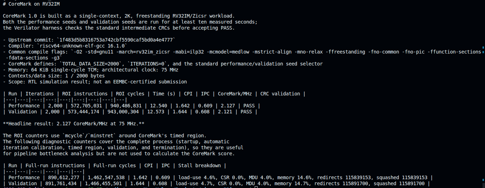
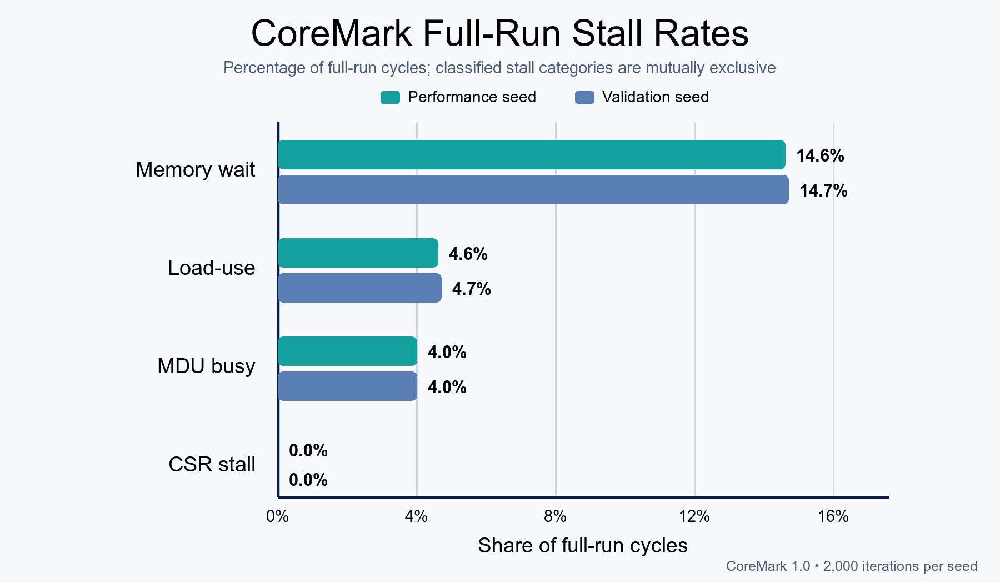
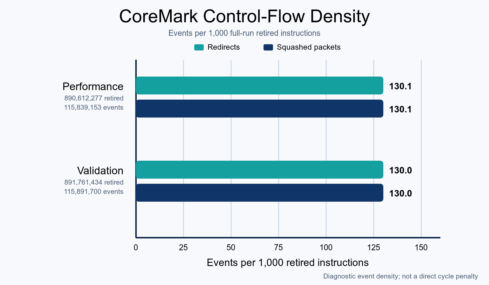

# CoreMark 1.0 on RV32IM

The frozen CoreMark performance-seed result is **2.127 CoreMark/MHz** at the
architectural 75 MHz clock. This document records the source provenance, build
configuration, measurement boundary, CRC acceptance, and diagnostic counters
behind that number. It is an RTL-simulation engineering result, not an
EEMBC-certified submission.

## 1. Source and build configuration

| Item | Frozen configuration |
|---|---|
| Benchmark | EEMBC CoreMark 1.0 |
| Upstream commit | `1f483d5b8316753a742cbf5590caf5bd0a4e4777` |
| Port | Project freestanding RV32IM port under `sw/coremark/` |
| Compiler | `riscv64-unknown-elf-gcc 16.1.0` |
| ISA / ABI | `rv32im_zicsr` / `ilp32` |
| Contexts | 1 |
| Data profile | Standard 2K profile; `TOTAL_DATA_SIZE=2000` |
| Iterations | `ITERATIONS=0` automatic calibration; selected result is 2,000 |
| Memory | 64 KiB true-dual-port TCM, registered one-cycle response, no cache |
| Measurement clock | 75,000,000 architectural cycles per second |

Code-generation flags are:

```text
-O2 -std=gnu11 -march=rv32im_zicsr -mabi=ilp32 -mcmodel=medlow
-mstrict-align -mno-relax -ffreestanding -fno-common -fno-pic
-ffunction-sections -fdata-sections -g3
```

The image is statically linked without hosted libc or default startup. The five
upstream benchmark sources and `coremark.h` are unmodified and
checksum-pinned. Their integrity gate is:

```sh
make -C sw coremark-check
```

## 2. Measurement and acceptance

The project port uses stable 64-bit `mcycle`/`minstret`
reads around CoreMark's timed region. The report block records iterations,
cycles, retired instructions, run type, clock, CRCs, and validation status.
The bare-metal harness accepts the result only after a retirement-qualified
PASS store.

The timed duration is calculated from architectural cycles:

```text
seconds      = ROI cycles / 75,000,000
CPI          = ROI cycles / ROI retired instructions
CoreMark/MHz = iterations × 1,000,000 / ROI cycles
```

Both seed sets exceed CoreMark's ten-second minimum measured interval. Before
PASS, the harness checks report magic/version, run type, clock, nonzero
iteration/instruction counts, `valid=1`, `errors=0`, and the
following intermediate CRCs:

| Run | Seed CRC | List CRC | Matrix CRC | State CRC |
|---|---:|---:|---:|---:|
| Performance | `0xE9F5` | `0xE714` | `0x1FD7` | `0x8E3A` |
| Validation | `0x18F2` | `0xE3C1` | `0x0747` | `0x8D84` |

## 3. Region-of-interest results

| Run | Iterations | ROI instructions | ROI cycles | Time (s) | CPI | IPC | CoreMark/MHz | CRC |
|---|---:|---:|---:|---:|---:|---:|---:|---|
| Performance | 2,000 | 572,705,031 | 940,486,831 | 12.540 | 1.642 | 0.609 | **2.127** | PASS |
| Validation | 2,000 | 573,444,174 | 943,000,304 | 12.573 | 1.644 | 0.608 | 2.121 | PASS |

The performance-seed row is the reported headline. The validation-seed run is
retained as an independent data-pattern cross-check; it is not averaged into
the headline score.

<p align="center">
  <a href="images/coremark-log.png">
    
  </a>
</p>

<p align="center"><em>Generated CoreMark report containing build provenance,
ROI metrics, CRC disposition, and complete-run diagnostics.</em></p>

## 4. Complete-run diagnostics

The counters below span reset release through completion. They include startup,
automatic iteration calibration, the timed region, result validation, and
termination. They are useful for bottleneck diagnosis but are not inputs to the
CoreMark score.

| Run | Full-run instructions | Full-run cycles | CPI | IPC | Stall/event breakdown |
|---|---:|---:|---:|---:|---|
| Performance | 890,612,277 | 1,462,547,538 | 1.642 | 0.609 | load-use 4.6%, CSR 0.0%, MDU 4.0%, memory 14.6%, redirects 115,839,153, squashed 115,839,153 |
| Validation | 891,761,434 | 1,466,455,501 | 1.644 | 0.608 | load-use 4.7%, CSR 0.0%, MDU 4.0%, memory 14.7%, redirects 115,891,700, squashed 115,891,700 |

The largest classified stall component is blocking data-memory service,
followed by load-use and MDU occupancy. Redirect and squash values are event
and packet counts rather than stall-cycle percentages. Exact counter semantics
are defined in [Directed performance](performance.md#11-diagnostic-counter-semantics).

<p align="center">
  <a href="images/performance/coremark-stall-rates.png">
    
  </a>
</p>

<p align="center"><em>Classified full-run stall-cycle rates for both frozen
seeds. Categories follow the mutually exclusive counter contract.</em></p>

<p align="center">
  <a href="images/performance/coremark-control-density.png">
    
  </a>
</p>

<p align="center"><em>Control-flow event density for both seeds per 1,000
full-run retired instructions. Redirect and squash counts are events, not
direct cycle costs.</em></p>

## 5. Reproduction and claim boundary

Run both seed sets and regenerate the report with:

```sh
make coremark
```

This is intentionally a long RTL simulation because each measured region must
represent at least ten architectural seconds. Generated software artifacts
remain below `/tmp/rv32im-core-software-*`.

The score assumes the documented compiler, port, memory latency, single-context
configuration, and 75 MHz architectural clock. It is not a board stopwatch
measurement, an Fmax result, a power/energy measurement, or evidence of
performance under caches, external buses, an RTOS, or multiple contexts. The
matching frozen summary and routed-clock scope are recorded in
[Hardware validation §§4–5](hardware-validation.md#4-performance-evidence).
