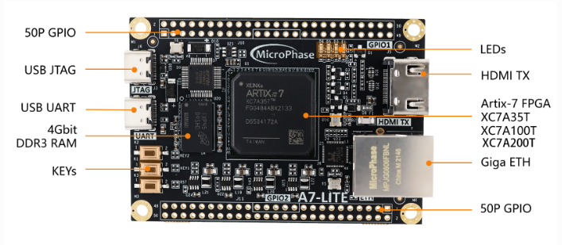
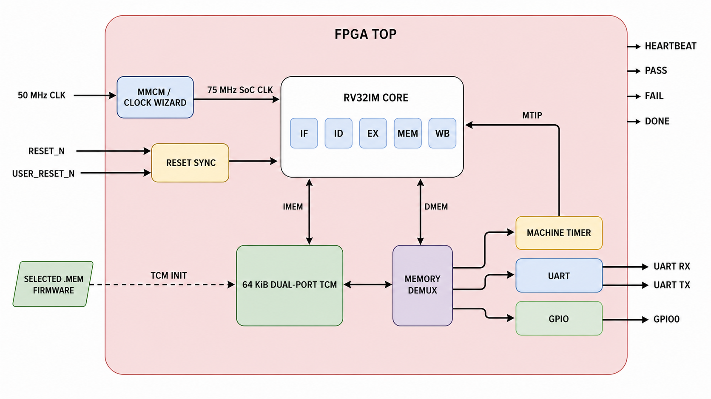
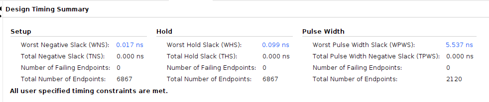

# FPGA Implementation and Hardware Bring-Up

This document defines the implemented FPGA platform for the RV32IM five-stage
core. It is the top-level hardware integration and sign-off guide for the
checked-in RTL, constraints, firmware image, implementation evidence, and
physical-board smoke test. Planned peripherals and unverified performance
claims are intentionally excluded.

The programmer-visible processor contract is defined in
[Architecture](architecture.md), cycle-level ordering in
[Pipeline and control](pipeline-control.md), verification evidence in
[Verification](verification.md), and the runtime and image format in
[Software](software.md).

## 1. Implemented platform

| Property | Baseline configuration |
|---|---|
| Board | MicroPhase A7-Lite R1.1 |
| Confirmed FPGA | AMD/Xilinx Artix-7 `xc7a35tfgg484-2` |
| Synthesis top | `fpga_top` |
| Tool used for the reviewed snapshot | Vivado 2024.1 |
| System clock | 50 MHz single-ended oscillator |
| Clock period constraint | 20.000 ns |
| Functional clock domains | One |
| Processor | Single-hart, single-issue, in-order RV32IM core |
| Memory | Unified 64 KiB true-dual-port TCM inferred in block RAM |
| Firmware boot | Bitstream-initialized TCM using a word-oriented `.mem` file |
| Board observability | Heartbeat and PASS LEDs; active-high FAIL and DONE on JP2 |

<p align="center">
  
</p>

<p align="center"><em>MicroPhase A7-Lite R1.1 target board. Only the FPGA,
50 MHz oscillator, reset, status LEDs, JTAG, and JP2 status pins are used by
this integration.</em></p>

The FPGA target preserves the project scope rather than turning the core into a
larger board-support design. DDR3/MIG, caches, AXI/AHB/APB, UART, interrupts,
debug transport, Ethernet, and HDMI are not instantiated.

<p align="center">
  
</p>

<p align="center"><em>Implemented FPGA boundary: synchronized reset, one
five-stage RV32IM core, independent instruction/data ports, and one
firmware-initialized dual-port TCM.</em></p>

## 2. Integration contract

### 2.1 Module ownership

| Block | FPGA responsibility |
|---|---|
| `fpga_top` | Board clock/reset boundary, heartbeat, status polarity, and synthesis top |
| `reset_sync` | Asynchronous reset-event capture and synchronous functional reset generation |
| `soc_tcm_top` | Core/TCM integration, retirement trace pass-through, and sticky completion mailbox |
| `rv32_tcm` | Independent instruction and data ports over one inferred block-RAM array |
| `rv32_core` | RV32IM pipeline, architectural state, traps, and retirement trace |

The FPGA source order is defined by `files/fpga.f`; the board constraints are
defined by `constraint/main.xdc`. Verification-only logic is not instantiated
inside the core. The mailbox and status mapping are SoC observability features,
not RISC-V architectural state.

### 2.2 Top-level configuration

| `fpga_top` parameter | Default | Contract |
|---|---:|---|
| `RESET_VECTOR` | `0x0000_0000` | First instruction address after reset |
| `TRAP_VECTOR` | `0x0000_0100` | Reset value of direct-mode `mtvec` |
| `TCM_BYTES` | 64 KiB | Unified instruction/data memory capacity |
| `TCM_BASE_ADDR` | `0x0000_0000` | TCM byte-address base |
| `TCM_INIT_FILE` | Empty | Synthesis-time word-oriented firmware image |
| `TEST_STATUS_ADDR` | Last TCM word | Completion mailbox address |
| `TEST_PASS_VALUE` | `0x0000_0001` | Value classified as PASS |
| `RESET_SYNC_STAGES` | 2 | Private reset synchronizer depth |
| `HEARTBEAT_WIDTH` | 24 | Heartbeat counter width |

The production configuration requires a word-sized TCM, at least two reset
synchronizer stages, a nonzero heartbeat width, aligned reset/trap/mailbox
addresses, and a mailbox contained within the implemented TCM.

## 3. Clock and reset architecture

### 3.1 Clock contract

The board oscillator drives `clk_50m_i` directly. `main.xdc` creates one
20.000 ns primary clock on package pin J19. The current design has no generated
clock, clock divider, PLL/MMCM, or functional clock-domain crossing.

Every core, TCM, mailbox, and status register is clocked from this one domain.
The heartbeat is a clock-enable-style counter output; it does not create a new
clock.

### 3.2 Reset contract

The K3 input `reset_ni` is an asynchronous, active-low board event. It is not
distributed as a functional asynchronous reset:

1. `reset_ni` asynchronously clears only the private synchronizer chain.
2. The synchronizer registers carry `ASYNC_REG="TRUE"` and
   `SHREG_EXTRACT="NO"` attributes.
3. A separate register with no asynchronous control generates active-high
   `soc_rst`.
4. Both assertion and deassertion observed by the CPU/SoC therefore occur on a
   rising edge of `clk_50m_i`.
5. With the default `RESET_SYNC_STAGES=2`, release takes three rising edges
   after `reset_ni` becomes inactive: two synchronization stages plus the
   functional-reset register.

The functional-reset register has FPGA initialization value `1`, holding the
SoC in reset immediately after configuration. A runtime button press clears the
private chain asynchronously; `soc_rst` asserts on the next clock edge.

The TCM storage array is deliberately not reset. This preserves block-RAM
inference and the bitstream initialization image. Reset clears processor and
mailbox state, but it does not restore TCM locations modified by software. A
bitstream reconfiguration, or a future explicit loader, is required to reload
the original image.

## 4. TCM and firmware boot

### 4.1 Memory organization

The default TCM covers `0x0000_0000` through `0x0000_FFFF` and contains 16,384
32-bit words.

| Region | Default address | Purpose |
|---|---:|---|
| Reset/startup | `0x0000_0000` | Reset vector and startup code |
| Direct trap entry | `0x0000_0100` | Reset value of `mtvec` |
| Application image | `0x0000_0400` onward | Text, read-only data, and writable data |
| Reserved stack | `0x0000_EF00`–`0x0000_FEFF` | Downward-growing 4 KiB stack |
| Completion mailbox | `0x0000_FFFC` | Final aligned word in the TCM |

Port A is a read-only instruction port. Port B supports data reads and
byte-enabled writes. Both ports are always ready and return a registered
response one cycle after a request. Out-of-range or unaligned TCM requests
return an error; architectural misalignment is detected earlier by the core.

The unified array permits concurrent instruction and data accesses. The
software environment does not use self-modifying code, and the core does not
implement Zifencei; instruction/data coherence after modifying executable TCM
contents is therefore outside the supported contract.

### 4.2 Image contract

Build the freestanding RV32IM/Zicsr firmware images from the repository root:

```sh
make -C sw BUILD_DIR=../build/software all
```

For the standard hardware smoke test, use:

```text
build/software/smoke.mem
```

The file contains exactly 16,384 lines of eight hexadecimal digits, one
little-endian 32-bit TCM word per line. Add it to the Vivado project as a memory
initialization source and set the `fpga_top` parameter `TCM_INIT_FILE` to its
synthesis-visible path. The parameter must not remain empty for a bootable
bitstream.

Vivado maps the constant `$readmemh` image into block-RAM INIT attributes.
Changing the firmware image changes the configured memory contents and requires
a new synthesis/implementation/bitstream run in the current flow.

### 4.3 Completion protocol

Firmware returns a result through one aligned full-word store to
`TEST_STATUS_ADDR`. The default PASS value is `0x0000_0001`; any other committed
value is classified as FAIL.

Completion is observed from the architectural retirement trace, not from a raw
data-port request. The monitor requires:

```text
trace_valid && !trace_trap
&& trace_mem_wstrb == 4'b1111
&& trace_mem_addr == TEST_STATUS_ADDR
```

Consequently, a wrong-path, squashed, misaligned, or faulting store cannot
produce a false PASS. The first valid status is sticky until reset.

## 5. Board interface and constraints

All physical mappings below come from `constraint/main.xdc` for the A7-Lite
R1.1 target.

| Function | RTL port | Board location | FPGA pin | Polarity | I/O standard |
|---|---|---|---|---|---|
| System clock | `clk_50m_i` | 50 MHz oscillator | J19 | Rising-edge clock | LVCMOS33 |
| Reset | `reset_ni` | K3 | L18 | Active low | LVCMOS33 |
| Running/heartbeat | `led1_n_o` | D6 / LED1 | M18 | Active low | LVCMOS33 |
| PASS | `led2_n_o` | D5 / LED2 | N18 | Active low | LVCMOS33 |
| FAIL | `fail_o` | JP2 pin 1 / GPIO2_0P | W21 | Active high | LVCMOS33 |
| DONE | `done_o` | JP2 pin 2 / GPIO2_0N | W22 | Active high | LVCMOS33 |

The XDC also sets `CFGBVS=VCCO` and `CONFIG_VOLTAGE=3.3`. Status outputs use
8 mA drive and slow slew. They are human-observable or logic-analyzer signals,
not a source-synchronous external interface, so the XDC excludes only these
output paths from timing analysis rather than inventing output-delay
requirements.

The asynchronous reset input is false-pathed at the package boundary; only the
synchronizer accepts that asynchronous event. The synchronizer structure and
attributes must still be reviewed with CDC and post-route reports—a timing
exception is not a substitute for a correct circuit.

### 5.1 Visible status states

| State | D6 heartbeat | D5 PASS | JP2 FAIL | JP2 DONE |
|---|---|---|---|---|
| Reset | Off | Off | Low | Low |
| Running | Toggles | Off | Low | Low |
| Passed | Off | On | Low | High |
| Failed | Off | Off | High | High |

At 50 MHz with `HEARTBEAT_WIDTH=24`, D6 has a full blink period of approximately
0.336 seconds. The standard `smoke` firmware can finish before the first visible
transition, so PASS/DONE—not a visible heartbeat—is the primary quick-smoke
oracle. Use a non-completing loop image or a deliberately smaller heartbeat
counter only when demonstrating liveness.

## 6. Vivado implementation flow

### 6.1 Project inputs

Use generated Vivado project files; do not treat `.xpr`, run databases, or
checkpoints as source. Reconstruct the project from these checked-in inputs:

| Input | Required setting |
|---|---|
| `files/fpga.f` | Ordered SystemVerilog RTL manifest |
| `constraint/main.xdc` | A7-Lite R1.1 pins, clock, voltage, and exceptions |
| `build/software/smoke.mem` | Selected BRAM initialization image |
| Top module | `fpga_top` |
| Project part | `xc7a35tfgg484-2` |
| Top parameter | `TCM_INIT_FILE` set to the selected project-visible `.mem` file |

Do not select a similar package or speed grade based only on a board-family
name. Confirm the marking on the populated FPGA before implementation. Expand
the nested `-f files/core.f` entry in `files/fpga.f` and add the listed `.sv`
files as SystemVerilog sources; the `.f` manifests are source-order metadata,
not HDL design units.

### 6.2 Run sequence

1. Build and simulate the selected firmware image.
2. Create a Vivado RTL project for `xc7a35tfgg484-2`.
3. Add the SystemVerilog sources in `files/fpga.f` order and set `fpga_top` as
   the synthesis top.
4. Add `constraint/main.xdc` and the selected `.mem` initialization file.
5. Set `TCM_INIT_FILE`, then elaborate and review top-level ports and parameter
   values.
6. Run synthesis; review inferred RAM/DSP structures, latches, warnings, and
   the clock/reset topology.
7. Run placement and routing; review timing, route status, DRC, methodology,
   CDC, utilization, and power reports.
8. Generate the bitstream only after implementation sign-off checks pass.

After `impl_1` completes, create a review package from the open Vivado project:

```tcl
source {/absolute/path/to/scripts/vivado/collect_impl_reports.tcl}
```

The script records project/run properties and produces timing setup/hold,
timing-summary, `check_timing`, utilization, DRC, methodology, power, clock,
route-status, CDC, exception, and effective-XDC reports. It writes a timestamped
`vivado_review_*` directory, which is intentionally ignored by Git.

### 6.3 Required implementation review

A successful `write_bitstream` message alone is insufficient. Review at least:

- the project part, top module, Vivado version, and firmware image;
- complete routing with zero routed-net errors;
- positive setup and hold slack at 20.000 ns;
- no unexplained unconstrained internal endpoints;
- block-RAM inference for the 64 KiB TCM and DSP inference for multiplication;
- all DRC, methodology, CDC, and timing-exception messages;
- pin assignments, voltage standards, and active-low LED polarity;
- vectorless power as an estimate, not a board measurement.

AMD documents `report_timing_summary` as the implemented-design timing sign-off
report and requires route status to establish that routed delays are being
used. `check_timing` and exception review are also required to detect missing
or inappropriate constraints.

## 7. Verification before hardware

Run the FPGA-focused regression:

```sh
make fpga
```

| Test | DUT boundary | Main checks | Current result |
|---|---|---|---:|
| `tb_reset_sync` | Reset synchronizer | Power-up reset, asynchronous event capture, staged synchronous release, runtime reset | 15 checks PASS |
| `tb_soc_tcm_top` | Core + TCM + mailbox | Image initialization, instruction/data operation, retirement-qualified sticky PASS/FAIL, trap isolation | 32 checks PASS |
| `tb_fpga_top` | Complete FPGA wrapper | Reset blanking, image boot, heartbeat, active-low LEDs, active-high FAIL/DONE | 33 checks PASS |

The full release regression remains:

```sh
make test
make act4
```

`make test` includes strict lint of `reset_sync` and `fpga_top`, all RTL
simulations, bare-metal tests, and the pinned RV32I/RV32M `riscv-tests`
portfolio. ACT4 is a separate Sail-backed architectural gate. These simulation
results establish functional confidence but do not replace implementation or
physical-board evidence.

## 8. Reviewed implementation result

The latest recorded local implementation was generated on 2026-08-11 with
Vivado 2024.1 for the confirmed `xc7a35tfgg484-2` device.

| Metric | Post-route result |
|---|---:|
| Clock target | 50 MHz / 20.000 ns |
| Setup WNS / TNS | +3.382 ns / 0.000 ns |
| Hold WHS / THS | +0.064 ns / 0.000 ns |
| Slice LUTs | 2,881 / 20,800 (13.85%) |
| Slice registers | 1,580 / 41,600 (3.80%) |
| Block RAM tiles | 16 / 50 (32.00%) |
| DSP48E1 blocks | 4 / 90 (4.44%) |
| Routed nets with errors | 0 |
| Unconstrained internal endpoints | 0 |
| Estimated on-chip power | 0.110 W, medium-confidence vectorless estimate |

<p align="center">
  <a href="images/timing_report.png">
    
  </a>
</p>

<p align="center"><em>Reviewed post-route timing summary for the documented
Vivado 2024.1 implementation snapshot.</em></p>

The design completed synthesis, placement, routing, and bitstream generation
with positive setup and hold slack. Eight advisory DSP pipelining DRC messages
and methodology recommendations concerning wide multipliers and BRAM
byte-write inference remain recorded optimization guidance; they are not
silently waived and do not prevent closure at 50 MHz.

Evidence captured in the repository:

| Evidence | Reviewed artifact |
|---|---|
| Timing | [Post-route timing summary](images/timing_report.png) |
| Hierarchical utilization | [Utilization report](images/utilization_report.png) |
| Placement/routing view | [Implemented device](images/device.png) |
| Vectorless power | [Power report](images/power_report.png) |
| Core hierarchy | [Synthesized core schematic](images/schematic_rv32core.png) |
| FPGA hierarchy | [Synthesized FPGA schematic](images/schematic_fpga.png) |

These figures are implementation evidence for this exact run, not an Fmax,
thermal, power, reliability, or production-characterization claim. The table
and warning discussion above are the retained implementation-status record for
this documentation set.

## 9. Physical-board bring-up

1. Confirm A7-Lite R1.1 board revision and the populated FPGA marking.
2. Run `make fpga` and simulate the exact firmware selected for the bitstream.
3. Generate `smoke.mem`, synthesize, implement, and review the reports above.
4. Generate the bitstream and record immutable hashes, for example:

   ```sh
   sha256sum build/software/smoke.elf \
     build/software/smoke.mem \
     /path/to/fpga_top.bit
   ```

5. Program the board through JTAG and assert K3 reset.
6. Release reset and observe D5 PASS. On JP2, DONE must be high and FAIL low.
7. Press reset again to confirm status blanking and a repeatable smoke boot. If
   firmware modified executable or initialized TCM contents, reprogram the
   bitstream before treating the rerun as image-identical.
8. Capture the board revision, device marking, Vivado version, Git commit,
   hashes, and a photograph or logic-analyzer trace of the observed status.

The generated bitstream has executed on the physical A7-Lite R1.1 and the
expected firmware PASS/DONE behavior was observed locally. Hardware execution
is therefore complete for the local project record. The remaining publication
task is to add the provenance bundle described above so another reviewer can
associate the photographed result with an exact RTL, firmware, and bitstream.

## 10. Sign-off and claim boundary

An FPGA release is ready only when all applicable items are satisfied:

- [ ] `make fpga` and `make test` pass from the release source tree.
- [ ] `make act4` passes when architectural RTL changed.
- [ ] Firmware ELF, map, disassembly, and `.mem` agree with the 64 KiB map.
- [ ] Exact board part, top, clock, XDC, and `TCM_INIT_FILE` are recorded.
- [ ] Synthesis inference and every critical warning are reviewed.
- [ ] Implementation is fully routed with timing met and constraints audited.
- [ ] Bitstream and firmware hashes are recorded against the Git commit.
- [ ] Physical PASS/DONE and reset behavior are observed on the named board.
- [ ] Public evidence contains the board revision and photo or analyzer trace.
- [ ] README, architecture, verification, software, and FPGA metrics agree.

The public claim supported today is: the five-stage RV32IM core, 64 KiB
BRAM-backed TCM, reset wrapper, and firmware completion interface were
implemented at 50 MHz for `xc7a35tfgg484-2`, met the recorded post-route timing
constraints, generated a bitstream, and executed successfully on the target
board. Public reproduction of the physical observation remains pending until
the exact hardware evidence bundle is published.

## 11. Portability and future integration

The processor and `soc_tcm_top` are board-independent. Porting to another FPGA
should normally replace or adapt `fpga_top`, the XDC, exact part, clock/reset
handling, and human-visible outputs while retaining the core memory and
retirement contracts.

The following are explicit future projects, not features of this bitstream:

- a scripted non-project or reproducible project-creation flow;
- UART or JTAG-backed architectural status and trace;
- external DDR3 through MIG and a defined boot/copy policy;
- caches, Zifencei behavior, and instruction/data coherence;
- standard AXI/AHB/APB interconnect and memory-mapped peripherals;
- a complete interrupt controller and privileged interrupt state;
- measured board power, thermal testing, and timing characterization above
  50 MHz.

Any such extension must rerun functional, architectural, CDC, timing,
implementation, and physical-board sign-off rather than inheriting the current
evidence automatically.

## 12. References

- [RISC-V RV32I Base Integer Instruction Set, Version 2.1](https://docs.riscv.org/reference/isa/unpriv/rv32.html)
- [RISC-V M Extension for Integer Multiplication and Division, Version 2.0](https://docs.riscv.org/reference/isa/unpriv/m-st-ext.html)
- [AMD Vivado Design Suite User Guide: Synthesis (UG901)](https://docs.amd.com/r/2024.1-English/ug901-vivado-synthesis)
- [AMD Vivado Design Suite User Guide: Using Constraints (UG903)](https://docs.amd.com/r/2024.1-English/ug903-vivado-using-constraints)
- [AMD Vivado Design Suite User Guide: Design Analysis and Closure Techniques (UG906)](https://docs.amd.com/r/2024.1-English/ug906-vivado-design-analysis)
- [AMD 7 Series FPGAs Memory Resources User Guide (UG473)](https://docs.amd.com/api/khub/documents/9gZGbqBxtlKXxBfkBt~lAg/content)
- [MicroPhase A7-Lite R1.1 reference schematic](https://github.com/MicroPhase/fpga-docs/blob/master/schematic/A7-LITE_R11.pdf)

The RISC-V specifications define instruction semantics; AMD documentation
defines the synthesis, constraint, block-memory, and timing-analysis framework.
The checked-in RTL, XDC, firmware linker contract, and reviewed reports remain
the source of truth for this implementation.
