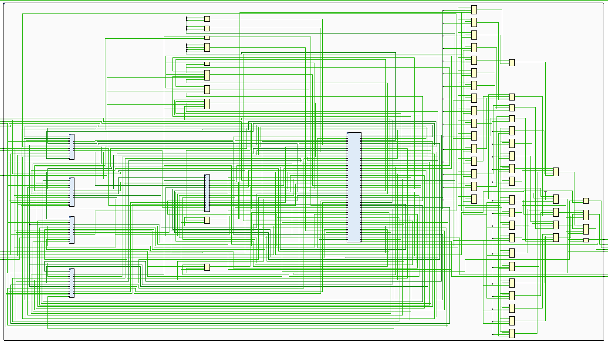
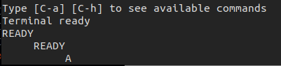

# FPGA Implementation and Hardware Bring-Up

This document defines how the RV32IM SoC is implemented and brought up on the
MicroPhase A7-Lite R1.1. The current wrapper and XDC define the intended board
boundary; the latest supplied routed report covers the `freertos_demo.mem`
implementation at 75 MHz. The dated provenance and evidence boundary are
recorded in [Hardware validation](hardware-validation.md).

The programmer-visible processor contract is defined in
[Architecture](architecture.md), cycle-level ordering in
[Pipeline and control](pipeline-control.md), verification evidence in
[Verification](verification.md), and the runtime and image format in
[Software](software.md).

## 1. Implemented platform

| Property | Baseline configuration |
|---|---|
| Board | MicroPhase A7-Lite R1.1 |
| Confirmed FPGA | AMD/Xilinx Artix-7 `xc7a35tfgg484-2` |
| Synthesis top | `fpga_top` |
| Tool used for the reviewed snapshot | Vivado 2024.1, build 5076996 |
| Board clock input | 50 MHz single-ended oscillator / 20.000 ns |
| SoC clock | 75 MHz generated by MMCM / 13.333 ns |
| Functional clock domains | One |
| Processor | Single-hart, single-issue, in-order RV32IM core |
| Memory | Unified 64 KiB true-dual-port TCM inferred in block RAM |
| Internal peripherals | Machine timer, polled 8N1 UART, and 32-bit GPIO through the data demux |
| Firmware boot | Bitstream-initialized TCM using a word-oriented `.mem` file |
| Board observability | Heartbeat and PASS LEDs; active-high FAIL and DONE on JP2 |
| Peripheral pins | CH340 UART RX/TX and GPIO output bit 0 are routed by `main.xdc` |

<p align="center">
  
</p>

<p align="center"><em>MicroPhase A7-Lite R1.1 target board. The implementation
uses the 50 MHz oscillator, two reset buttons, CH340 UART, status LEDs, JTAG,
and three JP2 outputs.</em></p>

The FPGA target preserves the project scope rather than turning the core into a
larger board-support design. DDR3/MIG, caches, AXI/AHB/APB, external/software
interrupt controllers, debug transport, Ethernet, and HDMI are not
instantiated. The wrapper exposes the polled UART and GPIO output bit 0; GPIO
inputs are tied low and the remaining GPIO outputs are not bonded out.

<p align="center">
  
</p>

<p align="center"><em>FPGA SoC integration view: the implemented core, MMCM
clocking, reset synchronizer, dual-port TCM, memory demultiplexer, machine
timer, UART, and GPIO. Board-visible pin mapping and status polarity are
defined in Sections 3–5.</em></p>

## 2. Integration contract

### 2.1 Module ownership

| Block | FPGA responsibility |
|---|---|
| `fpga_top` | Clocking Wizard, board reset boundary, UART/GPIO pin boundary, heartbeat, status polarity, and synthesis top |
| `reset_sync` | Asynchronous reset-event capture and synchronous functional reset generation |
| `soc_tcm_top` | Core, TCM, timer/UART/GPIO fabric, MTIP feedback, trace pass-through, and sticky completion mailbox |
| `rv32_tcm` | Independent instruction and data ports over one inferred block-RAM array |
| `rv32_mem_demux` | One-outstanding response ownership across TCM, timer, UART, and GPIO |
| `rv32_mtimer` | Memory-mapped `mtime/mtimecmp` and level-sensitive MTIP |
| `rv32_uart` / `rv32_gpio` | Polled serial and general-purpose I/O register blocks |
| `rv32_core` | RV32IM pipeline, architectural state, traps, and retirement trace |

The FPGA source order is defined by `files/fpga.f`; the board constraints are
defined by `constraint/main.xdc`. Verification-only logic is not instantiated
inside the core. The mailbox and status mapping are SoC observability features,
not RISC-V architectural state.

### 2.2 Top-level configuration

| `fpga_top` parameter | Default | Contract |
|---|---:|---|
| `RESET_VECTOR` | `0x0000_0000` | First instruction address after reset |
| `TRAP_VECTOR` | `0x0000_0100` | Reset value of direct-mode `mtvec` |
| `TCM_BYTES` | 64 KiB | Unified instruction/data memory capacity |
| `TCM_BASE_ADDR` | `0x0000_0000` | TCM byte-address base |
| `TCM_INIT_FILE` | Empty | Synthesis-time word-oriented firmware image |
| `SOC_CLK_FREQ_HZ` | 75,000,000 | UART baud-divider input; must match generated SoC clock |
| `TEST_STATUS_ADDR` | Last TCM word | Completion mailbox address |
| `TEST_PASS_VALUE` | `0x0000_0001` | Value classified as PASS |
| `RESET_SYNC_STAGES` | 2 | Private reset synchronizer depth |
| `HEARTBEAT_WIDTH` | 24 | Heartbeat counter width |

The production configuration requires a word-sized TCM, at least two reset
synchronizer stages, a nonzero heartbeat width, aligned reset/trap/mailbox
addresses, and a mailbox contained within the implemented TCM.

## 3. Clock and reset architecture

### 3.1 Clock contract

The board oscillator drives `clk_50m_i`, whose package pin and electrical
standard are defined by `main.xdc`. The Clocking Wizard IP creates the 20.000 ns
primary clock and derives the 13.333 ns `clk_75m` clock used by the complete
SoC. Keeping both clock constraints inside the IP avoids duplicate clocks on
the same input port and preserves their generated-clock relationship.

Every core, TCM, mailbox, and status register is clocked from `clk_75m`. No
functional data crosses between the input and generated clock domains; the
50 MHz input only feeds the MMCM. The heartbeat is a counter output and does
not create another clock.

### 3.2 Reset contract

K3 (`reset_ni`) resets the Clocking Wizard and the SoC. K1
(`user_reset_ni`) resets only the SoC, allowing a repeatable application reset
without restarting the MMCM. Neither input is distributed as a functional
asynchronous reset:

1. `reset_ni` resets the MMCM; either active reset input or loss of
   `clk_wiz_0.locked` asynchronously clears the private synchronizer chain.
2. The synchronizer registers carry `ASYNC_REG="TRUE"` and
   `SHREG_EXTRACT="NO"` attributes.
3. A separate register with no asynchronous control generates active-high
   `soc_rst`.
4. Both assertion and deassertion observed by the CPU/SoC therefore occur on a
   rising edge of `clk_75m`.
5. With the default `RESET_SYNC_STAGES=2`, release takes three rising edges
   after both reset inputs are inactive and the MMCM is locked: two
   synchronization stages plus the functional-reset register.

The functional-reset register has FPGA initialization value `1`, holding the
SoC in reset immediately after configuration. Reset cannot release until the
MMCM reports `locked`; loss of lock clears the private chain, and `soc_rst`
asserts on the next available `clk_75m` edge. During reset or loss of lock,
UART TX is held at its idle-high level and GPIO/status outputs are forced
inactive.

The TCM storage array is deliberately not reset. This preserves block-RAM
inference and the bitstream initialization image. Reset clears processor and
mailbox state, but it does not restore TCM locations modified by software. A
bitstream reconfiguration, or a future explicit loader, is required to reload
the original image.

## 4. TCM and firmware boot

### 4.1 Memory organization

The default TCM covers `0x0000_0000` through `0x0000_FFFF` and contains 16,384
32-bit words.

| Region | Default address | Purpose |
|---|---:|---|
| Reset/startup | `0x0000_0000` | Reset vector and startup code |
| Direct trap entry | `0x0000_0100` | Reset value of `mtvec` |
| Application image | `0x0000_0400` onward | Text, read-only data, and writable data |
| FreeRTOS report | `0x0000_E000–0x0000_E03F` | Self-checking demo report block |
| Reserved stack | `0x0000_EF00`–`0x0000_FEFF` | Downward-growing 4 KiB stack |
| Completion mailbox | `0x0000_FFFC` | Final aligned word in the TCM |

Port A is a read-only instruction port. Port B supports data reads and
byte-enabled writes. Both ports are always ready and return a registered
response one cycle after a request. Out-of-range or unaligned TCM requests
return an error; architectural misalignment is detected earlier by the core.

The unified array permits concurrent instruction and data accesses. The
software environment does not use self-modifying code, and the core does not
implement Zifencei; instruction/data coherence after modifying executable TCM
contents is therefore outside the supported contract.

Data accesses matching the timer, UART, or GPIO apertures are decoded as
documented in [Software §3](software.md#3-soc-bsp-and-mmio-contract); all other
addresses fall back to the range-checking TCM target. The demultiplexer latches
the selected slave at request handshake and holds response ownership until
completion; changing the live core address cannot redirect an outstanding
response.

### 4.2 Image contract

Build the board FreeRTOS image from the repository root. The 250 ms blink
period is the frozen board-demo setting; the simulation default remains 2 ms.

```sh
make fpga-freertos-images
```

The selected TCM image is:

```text
build/fpga-freertos/freertos_demo.mem
```

The file contains exactly 16,384 lines of eight hexadecimal digits, one
little-endian 32-bit TCM word per line. Add it to the Vivado project as a memory
initialization source and set the `fpga_top` parameter `TCM_INIT_FILE` to its
synthesis-visible path. The parameter must not remain empty for a bootable
bitstream.

Vivado maps the constant `$readmemh` image into block-RAM INIT attributes.
Changing the firmware image changes the configured memory contents and requires
a new synthesis/implementation/bitstream run in the current flow.

### 4.3 Completion protocol

Firmware returns a result through one aligned full-word store to
`TEST_STATUS_ADDR`. The default PASS value is `0x0000_0001`; any other committed
value is classified as FAIL.

Completion is observed from the architectural retirement trace, not from a raw
data-port request. The monitor requires:

```text
trace_valid && !trace_trap
&& trace_mem_wstrb == 4'b1111
&& trace_mem_addr == TEST_STATUS_ADDR
```

Consequently, a wrong-path, squashed, misaligned, or faulting store cannot
produce a false PASS. The first valid status is sticky until reset.

## 5. Board interface and constraints

All physical mappings below come from `constraint/main.xdc` for the A7-Lite
R1.1 target.

| Function | RTL port | Board location | FPGA pin | Polarity | I/O standard |
|---|---|---|---|---|---|
| System clock | `clk_50m_i` | 50 MHz oscillator | J19 | Rising-edge clock | LVCMOS33 |
| Clock-boundary reset | `reset_ni` | K3 | L18 | Active low | LVCMOS33 |
| User SoC reset | `user_reset_ni` | K1 | AA1 | Active low | LVCMOS33 |
| UART RX | `uart_rx_i` | CH340 TX | U2 | Idle high | LVCMOS33 |
| UART TX | `uart_tx_o` | CH340 RX | V2 | Idle high | LVCMOS33 |
| Running/heartbeat | `led1_n_o` | D6 / LED1 | M18 | Active low | LVCMOS33 |
| PASS | `led2_n_o` | D5 / LED2 | N18 | Active low | LVCMOS33 |
| FAIL | `fail_o` | JP2 pin 1 / GPIO2_0P | W21 | Active high | LVCMOS33 |
| DONE | `done_o` | JP2 pin 2 / GPIO2_0N | W22 | Active high | LVCMOS33 |
| GPIO output bit 0 | `gpio_led_o` | JP2 pin 3 / GPIO2_1P | N17 | Active high | LVCMOS33 |

The XDC also sets `CFGBVS=VCCO` and `CONFIG_VOLTAGE=3.3`. Status outputs use
8 mA drive and slow slew. They are human-observable or logic-analyzer signals,
not a source-synchronous external interface, so the XDC excludes only these
output paths from timing analysis rather than inventing output-delay
requirements.

The two reset inputs and UART RX are asynchronous to `clk_75m` and are
false-pathed at the package boundary. Reset enters the dedicated synchronizer;
UART RX is synchronized inside the UART. UART TX plus the five human-observable
status/GPIO outputs are also false-pathed because no external capture clock is
defined. These exceptions match the implemented interfaces; they do not waive
internal synchronous paths.

### 5.1 Visible status states

| State | D6 heartbeat | D5 PASS | JP2 FAIL | JP2 DONE |
|---|---|---|---|---|
| Reset | Off | Off | Low | Low |
| Running | Toggles | Off | Low | Low |
| Passed | Off | On | Low | High |
| Failed | Off | Off | High | High |

At 75 MHz with `HEARTBEAT_WIDTH=24`, D6 has a full blink period of approximately
0.224 seconds and stops when firmware completes. D6 indicates execution
liveness; D5 PASS and JP2 DONE/FAIL remain the completion oracle. The FreeRTOS
demo drives its independent GPIO0 activity through JP2 pin 3.

## 6. Vivado implementation flow

### 6.1 Project inputs

Use generated Vivado project files; do not treat `.xpr`, run databases, or
checkpoints as source. Reconstruct the project from these checked-in inputs:

| Input | Required setting |
|---|---|
| `files/fpga.f` | Ordered SystemVerilog RTL manifest |
| `scripts/vivado/create_clk_wiz_0.tcl` | Reproducible 50 MHz-to-75 MHz Clocking Wizard configuration |
| `constraint/main.xdc` | A7-Lite R1.1 pins, clock, voltage, and exceptions |
| `build/fpga-freertos/freertos_demo.mem` | Selected BRAM initialization image for the FreeRTOS board flow |
| Top module | `fpga_top` |
| Project part | `xc7a35tfgg484-2` |
| Top parameter | `TCM_INIT_FILE` set to the selected project-visible `.mem` file |

Do not select a similar package or speed grade based only on a board-family
name. Confirm the marking on the populated FPGA before implementation. Expand
the nested `-f files/core.f` entry in `files/fpga.f` and add the listed `.sv`
files as SystemVerilog sources; the `.f` manifests are source-order metadata,
not HDL design units.

### 6.2 Run sequence

1. Build the selected board image. Run the functionally equivalent FreeRTOS
   regression image through both Verilator and Questa; it uses a 2 ms blink
   period to keep simulation bounded, while the board image uses 250 ms.
2. Create a Vivado RTL project for `xc7a35tfgg484-2`.
3. Add the SystemVerilog sources in `files/fpga.f` order and set `fpga_top` as
   the synthesis top.
4. Recreate the Clocking Wizard in the open project:

   ```tcl
   source {/absolute/path/to/scripts/vivado/create_clk_wiz_0.tcl}
   ```

5. Add `constraint/main.xdc` and the selected `.mem` initialization file. The
   XDC assigns the physical clock pin; the IP constrains both the 50 MHz input
   and generated 75 MHz SoC clock.
6. Set `TCM_INIT_FILE`, then elaborate and review top-level ports and parameter
   values.
7. Run synthesis; review inferred RAM/DSP structures, latches, warnings, and
   the clock/reset topology.
8. Run placement and routing; review timing, route status, DRC, methodology,
   CDC, utilization, and any generated power report.
9. Generate the bitstream only after implementation sign-off checks pass.

After `impl_1` completes, create a provenance-checked FreeRTOS review package
from the open Vivado project:

```tcl
set ::release_profile freertos
source {/absolute/path/to/scripts/vivado/export_release_reports.tcl}
```

The wrapper verifies the implementation generic and the project-visible memory
image against `build/fpga-freertos/freertos_demo.mem`. It then records
project/run properties and produces timing setup/hold, timing-summary,
`check_timing`, utilization, DRC, methodology, power, clock, route-status, CDC,
exception, and effective-XDC reports. The bitstream and firmware artifacts are
copied and hash-identified in `Report_vivado/freertos/<timestamp>/`, which is
intentionally ignored by Git.

### 6.3 Required implementation review

A successful `write_bitstream` message alone is insufficient. Review at least:

- the project part, top module, Vivado version, and firmware image;
- complete routing with zero routed-net errors;
- `report_clocks` shows the 20.000 ns board input and 13.333 ns generated SoC
  clock;
- positive setup and hold slack on the 75 MHz SoC clock;
- no unexplained unconstrained internal endpoints;
- block-RAM inference for the 64 KiB TCM and DSP inference for multiplication;
- all DRC, methodology, CDC, and timing-exception messages;
- pin assignments, voltage standards, and active-low LED polarity;
- power, when generated, as an activity-dependent estimate rather than a board
  measurement.

AMD documents `report_timing_summary` as the implemented-design timing sign-off
report and requires route status to establish that routed delays are being
used. `check_timing` and exception review are also required to detect missing
or inappropriate constraints.

## 7. Verification before hardware

Run the FPGA-focused regression:

```sh
make fpga
```

| Test | DUT boundary | Main checks | Current result |
|---|---|---|---:|
| `tb_reset_sync` | Reset synchronizer | Power-up reset, asynchronous event capture, staged synchronous release, runtime reset | 15 checks PASS |
| `tb_soc_tcm_top` | Core + TCM + MMIO fabric + mailbox | TCM/timer/UART/GPIO access, response ownership, retirement-qualified sticky PASS/FAIL | 112 checks PASS |

The vendor-specific `fpga_top` and Clocking Wizard are intentionally excluded
from the portable RTL regression. Vivado synthesis, implementation, timing,
bitstream generation, and board bring-up validate that deployment layer.

The full release regression remains:

```sh
make test
make act4
```

`make test` includes strict lint, 29 RTL simulations including the FreeRTOS
SoC run, two bare-metal tests, and 48 pinned RV32I/RV32M programs. ACT4 is a
separate Sail-backed architectural gate. These simulation results establish
functional confidence but do not replace implementation or physical-board
evidence.

## 8. Latest supplied implementation result

The latest package, `Report_vivado/freertos/20260825_195339/`, was generated on
2026-08-25 with Vivado 2024.1 build 5076996 for `xc7a35tfgg484-2`. It records
Git state `e5eb288-dirty`, top `fpga_top`, and
`TCM_INIT_FILE=freertos_demo.mem SOC_CLK_FREQ_HZ=75000000`.

| Gate | Reviewed result |
|---|---|
| Placement and routing | Fully routed; zero unrouted or partially routed nets |
| Setup timing at 75 MHz | MET; WNS `+0.070 ns`, TNS `0.000 ns` |
| Hold timing | MET; WHS `+0.066 ns`, THS `0.000 ns` |
| Pulse width | MET; worst slack `+5.537 ns` |
| Internal timing coverage | 0 unclocked registers, 0 unconstrained endpoints, 0 combinational loops |
| DRC | 0 errors; 8 reviewed DSP pipelining advisories |
| Bitstream | Generated successfully |
| Power estimate | 0.253 W total, Medium confidence |

The small positive margin supports this implemented 75 MHz point only; it is
not an Fmax result.

```text
[RUN]   tb_reset_sync
tb_reset_sync: PASS (15 checks)
[RUN]   tb_soc_tcm_top
tb_soc_tcm_top: PASS (112 checks)
[PASS] FPGA-support reset and SoC/TCM simulations completed
```

<p align="center"><em>Reproduced <code>make fpga</code> terminal result. The
previously committed screenshot for this section predated the SoC/TCM
testbench growing to 112 checks and has been replaced with this current,
reproducible transcript rather than a stale image.</em></p>

<p align="center">
  <a href="images/timing_report.png">
    
  </a>
</p>

<p align="center"><em>FreeRTOS post-route timing summary for the current
75 MHz implementation. The hashed text report remains the numeric authority.</em></p>

Resource use is:

| Resource | Used / available | Utilization |
|---|---:|---:|
| Slice LUTs | 3,815 / 20,800 | 18.34% |
| Slice registers | 2,001 / 41,600 | 4.81% |
| Slices | 1,154 / 8,150 | 14.16% |
| Block RAM tiles | 16 / 50 | 32.00% |
| DSP48E1 | 4 / 90 | 4.44% |
| Bonded I/O | 10 / 250 | 4.00% |
| BUFGCTRL | 2 / 32 | 6.25% |
| MMCME2_ADV | 1 / 5 | 20.00% |

The four `DPOP-1` and four `DPOP-2` warnings identify unpipelined multiplier
DSP outputs/stages. They are accepted for this 75 MHz implementation because
routed timing closes, but remain optimization guidance rather than waivers.

<p align="center">
  <a href="images/utilization_report.png">
    
  </a>
</p>

<p align="center"><em>Current FreeRTOS implementation hierarchy and resource
use, including all ten bonded board I/O ports.</em></p>

<p align="center">
  <a href="images/device.png">
    
  </a>
</p>

<p align="center"><em>Placement and routing view supplied for the Artix-7
implementation. Numeric sign-off remains tied to the archived text reports.</em></p>

<p align="center">
  <a href="images/schematic_fpga.png">
    
  </a>
</p>

<p align="center"><em>Selected routed wrapper/status cone showing clock,
reset, SoC, and board-status connectivity. The complete ten-port inventory is
established by the release package's `io.rpt`.</em></p>

<p align="center">
  <a href="images/schematic_soc.png">
    
  </a>
</p>

<p align="center"><em>Selected SoC logic cone illustrating the implemented
core, memory, demultiplexer, and peripheral connectivity. It is structural
supporting evidence rather than a substitute for RTL review.</em></p>

Reviewed evidence is:

| Evidence | Reviewed artifact |
|---|---|
| Timing and route status | `timing_summary.rpt`, `route_status.rpt` in the release package |
| Hierarchical utilization | `utilization_hier.rpt`, `utilization_flat.rpt` in the release package |
| Placement/routing view | [Implemented device](images/device.png) |
| FPGA wrapper view | [Selected routed wrapper/status cone](images/schematic_fpga.png) |
| SoC hierarchy | [Selected synthesized SoC logic cone](images/schematic_soc.png) |
| Metrics and disposition | [Hardware validation §5](hardware-validation.md#5-post-route-implementation-results) |
| Artifact hashes | [Hardware validation §7](hardware-validation.md#7-artifact-identity) |

The latest post-route estimate is 0.253 W: 0.180 W dynamic and 0.073 W device
static, with a 25.7 °C estimated junction temperature. Vivado rates confidence
as Medium because I/O and internal-node activity are incompletely specified.
It is a vectorless estimate, not measured board power and not a FreeRTOS
workload-power result.

<p align="center">
  <a href="images/power_report.png">
    
  </a>
</p>

<p align="center"><em>Current vectorless post-route estimate; Medium
confidence and not a physical-board measurement.</em></p>

The I/O report validates all ten current top-level ports, including user reset,
UART RX/TX, GPIO, and status outputs.

## 9. Physical-board bring-up

<p align="center">
  <a href="images/board.png">
    
  </a>
</p>

<p align="center"><em>Recorded local FreeRTOS bring-up on the MicroPhase
A7-Lite Artix-7 target. The exact bitstream from the final clean export still
requires one program-and-capture pass.</em></p>

<p align="center">
  <a href="images/uart-terminal.png">
    
  </a>
</p>

<p align="center"><em>Physical CH340 session at 115200 8N1. The terminal
records repeatable boot output and character echo; final release binding still
depends on the clean-export bitstream hash.</em></p>

1. Confirm A7-Lite R1.1 board revision and the populated FPGA marking.
2. Build `freertos_demo.mem` with the 75 MHz timer setting and the selected
   board-visible blink period.
3. Run `make fpga`, `make freertos`, and `make questa-freertos-run`. These use
   the 2 ms regression blink period; the selected board image differs only in
   the 250 ms human-observable blink delay.
4. Synthesize, implement, audit the Section 8 reports, generate the bitstream,
   and record immutable hashes, for example:

   ```sh
   sha256sum build/fpga-freertos/freertos_demo.elf \
     build/fpga-freertos/freertos_demo.mem \
     /path/to/rv32_phase2_freertos.bit
   ```

5. Program the board through JTAG, connect CH340 at 115200 8N1, and assert K3.
6. Release K3 and observe UART `READY\n` plus GPIO0 activity on JP2 pin 3.
   Drive `0xA5`, confirm the echoed byte, then observe D5 PASS with DONE high
   and FAIL low.
7. Press K1 to confirm synchronous SoC reset and a repeatable boot without
   restarting the MMCM. Use K3 when the clocking boundary must also be reset.
8. Capture board revision, device marking, Vivado version, source state,
   firmware/report/bitstream hashes, and board evidence.

FreeRTOS was recorded as deployed successfully on the named A7-Lite at 75 MHz.
The exact bitstream exported after the final clean commit still requires one
last program-and-capture pass. RTL simulation remains the quantitative oracle for
UART bytes, GPIO transitions, timer traps, and scheduler counts. If firmware
changes TCM contents, reprogram the bitstream before calling a later reboot
image-identical.

## 10. References

- [AMD Vivado Design Suite User Guide: Synthesis (UG901)](https://docs.amd.com/r/2024.1-English/ug901-vivado-synthesis)
- [AMD Vivado Design Suite User Guide: Using Constraints (UG903)](https://docs.amd.com/r/2024.1-English/ug903-vivado-using-constraints)
- [AMD Vivado Design Suite User Guide: Design Analysis and Closure Techniques (UG906)](https://docs.amd.com/r/2024.1-English/ug906-vivado-design-analysis)
- [AMD 7 Series FPGAs Memory Resources User Guide (UG473)](https://docs.amd.com/api/khub/documents/9gZGbqBxtlKXxBfkBt~lAg/content)
- [MicroPhase A7-Lite R1.1 reference schematic](https://github.com/MicroPhase/fpga-docs/blob/master/schematic/A7-LITE_R11.pdf)

AMD documentation defines the synthesis, constraint, block-memory, and
timing-analysis framework. The checked-in RTL, XDC, firmware linker contract,
reviewed reports, and hash manifest remain the source of truth for this
implementation.
