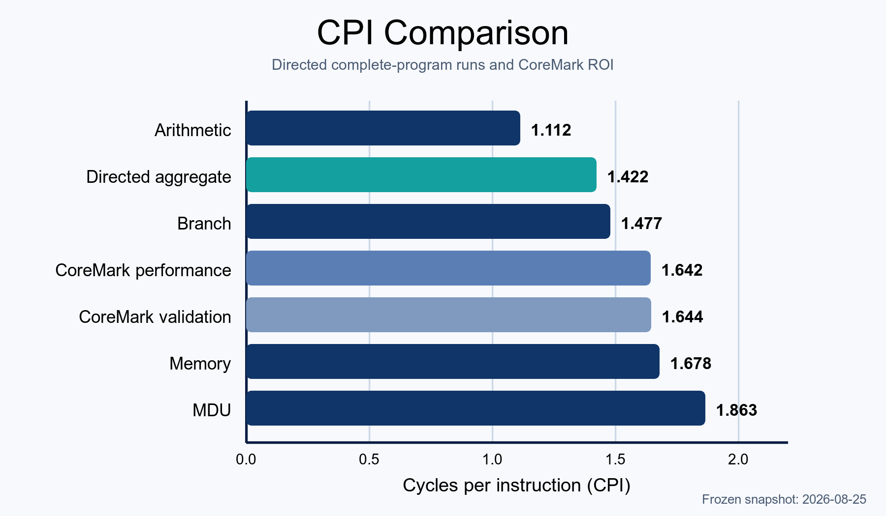
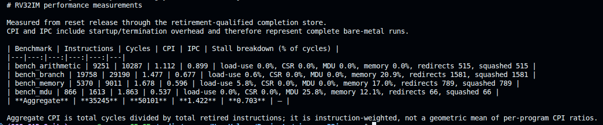

# Directed Performance Characterization

This document characterizes the frozen RV32IM core with four deterministic
bare-metal workloads. It reports architectural cycles, retired instructions,
CPI/IPC, and selected pipeline-event counters. CoreMark is reported separately
in [CoreMark](coremark.md); the dated source and FPGA validation snapshot is in
[Hardware validation](hardware-validation.md).

## 1. Measurement contract

The Verilator harness runs the complete `rv32_core` against the
production 64 KiB true-dual-port TCM. `mtip_i` is held low, so the
measurements contain no asynchronous interrupt activity.

Each run starts at reset release and ends on the retirement-qualified PASS
store to `tohost`. Counts therefore include reset startup, BSS
initialization, the benchmark body, result checking, and termination. They are
complete-program measurements, not region-of-interest measurements.

The harness cross-checks the RTL cycle counter against its own elapsed-cycle
count and the RTL retirement counter against the retirement trace. Metrics are:

```text
CPI = cycles / retired instructions
IPC = retired instructions / cycles
```

The completion store is included as the final retired instruction.

### 1.1 Diagnostic counter semantics

| Counter | Counted event |
|---|---|
| Load-use | Cycle in which a true load consumer receives the documented interlock |
| CSR | Cycle stalled for a real CSR dependency or unresolved interrupt-state writer |
| MDU | Cycle held by an active multiply/divide operation after older priorities are excluded |
| Memory | Cycle held by a data-memory transaction after older trap/exception priorities are excluded |
| Redirect | Taken control-transfer recovery event |
| Squashed | Valid fetch/IF-ID packets killed by redirects |

The four stall categories follow controller age priority and are mutually
exclusive. Redirects are event counts and squashes count packets, so neither is
a stall-cycle percentage and they must not be added to the stall categories.
Trap-drain cycles are intentionally outside this benchmark breakdown.

## 2. Workloads

| Workload | Directed stress |
|---|---|
| `bench_arithmetic` | 512 iterations of mixed integer add, XOR, shift, rotate, and logical dependency chains |
| `bench_branch` | Recursive `fib(16)`, stressing calls, returns, conditional control, and stack traffic |
| `bench_memory` | In-place bubble sort of 32 volatile words followed by an order check |
| `bench_mdu` | 64 iterations combining multiply, divide, remainder, and integer dependency chains |

These are project-directed microbenchmarks. They isolate pipeline behavior but
are not an industry-standard application suite.

## 3. Frozen results

| Workload | Instructions | Cycles | CPI | IPC |
|---|---:|---:|---:|---:|
| Arithmetic | 9,251 | 10,287 | 1.112 | 0.899 |
| Branch | 19,758 | 29,190 | 1.477 | 0.677 |
| Memory | 5,370 | 9,011 | 1.678 | 0.596 |
| MDU | 866 | 1,613 | 1.863 | 0.537 |
| **Weighted aggregate** | **35,245** | **50,101** | **1.422** | **0.703** |

Aggregate CPI is total cycles divided by total retired instructions; aggregate
IPC is the reciprocal ratio. It is instruction-weighted and is not an average
of the four displayed ratios.

<p align="center">
  <a href="images/performance/cpi-by-workload.png">
    
  </a>
</p>

<p align="center"><em>CPI values from the frozen 2026-08-25 snapshot. The
directed aggregate is instruction-weighted; both CoreMark bars retain the ROI
measurement boundary defined in CoreMark.</em></p>

### 3.1 Pipeline diagnostics

Counts are shown as `cycles (percentage of workload cycles)`.

| Workload | Load-use | CSR | MDU | Memory | Redirects | Squashed |
|---|---:|---:|---:|---:|---:|---:|
| Arithmetic | 0 (0.0%) | 0 (0.0%) | 0 (0.0%) | 2 (0.0%) | 515 | 515 |
| Branch | 165 (0.6%) | 0 (0.0%) | 0 (0.0%) | 6,101 (20.9%) | 1,581 | 1,581 |
| Memory | 527 (5.8%) | 0 (0.0%) | 0 (0.0%) | 1,532 (17.0%) | 789 | 789 |
| MDU | 0 (0.0%) | 0 (0.0%) | 416 (25.8%) | 195 (12.1%) | 66 | 66 |
| **Total** | **692 (1.4%)** | **0 (0.0%)** | **416 (0.8%)** | **7,830 (15.6%)** | **2,951** | **2,951** |

The arithmetic run is closest to the ideal single-issue rate. Recursive branch
execution adds control recovery and stack memory traffic. Bubble sort exposes
both load-use and blocking-memory cost. The MDU workload is intentionally
dominated by iterative divide/remainder occupancy. These observations explain
the directed programs; they are not a general workload-frequency model.

## 4. Reproduction and claim boundary

Run:

```sh
make benchmark
```

The target builds the four ILP32 images, executes each through
`tb_baremetal`, and writes the machine-generated result snapshot to
`build/generated-reports/performance.md` using `tools/run_benchmarks.py`.
The checked-in document remains the reviewed, frozen evidence record rather
than being overwritten by a routine run. Build flags, linker layout, and
completion semantics are defined in [Software](software.md).

<p align="center">
  <a href="images/benchmark-log.png">
    
  </a>
</p>

<p align="center"><em>Generated benchmark report for the four frozen
complete-program measurements.</em></p>

These figures are RTL architectural-cycle measurements with the checked-in
one-cycle TCM. They are not FPGA wall-clock measurements, Fmax characterization,
energy results, or a claim for cache- or bus-based systems. The corresponding
75 MHz routed implementation point is validated separately in
[Hardware validation §5](hardware-validation.md#5-post-route-implementation-results).
