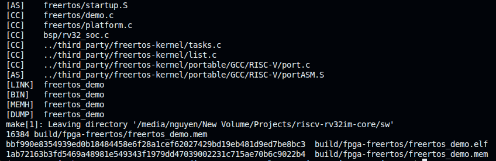

# Software Environment and FreeRTOS Port

This document defines the software contract for the RV32IM SoC. Two execution
profiles share the same CPU, TCM, toolchain, MMIO map, and completion protocol:

1. a compact bare-metal runtime for directed tests, benchmarks, CoreMark, and
   ISA regressions;
2. a pinned FreeRTOS machine-mode port with a GPIO-blink and UART-echo demo.

The programmer-visible hardware is defined in
[Architecture](architecture.md), precise ordering in
[Pipeline and control](pipeline-control.md), and acceptance evidence in
[Verification](verification.md). Dated image sizes, simulator observations,
FPGA deployment status, and artifact hashes are recorded in
[Hardware validation](hardware-validation.md), not duplicated here.

<p align="center">
  
</p>

<p align="center"><em>FPGA SoC boundary shared by both software profiles: the
core, dual-port TCM, memory demultiplexer, machine timer, UART, and GPIO. The
completion mailbox occupies the last TCM word and is not drawn separately; the
full memory map is below.</em></p>

## 1. Source ownership

| Path | Responsibility |
|---|---|
| `sw/Makefile` | Compile, link, inspect, disassemble, and generate TCM images |
| `sw/include/baremetal.h` | Bare-metal completion and CSR API |
| `sw/runtime/` | Bare-metal reset entry, trap wrapper, and memory primitives |
| `sw/link.ld` | Bare-metal 64 KiB TCM layout |
| `sw/tests/` | Smoke, trap, and directed benchmark programs |
| `sw/isa/` | Pinned ISA-test environment, linker script, and image flow |
| `sw/include/rv32_soc.h` | Timer/UART/GPIO register map and BSP API |
| `sw/include/freertos_demo.h` | FreeRTOS report and acceptance constants |
| `sw/bsp/rv32_soc.c` | Stable timer read, safe compare write, UART, and GPIO drivers |
| `sw/freertos/FreeRTOSConfig.h` | Scheduler, clock, allocation, hook, and port settings |
| `sw/freertos/startup.S` | FreeRTOS reset entry and trap-vector installation |
| `sw/freertos/link.ld` | FreeRTOS text, report, stack, and mailbox layout |
| `sw/freertos/platform.c` | Hooks, diagnostics, report, completion, memory primitives |
| `sw/freertos/demo.c` | Blink, UART echo, and monitor tasks |
| `sw/coremark/` | CoreMark platform binding and result mailbox |
| `third_party/freertos-kernel/` | Unmodified pinned upstream kernel subset |
| `tools/bin_to_memh.py` | Dense binary to 32-bit Verilog memory conversion |

## 2. Common target profile

| Property | Contract |
|---|---|
| ISA string | `rv32im_zicsr` |
| ABI | `ilp32`, integer calling convention, soft float |
| ELF | ELF32 little-endian RISC-V executable |
| Hart / privilege | Hart 0, M-mode only |
| Reset entry | `_start` at `0x0000_0000` |
| Instruction alignment | 32-bit instructions, no RVC |
| Code model | `medlow`, non-PIC |
| Stack alignment | 16 bytes at C call boundaries |
| Linking | Static, freestanding, no default startup or hosted libc |
| Relaxation | Disabled during compile/link and explicitly around `gp` setup |

The `riscv64-unknown-elf-` prefix selects an RV32 multilib through
`-march=rv32im_zicsr -mabi=ilp32`. `CROSS_COMPILE` can override the prefix.

Project C sources use `-O2 -Wall -Wextra -Werror`. Upstream FreeRTOS files use
the same architecture, ABI, freestanding, sectioning, alignment, and
optimization flags without converting upstream warnings into project-owned
errors. All link warnings are fatal.

Generated products are placed below `/tmp/rv32im-core-software-<uid>/`:

| Artifact | Purpose |
|---|---|
| `NAME.elf` | Debuggable ELF32 executable |
| `NAME.map` | Section placement and symbol audit |
| `NAME.dump` | Source-interleaved canonical disassembly |
| `NAME.bin` | Flat little-endian load image |
| `NAME.mem` | Exactly 16,384 word-oriented lines for the 64 KiB TCM |

## 3. SoC BSP and MMIO contract

The core data port reaches TCM, timer, UART, and GPIO through the same blocking
request/response protocol. A C volatile load/store therefore waits until the
selected peripheral accepts and completes the request.

The complete address-space diagram is provided in
[Architecture §6.3](architecture.md#63-dual-port-tcm-and-soc-fabric); the tables
below define the software-visible registers and access semantics.

### 3.1 Machine timer

| Address | Register | Access |
|---:|---|---|
| `0x0200_4000` | `mtimecmp[31:0]` | RW |
| `0x0200_4004` | `mtimecmp[63:32]` | RW |
| `0x0200_BFF8` | `mtime[31:0]` | RW |
| `0x0200_BFFC` | `mtime[63:32]` | RW |

`rv32_soc_mtime_read()` performs `high → low → high` reads and retries across a
low-word rollover. `rv32_soc_mtimecmp_write()` uses the RV32-safe sequence:

```text
mtimecmp.low  = 0xffff_ffff
mtimecmp.high = new_high
mtimecmp.low  = new_low
```

This prevents an intermediate compare value from falling below the live
`mtime`. MTIP is a level: software deasserts it by moving `mtimecmp` into the
future, not by writing `mip`.

### 3.2 UART

| Offset | Register | Behavior |
|---:|---|---|
| `+0x00` | `TXDATA` | Store low byte; backpressured while TX busy |
| `+0x04` | `RXDATA` | Read low byte and pop; bit 31 means empty |
| `+0x08` | `STATUS` | TX ready/busy, RX valid, sticky overrun/frame error |
| `+0x0C` | `BAUDDIV` | Read-only clocks per serial bit |

Base address is `0x1000_0000`; the default serial format is 115200-baud 8N1.
RX has one buffered byte; a second completed frame before software pops it sets
overrun.
Writing ones to status bits 3/4 clears overrun/frame-error flags. The BSP uses
blocking `rv32_soc_uart_putc()` and non-blocking `rv32_soc_uart_try_getc()`.

### 3.3 GPIO

| Offset | Register | Behavior |
|---:|---|---|
| `+0x00` | `INPUT` | Two-flop synchronized pins, read-only |
| `+0x04` | `OUTPUT` | Output data latch |
| `+0x08` | `OUTPUT_ENABLE` | One bit per driven output |
| `+0x0C` | `OUTPUT_SET` | Atomic set |
| `+0x10` | `OUTPUT_CLEAR` | Atomic clear |
| `+0x14` | `OUTPUT_TOGGLE` | Atomic toggle |

Base address is `0x1001_0000`. Byte strobes are honored for data, enable,
set, clear, and toggle writes.

UART and GPIO are project-defined peripherals. Their layout is an SoC ABI, not
part of the RISC-V ISA.

## 4. Memory and linker contract

### 4.1 Bare-metal startup and trap ABI

`sw/runtime/crt0.S` performs:

1. `gp = __global_pointer$` with relaxation disabled;
2. `sp = 0x0000_FF00`;
3. zeroing of `.bss`;
4. direct-mode `mtvec = trap_entry`;
5. `main()` call followed by `bm_exit()`.

`trap_entry` uses a 128-byte aligned frame, preserves the integer register
context, passes `mcause`, `mepc`, and `mtval` to:

```c
void bm_trap_handler(uint32_t cause, uint32_t epc, uint32_t tval);
```

and executes `MRET` after the callback returns. The weak callback treats every
trap as unexpected. `trap.c` overrides it, validates ECALL/EBREAK/illegal
instruction state, advances `mepc` by four for the fixed-width instruction,
and returns.

### 4.2 TCM and linker layout

Both linker scripts use the same 64 KiB TCM partition and fixed reset, trap,
report, stack, and completion boundaries:

| Range | Bare-metal use | FreeRTOS use |
|---|---|---|
| `0x0000_0000–0x0000_00FF` | Reset startup | Reset startup |
| `0x0000_0100–0x0000_03FF` | Trap wrapper reservation | Aligned official trap-handler reservation |
| `0x0000_0400–__image_end` | Runtime and application | Kernel, port, BSP, application, static TCBs/stacks |
| `0x0000_E000–0x0000_E0FF` | Optional CoreMark report | 64-byte report at `0x0000_E000–0x0000_E03F` |
| `0x0000_EF00–0x0000_FEFF` | 4 KiB application stack | Pre-scheduler C stack reservation |
| `0x0000_FFFC` | `tohost` completion word | `tohost` completion word |

Code and initialized data have identical load and execution addresses. Startup
therefore clears BSS but performs no ROM-to-RAM copy. Linker assertions reject
startup/trap overlap, image/report/stack overlap, a non-64-byte FreeRTOS
report, or an incorrectly sized mailbox.

### 4.3 Completion protocol

`bm_pass()` and the FreeRTOS monitor store one to `0x0000_FFFC` for PASS.
`bm_fail(code)` and `freertos_platform_fail(code)` encode a non-one odd failure
status. `soc_tcm_top` accepts completion only from a non-trapping, retired,
aligned full-word store; speculative, faulting, killed, or partial stores
cannot report completion.

The included software tests are:

| Program | Coverage |
|---|---|
| `smoke` | Startup, ABI, stack/data/BSS, calls, memory, RV32M, ID CSRs |
| `trap` | ECALL, EBREAK, illegal instruction, trap CSRs, three `MRET` returns |

## 5. FreeRTOS profile

### 5.1 Upstream provenance

The repository vendors the minimum required subset of official
[FreeRTOS Kernel V11.3.0](https://github.com/FreeRTOS/FreeRTOS-Kernel/releases/tag/V11.3.0)
at commit:

```text
9b777ae5c5b8e9e456065a00294d1e5f5f9facf5
```

Imported `tasks.c`, `list.c`, public headers, and the GCC RISC-V port remain
unmodified. `third_party/freertos-kernel/UPSTREAM.md` records provenance and
`SOURCE.sha256` protects every imported file. Project-specific configuration
and chip macros remain under `sw/freertos/`.

Run the integrity check independently with:

```sh
make -C sw freertos-check
```

### 5.2 Scheduler configuration

| Setting | Value |
|---|---:|
| Kernel | FreeRTOS V11.3.0 |
| Scheduling | Preemptive, time slicing enabled |
| Tick | 1 kHz |
| Timer clock | 75 MHz by default |
| Priorities | 4 |
| Allocation | Static task/TCB memory only |
| Idle stack | 128 words |
| ISR stack | 192 words, statically allocated |
| Software timers | Disabled |
| FPU / vector context | Disabled |
| Tickless idle | Disabled |
| Stack checking | Level 2 |

`FREERTOS_CPU_CLOCK_HZ` can override the default at build time. It must match
the clock that advances `mtime`; otherwise the kernel tick period is wrong.

The custom RISC-V extension header declares `portasmHAS_MTIME=1`, no SiFive
full-CLINT dependency, no FPU/VPU, and no implementation-specific registers.
The official port saves/restores the standard integer context, per-task
critical nesting, `mstatus`, and `mepc`; `gp` and `tp` remain fixed as required
by the port assumption.

### 5.3 Startup and trap flow

`sw/freertos/startup.S` disables `mstatus.MIE` and `mie`, initializes `gp/sp`,
clears BSS, installs `freertos_risc_v_trap_handler` in direct `mtvec`, and calls
`main`.

Scheduler start then:

1. reads stable `mtime`;
2. sets the first `mtimecmp` deadline;
3. enables `mie.MTIE`;
4. restores the first task with global interrupts enabled.

On machine-timer interrupt, hardware records the interrupted instruction PC,
sets `mcause=0x8000_0007`, performs the MIE/MPIE trap transition, and redirects
to the FreeRTOS handler. The handler saves the task context, switches to the
dedicated ISR stack, safely advances `mtimecmp`, increments the kernel tick,
optionally selects another task, restores context, and executes `MRET`.

FreeRTOS uses M-mode ECALL for a synchronous yield. The handler advances this
ECALL `mepc` by four before scheduling. An MTIP trap preserves the original
`mepc`, so the interrupted instruction boundary resumes precisely.

Unexpected exceptions, unexpected non-MTIP interrupts, `configASSERT`, task
return, or stack overflow populate diagnostics and terminate with a failing
mailbox status instead of spinning silently in an upstream weak handler.

### 5.4 Demo tasks

| Task | Priority | Stack | Behavior |
|---|---:|---:|---|
| `check` | 3 | 192 words | Validates progress, writes report, reports PASS |
| `echo` | 2 | 192 words | Sends `READY\n`, polls RX, echoes one byte |
| `blink` | 1 | 160 words | Toggles GPIO0 every `FREERTOS_BLINK_PERIOD_MS` (2 ms by default) |
| idle | 0 | 128 words | Kernel idle task |

The monitor accepts completion only after at least three blinks, one echo, four
tick-hook calls, and eight task-switch trace events.

### 5.5 Report ABI

The 16-word structure at `0x0000_E000` is cleared on every application start:

| Word | Field |
|---:|---|
| 0 | Magic `0x4652544F` (`FRTO`) |
| 1 | Kernel encoding `0x000B0300` |
| 2 | Kernel tick count |
| 3 | Application tick-hook count |
| 4 | Task switch-in count |
| 5 | Blink count |
| 6 | Echo count |
| 7 | Echoed byte |
| 8 | GPIO output latch |
| 9 | `mstatus` snapshot |
| 10 | `mie` snapshot |
| 11–13 | Unexpected `mcause/mepc/mtval` diagnostics |
| 14 | Failure code; zero on success |
| 15 | Reserved |

## 6. Build and run

```sh
# Bare-metal images and disassembly
make -C sw baremetal-images

# FreeRTOS image and source-integrity check
make -C sw freertos-images

# End-to-end FreeRTOS on Verilator
make freertos

# Same image on Questa
make questa-freertos-run

# Frozen 75 MHz board image with a human-visible 250 ms blink period
make fpga-freertos-images

# Everything in the public CI gate
make -j"$(nproc)" test
```

<p align="center">
  <a href="images/firmware-rtos.png">
    
  </a>
</p>

<p align="center"><em>The frozen board profile compiles the upstream port and
project BSP, emits the 16,384-word TCM image, and records ELF/MEM identities
before Vivado consumes the image.</em></p>

Frozen simulator results are recorded in
[Hardware validation §3](hardware-validation.md#3-functional-and-architectural-evidence);
the image footprint and hashes are recorded in
[§7](hardware-validation.md#7-artifact-identity).

## 7. FPGA firmware contract

The FPGA TCM is initialized from a generated `.mem` image. `.data` already has
identical load and virtual addresses, so startup performs no ROM-to-RAM copy.
The TCM array is not reset; asserting CPU reset preserves its contents.

The current Vivado release-candidate package selects `freertos_demo.mem`, and
`FREERTOS_CPU_CLOCK_HZ` matches the 75 MHz clock that advances `mtime`. The
regression image uses the 2 ms blink default; the board image uses
`FREERTOS_BLINK_PERIOD_MS=250` so GPIO activity is human-observable. This
changes only the demo delay, not the 1 kHz kernel tick. Firmware ELF, memory
image, map, disassembly, and bitstream are paired by SHA-256 in the hardware
validation record.

The board wrapper exposes CH340 UART RX/TX on U2/V2, GPIO bit 0 on N17,
active-low heartbeat/PASS LEDs on M18/N18, and active-high FAIL/DONE on
W21/W22.

<p align="center">
  <a href="images/uart-terminal.png">
    
  </a>
</p>

<p align="center"><em>Board UART at 115200 8N1 shows repeatable `READY`
output after reset and a character returned by the polling echo task.</em></p>

The exact deployment result is owned by
[Hardware validation §6](hardware-validation.md#6-io-and-physical-board-validation),
and image/bitstream identity by
[§7](hardware-validation.md#7-artifact-identity).
Changing the firmware image, SoC clock, wrapper, XDC, target part, or Vivado
strategy requires a new implementation and hardware-validation record. The
current package was exported from a dirty worktree; the public release must be
regenerated from the final clean commit and its exact bitstream retested.

## 8. Explicit limitations

This software environment does not claim:

- an SBI, U/S-mode port, virtual memory, PMP, process isolation, or userspace;
- software/external interrupts, a PLIC, nested-interrupt support, or UART/GPIO
  interrupt-driven drivers;
- libc/POSIX, filesystem, network stack, shell, bootloader, secure boot, or
  firmware-update infrastructure;
- dynamic FreeRTOS allocation or production worst-case stack proof;
- official FreeRTOS certification or full privileged-architecture compliance.

The implemented claim is a reproducible M-mode FreeRTOS bring-up using the
official RISC-V port on this documented single-MTIP SoC.
