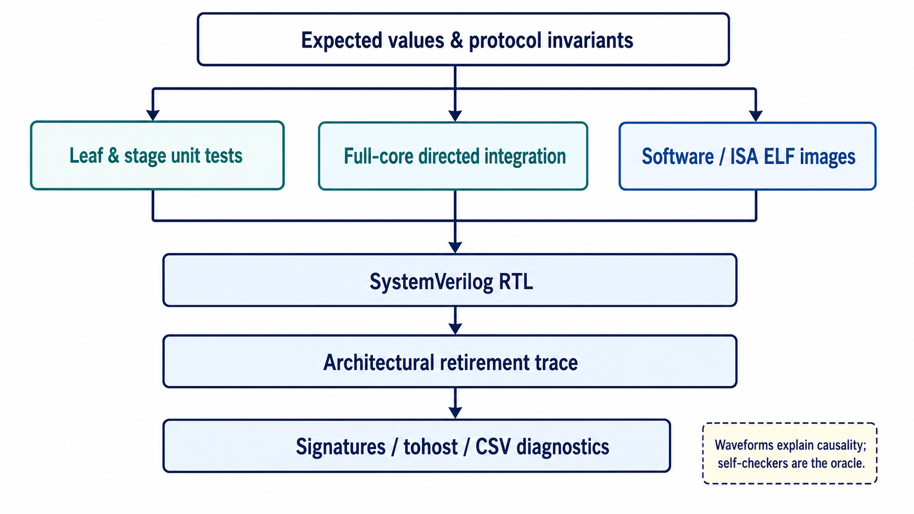
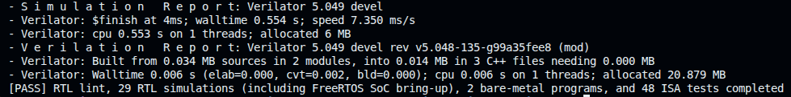
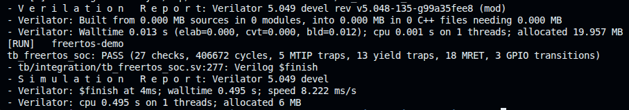
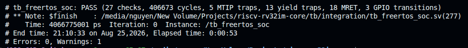

# RV32IM Verification Strategy

This document defines what is verified, which evidence supports each design
claim, and how the regression is reproduced for the five-stage RV32IM core and
its memory-mapped SoC. The design contract is owned by
[Architecture](architecture.md), cycle-level ordering by
[Pipeline and control](pipeline-control.md), and the software execution
contract by [Software](software.md).

This file owns verification structure and acceptance policy. The dated,
frozen PASS snapshot—including cycle counts, FPGA timing, utilization, board
result, and artifact hashes—is recorded once in
[Hardware validation](hardware-validation.md).

## 1. Scope and objectives

The checked-in verification environment targets five properties:

1. **Architectural correctness:** implemented RV32I, RV32M, Zicsr, CSR, trap,
   MTIP, and `MRET` behavior produces the documented visible state.
2. **Precise in-order execution:** dependencies, waits, redirects, exceptions,
   and interrupts preserve age order and suppress wrong-path side effects.
3. **Memory protocol correctness:** a backpressured or accepted request stays
   stable, has bounded ownership, and cannot be confused with a stale response.
4. **SoC integration:** TCM, timer, UART, GPIO, and address demultiplexing obey
   their register, transaction, and response-routing contracts.
5. **Executable-system behavior:** bare-metal and FreeRTOS images boot through
   the production startup/linker flow and complete through architectural
   evidence.

The claim is bounded to the documented implementation. It excludes U/S modes,
PMP, virtual memory, debug mode, caches, compressed instructions, external and
software interrupt controllers, official RISC-V certification, and production
RTOS or silicon qualification.

## 2. Verification architecture

<p align="center">
  <a href="images/verification-flow.png">
    
  </a>
</p>

<p align="center"><em>Verification layers converge on architectural
retirement, signatures, and self-checking diagnostics; waveforms remain a
debug aid rather than the PASS oracle.</em></p>

| Layer | DUT boundary and primary oracle | Inventory / command |
|---|---|---|
| Strict lint | Synthesizable core, SoC blocks, and reset wrapper | `make lint` |
| Unit RTL | Leaf datapath, stages, controller, memory endpoints, and peripherals | 21 self-checking benches |
| Directed integration | Complete core, precise traps/MTIP, waits, forwarding, control recovery, and SoC | 7 self-checking benches |
| Bound assertions | Memory protocol, retirement, and interrupt invariants in full-core simulations | `make assertions` focuses 3 stress benches |
| FreeRTOS SoC | Production SoC hierarchy, scheduler, timer, UART, GPIO, and mailbox | 1 end-to-end bench |
| Bare-metal software | Production core/TCM plus startup, runtime, trap entry, and linker script | 2 programs |
| Pinned `riscv-tests` | Full pipeline with retirement-qualified completion | 40 RV32I + 8 RV32M |
| ACT4 4.0.0 + Sail | Generated self-checking I/M ELFs against independent signatures | 39 RV32I + 8 RV32M |
| Questa cross-check | Curated RTL portfolio and FreeRTOS execution | Local licensed gate |

`make test` is the public open-source gate: strict lint, 29 RTL
simulations (21 unit, 7 directed integration, and one FreeRTOS SoC), two
bare-metal programs, and 48 pinned ISA programs. ACT4 is separate because its
generator, Sail model, solver, and toolchain bootstrap are heavier external
dependencies.

<p align="center">
  <a href="images/test-log.png">
    
  </a>
</p>

<p align="center"><em>Frozen public-gate terminal summary. The authoritative
dated disposition and tool versions remain in Hardware validation.</em></p>

The accepted frozen result for these layers is
[Hardware validation §1](hardware-validation.md#1-validation-disposition).
FPGA implementation and physical-board evidence are separate evidence classes;
simulation PASS alone does not establish a hardware claim.

## 3. Checker and assertion policy

### 3.1 Acceptance oracles

- Every bench is self-checking and terminates on a violated expectation or
  timeout; a waveform is debug evidence, not a PASS oracle.
- Unit tests compare directed vectors, handshakes, state transitions, and
  exception metadata at the smallest useful boundary.
- Integration tests prefer retirement events, architectural state, memory
  signatures, and externally visible SoC behavior. Internal signals are used
  only for microarchitectural invariants.
- Software PASS requires a retired, aligned, full-word store to `tohost`;
  speculative, squashed, or faulting stores cannot complete a test.
- Simulation harnesses clear TCM before image load and enforce cycle or
  retirement limits. The bare-metal harness can emit retirement CSV for
  failure diagnosis.
- Verilator and Questa results remain separate so simulator-specific
  elaboration or scheduling assumptions are visible.

### 3.2 Bound assertions

The assertion modules live under `tb/assertions` and are compiled only
for verification targets.

| Checker | Enforced invariants |
|---|---|
| Memory protocol | Request stability under backpressure, response provenance, at most one outstanding transaction, word-aligned physical requests, and legal read/write strobes |
| Retirement | No retirement from a held slot, side-effect-free traps, legal GPR/store events, consistent control metadata, and aligned retirement PC |
| Timer interrupt | Effective eligibility, CSR-state ambiguity and trap-drain exclusion, immediate post-commit enable behavior, candidate provenance, and construction of a precise side-effect-free interrupt packet |

The protocol checker retains accepted-transaction accounting across core reset
so a late external response can be drained. Assertions complement directed
tests; they do not constitute formal proof or functional/code coverage closure.

## 4. Requirement-to-evidence traceability

### 4.1 Architectural requirements

| Requirement | Principal evidence |
|---|---|
| RV32I decode and visible results | Leaf tests, `tb_rv32_core`, 40 pinned RV32I programs, 39 ACT4 RV32I tests |
| Complete RV32M operations and corner cases | `tb_mul_unit`, `tb_div_unit`, `tb_ex_stage`, 8 pinned and 8 ACT4 RV32M tests |
| GPR and retirement semantics | `tb_regfile`, `tb_id_stage`, retirement assertions, software traces |
| Branch, JAL, and JALR targets/recovery | `tb_branch_unit`, `tb_ex_stage`, `tb_core_control_flow`, ISA control-flow tests |
| Little-endian byte/half/word memory | `tb_lsu`, `tb_rv32_tcm`, `tb_soc_tcm_top`, ISA memory tests |
| CSR operations, legality, and WARL masks | `tb_decoder`, `tb_csr`, `tb_csr_core` |
| `mcycle`/`minstret` and retirement qualification | `tb_csr`, `tb_csr_core`, bare-metal traces |
| Precise synchronous traps and `MRET` | `tb_pipeline_ctrl`, `tb_core_control_flow`, `tb_csr_core`, bare-metal `trap` |
| Precise MTIP entry and state restoration | `tb_timer_interrupt_core`, interrupt assertions, FreeRTOS SoC |

### 4.2 Microarchitectural and interface requirements

| Requirement | Principal evidence |
|---|---|
| EX/MEM forwarding wins over an older MEM/WB match | `tb_forwarding_unit`, `tb_pipeline_forwarding` |
| A load consumer receives the documented interlock | `tb_hazard_unit`, `tb_pipeline_forwarding` |
| CSR stalls are limited to conflicting architectural state | `tb_hazard_unit`, `tb_csr_core` |
| Requests remain stable under backpressure | `tb_if_stage`, `tb_lsu`, `tb_pipeline_memory_wait`, protocol assertions |
| Delayed responses cannot duplicate retirement | `tb_pipeline_memory_wait`, retirement assertions |
| Redirected, killed, or pre-reset responses are drained | IF and LSU unit tests, control-flow scenarios, protocol assertions |
| Older waits, faults, and traps defeat younger redirects | `tb_pipeline_ctrl`, `tb_core_control_flow` |
| MTIP waits only for unresolved older interrupt-state writers | `tb_timer_interrupt_core`, interrupt assertions |
| Enabling/disabling CSR commits affect MTIP without a shadow instruction | `tb_timer_interrupt_core`, interrupt assertions |
| Timer split writes and demux ownership remain safe | `tb_rv32_mtimer`, `tb_rv32_mem_demux`, FreeRTOS SoC |
| UART RX/TX and GPIO register behavior | `tb_rv32_uart`, `tb_rv32_gpio`, FreeRTOS SoC |

## 5. Directed RTL inventory

### 5.1 Unit verification

| Group | Testbenches |
|---|---|
| Integer datapath and decode | `tb_alu`, `tb_imm_gen`, `tb_decoder`, `tb_branch_unit` |
| Architectural state and stages | `tb_regfile`, `tb_if_stage`, `tb_id_stage`, `tb_ex_stage`, `tb_csr` |
| Dependencies and control | `tb_forwarding_unit`, `tb_hazard_unit`, `tb_pipeline_ctrl` |
| RV32M and load/store | `tb_mul_unit`, `tb_div_unit`, `tb_lsu` |
| Memory and reset | `tb_rv32_tcm`, `tb_reset_sync` |
| SoC peripherals and fabric | `tb_rv32_mtimer`, `tb_rv32_uart`, `tb_rv32_gpio`, `tb_rv32_mem_demux` |

Printed deterministic check counts are stimulus-vector counts, not coverage
percentages.

### 5.2 Pipeline and SoC invariants

| Testbench | Acceptance responsibility |
|---|---|
| `tb_rv32_core` | End-to-end RV32IM execution and retirement stream |
| `tb_csr_core` | Zicsr dependencies, counters, precise traps, and return |
| `tb_timer_interrupt_core` | MTIP arbitration, drain, CSR-writer interlock, and post-commit enable/disable |
| `tb_soc_tcm_top` | Core, TCM, timer/peripheral fabric, and completion boundary |
| `tb_pipeline_forwarding` | RAW matrix, forwarding priority, and load-use behavior |
| `tb_pipeline_memory_wait` | Request backpressure, delayed response, global hold, and single retirement |
| `tb_core_control_flow` | Branch/jump recovery, exception priority, trap drain, and `MRET` |
| `tb_freertos_soc` | Scheduler/tick execution plus serial UART, GPIO, timer, and mailbox behavior |

## 6. Integration verification

Integration acceptance deliberately exercises collisions that leaf tests
cannot prove in isolation: simultaneous forwarding matches, load-use plus
memory wait, held-operand refresh, redirect against wrong-path MDU/store,
synchronous trap against pending MTIP, CSR enable/disable at commit, and
backpressured or delayed memory responses. The result is judged at retirement
or at the external interface after all older work has resolved.

The FreeRTOS bench boots the pinned image on the production 64 KiB SoC,
decodes serial UART TX, drives UART RX, observes GPIO activity, classifies
trap entries from `mcause`, and checks the report block. Exact
Verilator/Questa cycle and event counts belong to
[Hardware validation §3](hardware-validation.md#3-functional-and-architectural-evidence),
not to this strategy document.

<p align="center">
  <a href="images/freertos-verilator.png">
    
  </a>
</p>

<p align="center"><em>Verilator observes the expected scheduler, timer-trap,
yield, MRET, and GPIO activity before architectural completion.</em></p>

<p align="center">
  <a href="images/freertos-questa.png">
    
  </a>
</p>

<p align="center"><em>The independent Questa run matches the acceptance
counts within the documented one-cycle harness difference.</em></p>

## 7. Software and independent architectural suites

### 7.1 Bare-metal programs

| Program | Principal coverage |
|---|---|
| `smoke` | Startup, ILP32 ABI, data/BSS, calls, memory, RV32M, and identification CSRs |
| `trap` | ECALL, EBREAK, illegal instruction, trap CSRs, handler recovery, and `MRET` |

### 7.2 Pinned `riscv-tests`

The minimal source snapshot is pinned at commit
`447a5fcb8253627ddb5f6a226f64e43463afcdd5`. It runs 40 in-scope
`rv32ui` and all eight `rv32um` programs. `fence_i`
is excluded because Zifencei is outside scope; `ma_data` expects
successful misaligned accesses while this core traps them. These are declared
scope exclusions, not passing waivers.

### 7.3 ACT4 with Sail

ACT4 4.0.0 is pinned at commit
`a7c99303516f4e668f7488f172043392e23b9dfd`. The configuration selects
I 2.1, M 2.0, Zicsr 2.0, RV32 little-endian execution, and the project trap
policy; Sail RISC-V 0.10 supplies expected signatures. Privileged ACTs remain
disabled because the core implements only the documented M-mode subset.

<p align="center">
  <a href="images/act4.png">
    
  </a>
</p>

<p align="center"><em>ACT4 4.0.0 independent architectural regression:
47 self-checking RV32I/RV32M tests complete successfully.</em></p>

## 8. Regression operation and failure triage

| Command | Purpose |
|---|---|
| `make lint` | Strict lint of synthesizable boundaries |
| `make unit` | Run all 21 unit tests |
| `make integration` | Run all 7 directed integration tests |
| `make assertions` | Focus protocol, retirement, and interrupt assertion stress |
| `make baremetal` | Build and execute both freestanding programs |
| `make freertos` | Verify source hashes, build, and run the FreeRTOS SoC demo |
| `make isa` | Run all 48 pinned `riscv-tests` programs |
| `make test` | Run the complete public open-source gate |
| `make act4` | Run the separate 47-test Sail-backed suite |
| `make questa-check` | Cross-check the curated RTL portfolio locally |
| `make questa-freertos-run` | Cross-check FreeRTOS locally |

For a failure, reproduce the narrow target first, retain the first assertion or
`$fatal` message, then inspect retirement/signature output before
opening a waveform. Examples:

```sh
make tb_timer_interrupt_core
make isa-rv32ui-jalr
make baremetal-smoke BAREMETAL_PLUSARGS='+trace=/tmp/smoke.csv'
```

Generated models, images, traces, and simulator databases remain below
`/tmp/rv32im-core-*`, keeping the checkout clean and supporting paths
that contain spaces.

## 9. CI and evidence retention

`.github/workflows/rtl-regression.yml` runs `make test` on
pushes, pull requests, and manual dispatch. It restores shared
`riscv-tests` sources at the pinned commit and uploads software/ISA
diagnostics on failure. The path-filtered ACT4 workflow installs checksum-pinned
tool/model inputs, runs `make act4`, and uploads signatures and RTL
artifacts on failure.

Questa remains a local cross-check because a commercial license is not a
public-CI prerequisite. A PASS claim must identify the source revision,
relevant tool versions, and the command set; failure-only CI artifacts are not
a substitute for the frozen validation record.

## 10. Sign-off policy

For a change that affects architectural or SoC behavior:

1. run `make test` from the intended source revision;
2. run the focused assertion/integration target for the changed mechanism;
3. run `make act4` for I/M-visible behavior;
4. cross-check the affected portfolio and FreeRTOS test on Questa;
5. regenerate implementation and board evidence when making an FPGA claim;
6. record the source, tool, image, and artifact identity in
   [Hardware validation](hardware-validation.md).

### Open verification work

- retirement-stream differential testing against an independent ISA model;
- constrained-random collision testing and functional/code coverage closure;
- formal proof of selected control and memory-protocol properties;
- complete privileged-architecture conformance beyond the implemented subset.

The current FPGA result is artifact-hash identified but was captured from the
board-integration worktree rather than a clean release tag. Closing that
source-to-bitstream provenance is a release-packaging task; it does not
invalidate the recorded functional, timing, or board observations.
