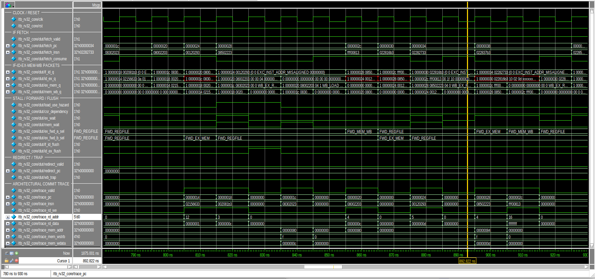
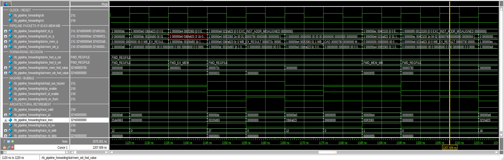
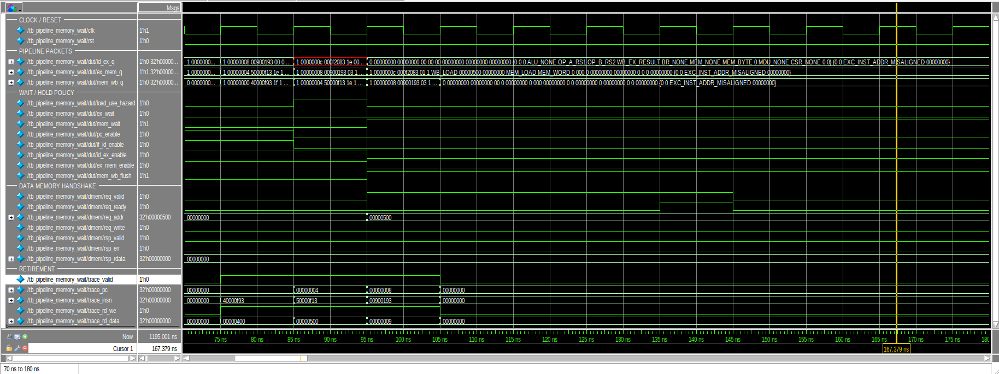
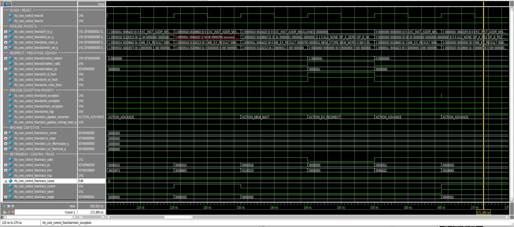
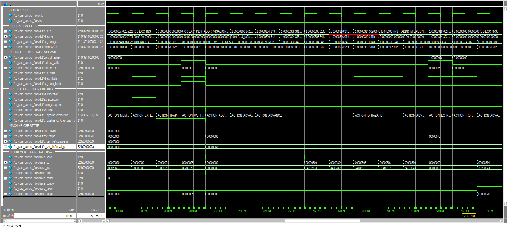
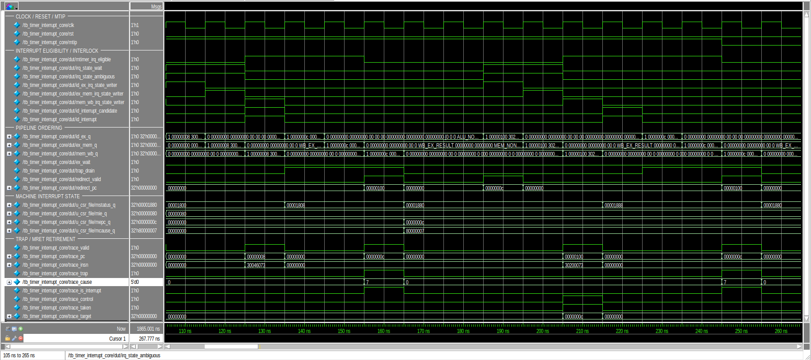
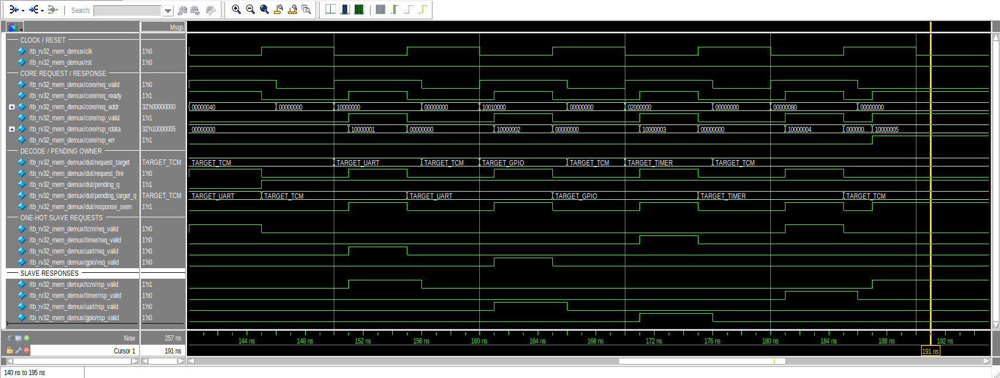
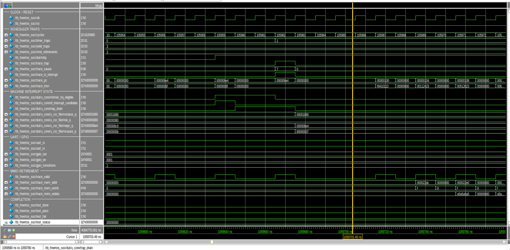
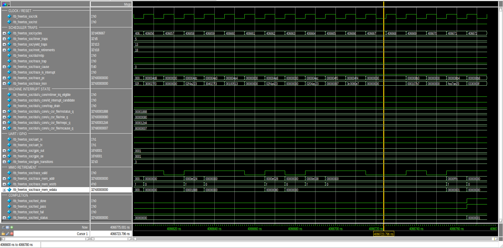

# Waveform debug and architectural evidence

## Purpose

This document is the cycle-level companion to the self-checking verification
flow. It explains how the RV32IM core reaches each architectural result instead
of treating a PASS line as a black box. The selected captures cover the
IF-ID-EX-MEM-WB pipeline, data and control hazards, blocking memory behavior,
precise trap/interrupt ordering, MMIO response ownership, and the FreeRTOS
completion path.

The testbench remains the pass/fail oracle. A waveform is supporting evidence:
it makes ordering, ownership, and side-effect suppression reviewable, but it is
not a replacement for assertions, regression, coverage, synthesis, or hardware
validation. See [Verification](verification.md),
[Architecture](architecture.md), and
[Hardware validation](hardware-validation.md) for those complementary results.

## Reproducing the captures

Questa commands must be available in `PATH`:

```sh
export PATH="/path/to/questa/bin:$PATH"
vlog -version
vsim -version
```

Run the 11-test curated hardware portfolio in batch mode before inspecting any
waveform:

```sh
make questa-check
```

The MMIO demux and FreeRTOS evidence use separate targets:

```sh
make questa-run TEST=tb_rv32_mem_demux
make questa-freertos-run
```

Open one selected test in the GUI. Its test-specific `.do` recipe loads only
the signals relevant to that contract and runs the self-checking test:

```sh
make questa-gui TEST=tb_rv32_core
```

Then select the documented time window in the Questa Transcript:

```tcl
do sim/questa/waves/capture_ranges.do
rv32_zoom_list
rv32_zoom pipeline_retirement
```

For FreeRTOS, build the software image and open the complete SoC directly:

```sh
make questa-freertos-gui
```

Questa libraries, transcripts, and WLF databases are generated under
`/tmp/rv32im-core-questa-<uid>/<test>/`. They are intentionally not repository
artifacts. The checked-in evidence consists of the testbenches, waveform
recipes, deterministic zoom ranges, images, and this interpretation guide.

## Evidence index

| Evidence | Testbench / GUI command | Deterministic zoom | Contract under review |
|---|---|---|---|
| Five-stage retirement | `make questa-gui TEST=tb_rv32_core` | `pipeline_retirement` | Pipeline occupancy and single MEM/WB commit point |
| Forwarding/load-use | `make questa-gui TEST=tb_pipeline_forwarding` | `forwarding_load_use` | EX/MEM priority, MEM/WB forwarding, one-bubble load-use interlock |
| Memory backpressure | `make questa-gui TEST=tb_pipeline_memory_wait` | `memory_backpressure` | Stable request, global hold, and exactly-once retirement |
| Branch redirect | `make questa-gui TEST=tb_core_control_flow` | `branch_redirect` | EX redirect and two-younger-instruction squash |
| Trap and MRET | `make questa-gui TEST=tb_core_control_flow` | `trap_mret` | Precise synchronous trap, handler entry, and return |
| Timer interrupt | `make questa-gui TEST=tb_timer_interrupt_core` | `timer_enable_mret` | MTIP eligibility, in-flight CSR interlock, drain, and interrupt identity |
| MMIO response ownership | `make questa-gui TEST=tb_rv32_mem_demux` | `demux_back_to_back` | Back-to-back requests to different slaves |
| FreeRTOS MTIP entry | `make questa-freertos-gui` | `freertos_mtip_entry` | Real software interrupt entry through the complete SoC |
| FreeRTOS completion | `make questa-freertos-gui` | `freertos_completion` | Scheduler progress and retirement-qualified PASS mailbox |

All ranges above are defined in
[`capture_ranges.do`](../sim/questa/waves/capture_ranges.do). They are tied to
the current deterministic tests; update the ranges if a test stimulus changes.

## Reading conventions

The packed pipeline registers are the authoritative instruction-age chain:

```text
fetch -> if_id_q -> id_ex_q -> ex_mem_q -> mem_wb_q -> trace/commit
```

Read each capture from top to bottom:

1. Follow `valid`, `pc`, and `insn` through the packed stage packets.
2. Identify the controller decision and its enables/flushes.
3. Check the relevant producer/consumer, bus, redirect, or CSR state.
4. Confirm the result only at `trace_valid` in MEM/WB.

The trace interface is retirement-qualified. `trace_cause` is meaningful only
when `trace_trap=1`, and cause value 7 must be interpreted together with
`trace_is_interrupt`: `1` denotes machine-timer interrupt, while `0` denotes a
synchronous exception with the same numeric cause space.

The main invariants visible across the selected captures are:

- EX/MEM forwarding wins over MEM/WB when both stages can supply an operand.
- A load-use dependency holds PC and IF/ID and inserts one bubble into ID/EX.
- A blocked memory transaction retains its request and owning pipeline packet.
- A taken EX control transfer flushes IF/ID and ID/EX before wrong-path commit.
- Trap entry waits for older work; faulting or squashed instructions have no
  architectural side effects.
- MTIP injection does not bypass an in-flight CSR or MRET update that changes
  interrupt eligibility.
- The memory demux returns a response only from the slave captured when the
  request was accepted.
- Only MEM/WB produces an architectural retirement event.

## 1. Five-stage flow and architectural retirement

<p align="center">
  <a href="images/waveform/pipeline.png">
    
  </a>
</p>

<p align="center"><em>Figure 1 — Full-core window, 780-930 ns
(`pipeline_retirement`).</em></p>

The stage packets show different instructions occupying IF/ID, ID/EX, EX/MEM,
and MEM/WB concurrently. The adjacent control signals explain bubbles and held
packets rather than leaving them to visual inference. Forward selections and
memory-wait intervals change the movement of packets, while the trace group
updates only for the instruction at the MEM/WB commit point.

The key observation is that `trace_valid`, the trace PC/instruction, GPR
writeback, and memory side-effect fields form one coherent retirement stream.
Pipeline occupancy alone is not counted as execution; a stalled or flushed
packet cannot create a second commit.

## 2. Forwarding and load-use interlock

<p align="center">
  <a href="images/waveform/forwarding.png">
    
  </a>
</p>

<p align="center"><em>Figure 2 — Directed forwarding window, 1120-1220 ns
(`forwarding_load_use`).</em></p>

The forwarding selectors and forwarded operand values track the matching
producer in EX/MEM or MEM/WB. Where a load result is not yet available for the
immediately following consumer, `load_use_hazard` asserts, PC and IF/ID stop
advancing, and ID/EX is flushed for one bubble. The dependent instruction then
continues with the returned value and retires normally.

This capture demonstrates both halves of the RAW policy: bypass values that are
available, and interlock values that are not. It also exposes the intended
EX/MEM-over-MEM/WB selection priority when both metadata matches are present.

## 3. Data-memory backpressure

<p align="center">
  <a href="images/waveform/Memory-backpressure.png">
    
  </a>
</p>

<p align="center"><em>Figure 3 — Delayed-request/response window, 70-180 ns
(`memory_backpressure`).</em></p>

While `dmem.req_valid=1` and `dmem.req_ready=0`, the request address, write
direction, byte strobes, and data remain stable. `mem_wait` keeps the owning
EX/MEM packet in place and the upstream stage enables closed. Once the request
is accepted and the delayed response arrives, the pipeline resumes and the
operation appears once in the retirement trace.

The important contract is not simply that the core stalls: request identity is
preserved across an arbitrary wait, no younger MDU or memory operation passes
the blocked transaction, and the WB packet is not recommitted during the hold.

## 4. Taken branch redirect and squash

<p align="center">
  <a href="images/waveform/branch-redirect.png">
    
  </a>
</p>

<p align="center"><em>Figure 4 — Taken-control window, 115-175 ns
(`branch_redirect`).</em></p>

At approximately 145 ns the controller selects `ACTION_EX_REDIRECT`, asserts
`redirect_valid`, and drives target `0x0000002c`. `if_id_flush` and
`id_ex_flush` assert together, removing the two younger wrong-path packets.
After the redirect bubble, fetch/retirement resumes on the target path; the
retirement trace records the taken control transfer without a wrong-path side
effect.

The preceding memory-wait action in the same window is useful evidence of age
ordering: the older MEM condition is serviced before the younger EX redirect is
allowed to redirect the machine.

## 5. Precise synchronous trap and MRET

<p align="center">
  <a href="images/waveform/trap-mret.png">
    
  </a>
</p>

<p align="center"><em>Figure 5 — Trap/handler/return window, 375-535 ns
(`trap_mret`).</em></p>

The synchronous exception is first detected in the pipeline, then selected by
the age-ordered controller. Trap entry redirects to `mtvec=0x00000300` only
after the required older work has drained. The CSR state records the faulting
context (`mepc`, `mcause`, and `mtval`), and the faulting packet does not retire
with a normal writeback or memory side effect.

Handler instructions subsequently retire from the `0x00000300` region. The
handler advances `mepc` past the directed fault, and the later MRET redirect
returns to `0x0000007c`. The MRET packet then retires with its control metadata
and restores `mstatus.MIE/MPIE`; the interrupt interlock prevents that state
transition from being observed early. The capture therefore links fault
detection, precise commit, handler execution, and return in one ordered view.

## 6. Machine-timer interrupt injection and return

<p align="center">
  <a href="images/waveform/timer-interrupt.png">
    
  </a>
</p>

<p align="center"><em>Figure 6 — Directed MTIP/MRET window, 105-265 ns
(`timer_enable_mret`).</em></p>

The eligibility group combines pending MTIP state with `mstatus.MIE` and
`mie.MTIE`. The three in-flight CSR-writer indicators and `irq_state_wait`
prevent ID injection while an older instruction can still change that state.
Once eligibility is unambiguous, `id_interrupt_candidate` becomes an injected
interrupt packet, `trap_drain` preserves precise ordering, and trap retirement
redirects to the handler.

At each timer trap, `trace_trap=1`, `trace_cause=7`, and
`trace_is_interrupt=1`; `mcause` contains `0x80000007`. This explicitly
distinguishes MTIP from synchronous store-access-fault cause 7. The same window
also shows an MRET control retirement and renewed interrupt qualification,
covering the enable/restore boundary that is most vulnerable to early or stale
interrupt injection.

## 7. Back-to-back MMIO response ownership

<p align="center">
  <a href="images/waveform/demux-back-to-back.png">
    
  </a>
</p>

<p align="center"><em>Figure 7 — N-way demux window, 140-195 ns
(`demux_back_to_back`).</em></p>

Accepted requests move across UART (`0x10000000`), GPIO (`0x10010000`), timer
(`0x02000000`), and TCM (`0x00000080`) address regions. `pending_target_q`
captures the selected slave on `request_fire` and remains the response owner
until `response_seen`, even when the next core address already decodes to a
different target.

The core response data sequence (`0x00000001` through `0x00000005`) follows the
captured owners, and only the corresponding one-hot slave request/response is
active for each transaction. This is the critical evidence for the boundary
case where a response and the next differently targeted request occur in
adjacent cycles.

## 8. FreeRTOS machine-timer interrupt entry

<p align="center">
  <a href="images/waveform/freertos-mtip.png">
    
  </a>
</p>

<p align="center"><em>Figure 8 — First FreeRTOS timer tick, 1059580-1059780 ns
(`freertos_mtip_entry`).</em></p>

This is the generated FreeRTOS image running on `soc_tcm_top`, not a forced
unit-level trap. MTIP asserts, the core qualifies and injects the interrupt,
and `trap_drain` delays architectural entry until older instructions have
retired. The trap trace reports PC `0x00000084`, cause 7 with
`trace_is_interrupt=1`, while `mepc` captures `0x00000084` and `mcause` becomes
`0x80000007`. Execution then starts in the handler region at `0x00000100`.

The testbench's `timer_traps` counter increments from 0 to 1 on the same
retirement-qualified event. The CSR transition also shows global interrupt
enable being cleared on entry; this prevents nested MTIP before the handler and
MRET restore the intended state.

## 9. FreeRTOS scheduler progress and completion

<p align="center">
  <a href="images/waveform/freertos-completion.png">
    
  </a>
</p>

<p align="center"><em>Figure 9 — FreeRTOS completion window,
4066600-4066780 ns (`freertos_completion`).</em></p>

Immediately before completion, the observed counters are five machine-timer
traps, 13 software-yield traps, 18 MRET retirements, and three GPIO
transitions. These are independent progress indicators: periodic timer entry,
task-level yielding, successful return from every trap path, and a visible
peripheral side effect.

The final retirement-qualified store targets the test-status mailbox at
`0x0000fffc` with full byte strobes and data `0x00000001`. The harness then
asserts `test_done` and `test_pass`, keeps `test_fail` low, and records
`test_status=1`. This figure is the end-to-end completion proof for the
generated software image; the exact functional checks are still defined by the
self-checking `tb_freertos_soc` testbench and its PASS transcript.

## Additional debug windows

The checked-in zoom helper also contains focused windows that are useful when a
regression fails but are intentionally not duplicated as headline figures:

| Case | Purpose |
|---|---|
| `timer_div_race` | MTIP arrival while the iterative divider blocks EX |
| `timer_redirect_race` | Interrupt eligibility around a younger redirect |
| `timer_sync_priority` | Synchronous exception versus simultaneous interrupt ordering |
| `timer_trap_drain` | Interrupt drain while older packets remain in flight |
| `lsu_reset_drain` | Discarding a pre-reset delayed data response |
| `divider_iteration` | Iterative quotient/remainder state and sticky response |
| `freertos_mret` | Software return from the timer handler |
| `freertos_gpio` | Task-driven GPIO transition |
| `freertos_uart_echo` | UART RX/TX activity over the software echo interval |

Use the same sequence after opening the matching test:

```tcl
do sim/questa/waves/capture_ranges.do
rv32_zoom <case-name>
```

## Evidence and publication rules

For a repeatable report update:

1. Run the corresponding headless test and retain its PASS summary.
2. Open the GUI through the Make target so `+acc`, source order, plusargs, and
   the curated waveform recipe match the regression.
3. Apply the named zoom range and keep signal names, time scale, and values
   visible in the capture.
4. Capture only the event and the few cycles needed to establish cause and
   effect; do not replace these figures with an unreadable full-run screenshot.
5. If RTL or stimulus timing changes, regenerate the affected image and update
   its range/caption together.

These figures support a claim of a verified educational RV32IM five-stage core
and small FPGA-oriented SoC capable of running the included FreeRTOS demo. They
do not by themselves establish official RISC-V conformance, coverage closure,
production sign-off, cache/MMU support, higher privilege modes, or silicon
readiness. FPGA implementation and board evidence belong in
[FPGA implementation](fpga.md) and
[Hardware validation](hardware-validation.md), not in this waveform set.

## Troubleshooting

- `unknown TEST`: run `make questa-list` and check the `<test>_SRCS` manifest.
- Missing internal signals: launch through `make questa-gui`; it supplies
  `-voptargs=+acc`.
- Stale elaboration or wave layout: run `make questa-clean`, then rebuild the
  selected test.
- Missing FreeRTOS memory image: use `make questa-freertos-gui` from the
  repository root so the image and runtime plusargs are generated together.
- Very slow GUI: retain the curated contract-level groups instead of using a
  recursive `add wave -r /*`.
- A blank or sub-nanosecond view after simulation: source
  `capture_ranges.do` and call the named `rv32_zoom` case rather than using
  `wave zoom full`.
